<!--
https://nbisweden.github.io/workshop-scRNAseq/home_schedule.html
-->

# Introduction

## Pour suivre la formation

### Installation sur votre ordinateur

Mettre ici les infos pour la mise en place .....

### Packages nécessaires

```{r}
library(Seurat)
library(DESeq2)
library(patchwork)
library(tidyverse)
library(dplyr)
library(corrplot)
library(clustree)
library(SeuratData)
library(reshape2)
library(ggplot2)
library(mvtnorm)
library(FactoMineR)
library(gridExtra)

source("Cours/FunctionsAux.R")
# devtools::install_github('satijalab/seurat-data')
```

### Objectifs de la formation

A FAIRE


## Qu'est-ce-que les données de single-cell RNA-seq ? 

### bulk RNA-seq vs single-cell RNAseq

- Principe du bulk RNA-seq

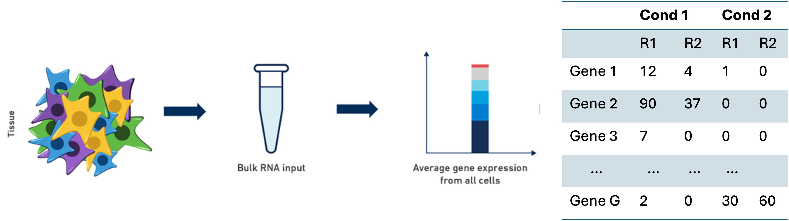
- Principe du single-cell RNA-seq (scRNAseq)

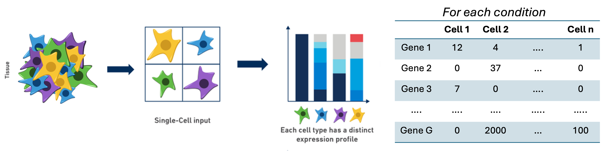

<!--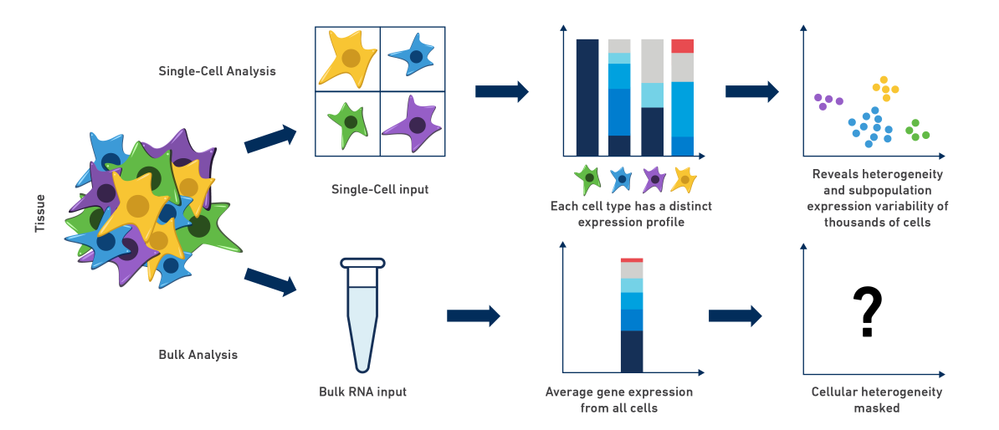-->


## De la manip à la fin de la bio-informatique 

### Différentes technologies

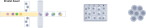
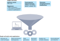

From https://www.nature.com/articles/s41580-023-00615-w


### Alignement - filtrage 

- Après la manip, passage par la bioinformatique
- Alignement des séquences, analyse des cellules que l'on peut retenir, ....

### Avec CellRanger

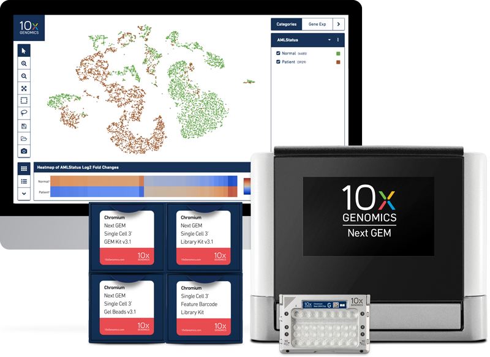
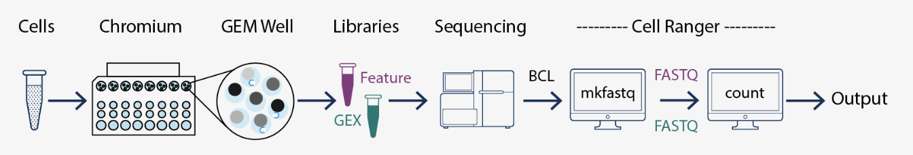
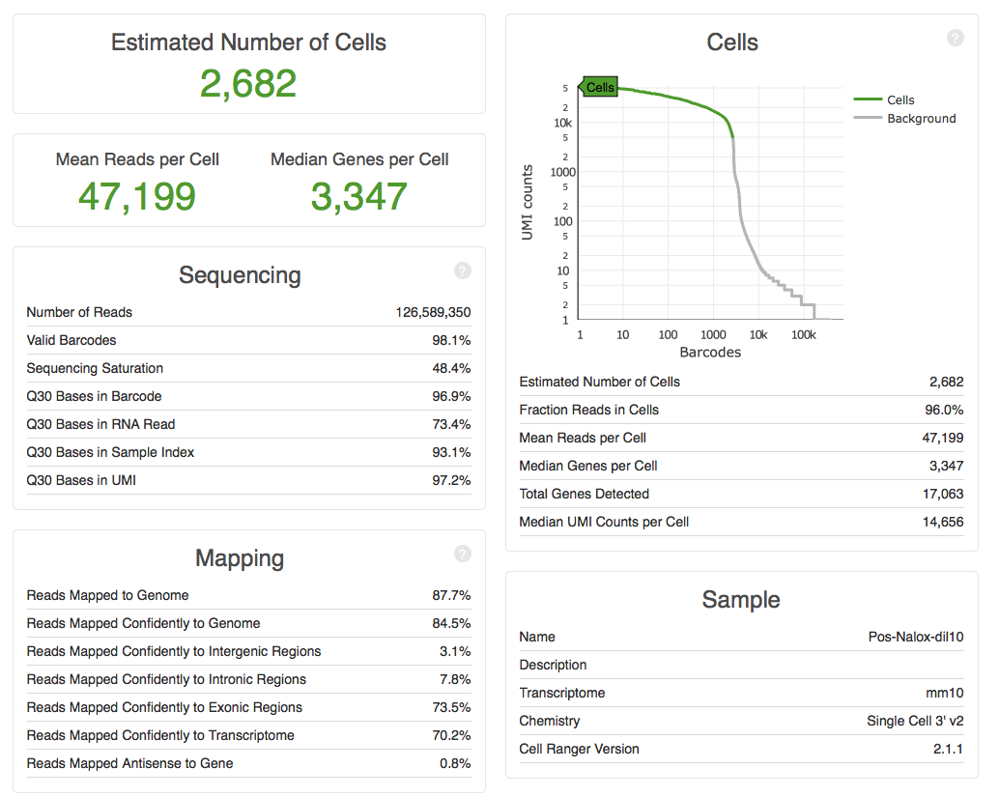


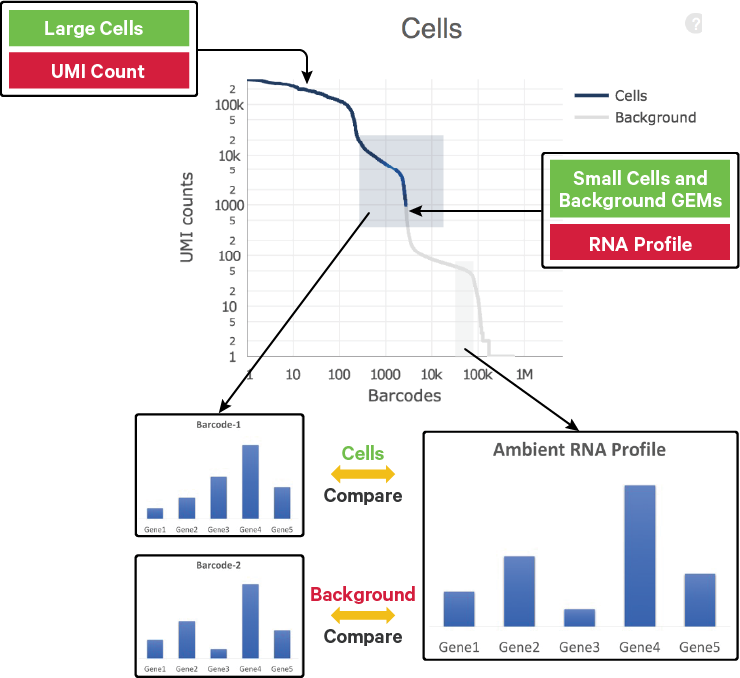


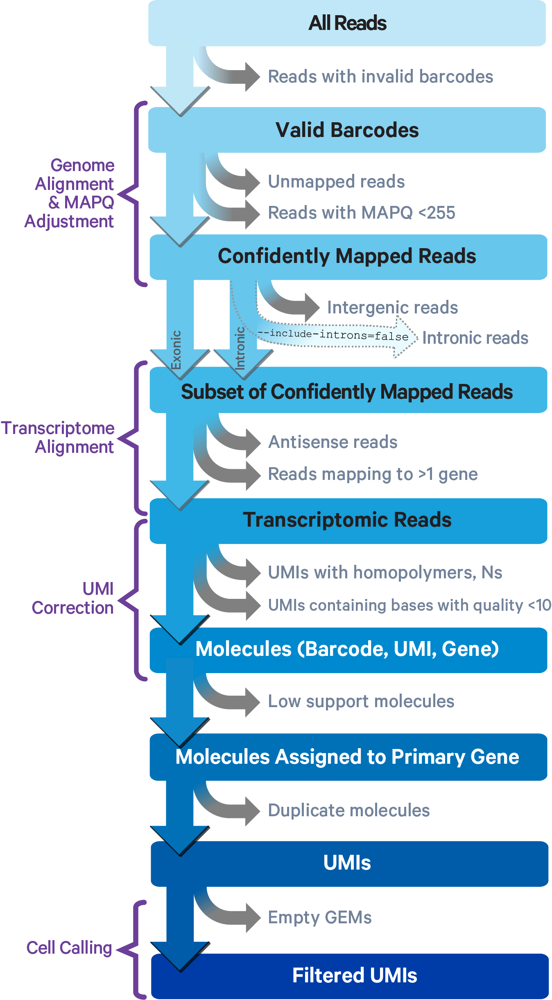


Les étapes importantes :

- Trimming des reads
- Demultiplexage - Stockage des UMIs
- Alignement
- UMI counting


### Others

https://salmon.readthedocs.io/en/latest/alevin.html
https://umi-tools.readthedocs.io/en/latest/index.html

### Après la bio-informatique

https://satijalab.org/seurat/reference/read10x

- 3 fichiers : features, barcode et table de comptage

Pour alvin : 

- _quants_mat.gz_ – Compressed count matrix.
- _quants_mat_cols.txt_ – Column Header (Gene-ids) of the matrix.
- _quants_mat_rows.txt_ – Row Index (CB-ids) of the matrix.
- _quants_tier_mat.gz_ – Tier categorization of the matrix.


Need `tximport`:

```
# Reading in the alevin quants quants
txi <- tximport(files, type="alevin")
```

## De la question bio à la question stat

### Biological questions

:::: {.columns}
::: {.column width="50%"}
- Are there distinct subpopulations of cells? 
- For each cell type, what are the marker genes? 
- How visualize the cells? 
- Are there continuums of differentiation / activation cell states? 
- ...
:::
::: {.column width="50%"}
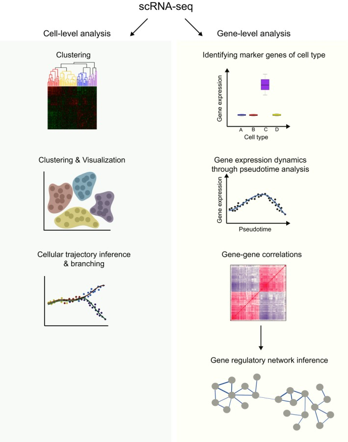
(\tiny Rostom et al, FEBS 2017)
:::
:::


### Statistical analysis
:::: {.columns}
::: {.column width="50%"}
- Clustering of cells 
- Variable (gene) selection in learning or differential analysis (hypothesis testing) 
- Reduction dimension 
- Network inference
- Pseudo-time inference
- ...
:::
::: {.column width="50%"}

(\tiny Rostom et al, FEBS 2017)
:::
:::

## Les packages pour analyser les données de scRNAseq

### Number of available tools for scRNAseq data
:::: {.columns}
::: {.column width="50%"}
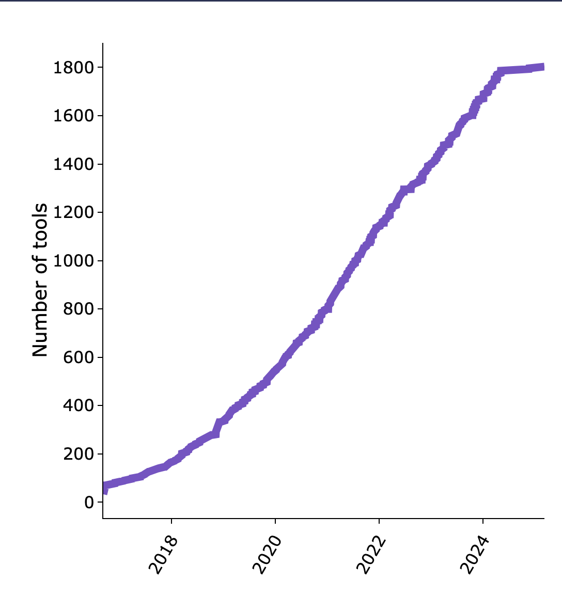
:::
::: {.column width="50%"}

Many packages are released regularly for scRNAseq data analysis.
You can follow the news in the "Updates" section of scRNA-tools.
<!--
\underline{\url{https://www.scrna-tools.org/updates}}} 
-->
:::
:::
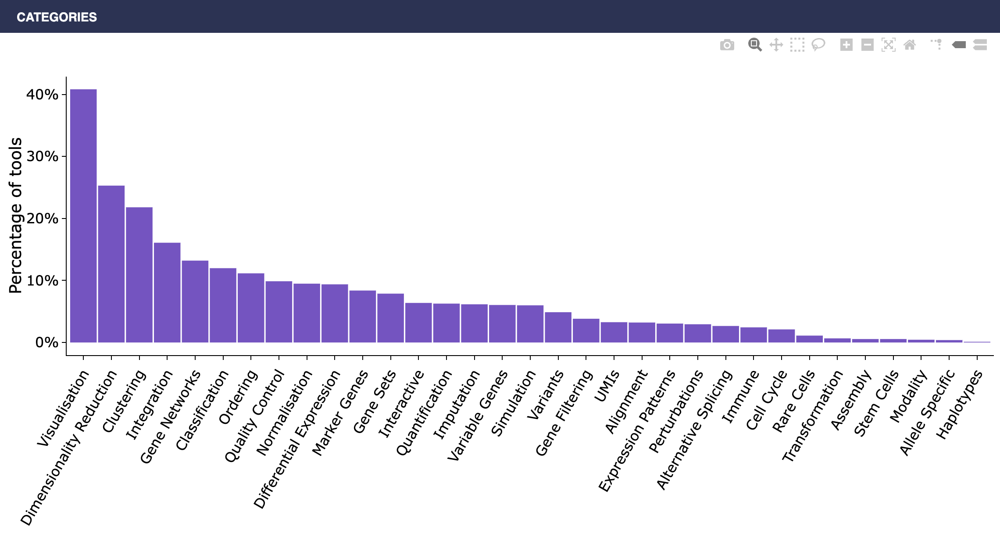


### Some bio-info-stat. pipelines/workflows


- [Seurat](https://satijalab.org/seurat/) <!--\cite{Satija15}-->


Hao, et al., Nature Biotechnology 2023 [Seurat v5]
Hao, Hao, et al., Cell 2021 [Seurat v4]
Stuart, Butler, et al., Cell 2019 [Seurat v3]
Butler, et al., Nat Biotechnol 2018 [Seurat v2]
Satija, Farrell, et al., Nat Biotechnol 2015 [Seurat v1]

Pour récupérer les citations : https://satijalab.org/seurat/authors#citation

Package en R très utilisé, on va se focaliser dessus durant la formation


- [SCANPY](https://github.com/theislab/Scanpy)<!--\cite{scanpy:wolf18}-->


Scanpy is a scalable toolkit for analyzing single-cell gene expression data built jointly with anndata. It includes preprocessing, visualization, clustering, trajectory inference and differential expression testing. The Python-based implementation efficiently deals with datasets of more than one million cells.

Package le plus populaire en Python 

SCANPY: large-scale single-cell gene expression data analysis
F. Alexander Wolf, Philipp Angerer, Fabian J. Theis
Genome Biology 2018 Feb 06. doi: 10.1186/s13059-017-1382-0.


- [Sincell](https://bioconductor.org/packages/release/bioc/html/sincell.html) 
<!--\cite{Sincell15} -->	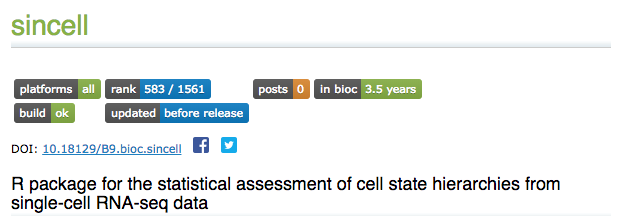

Package sur BioConductor

Juliá M, Telenti A, Rausell A. Sincell: an R/Bioconductor package for statistical assessment of cell-state hierarchies from single-cell RNA-seq. Bioinformatics. 2015 Oct 15;31(20):3380-2. doi: 10.1093/bioinformatics/btv368. Epub 2015 Jun 22. PMID: 26099264; PMCID: PMC4595899.

- [simpleSingleCell](https://bioconductor.org/packages/release/workflows/html/simpleSingleCell.html)
<!--\cite{LunWorkflow16}-->
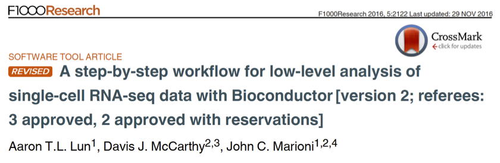


package Bioconductor

Lun ATL, McCarthy DJ, Marioni JC (2016). “A step-by-step workflow for low-level analysis of single-cell RNA-seq data with Bioconductor.” F1000Res., 5, 2122. doi:10.12688/f1000research.9501.2


- [SINCERA](https://research.cchmc.org/pbge/sincera.html)    
<!--\cite{GuoSINCERA15}-->
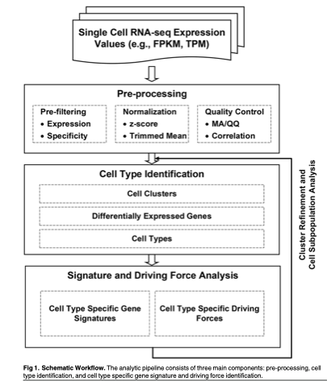

Minzhe Guo, Hui Wang, S. Steve Potter, Jeffrey A. Whitsett, Yan Xu. SINCERA: A Pipeline for Single-Cell RNA-Seq Profiling Analysis. PLoS Comput Biol. 2015 Nov 24;11(11):e1004575. doi: 10.1371/journal.pcbi.1004575. eCollection 2015.   


- [Scedar](https://github.com/logstar/scedar) <!--\cite{scedar}-->
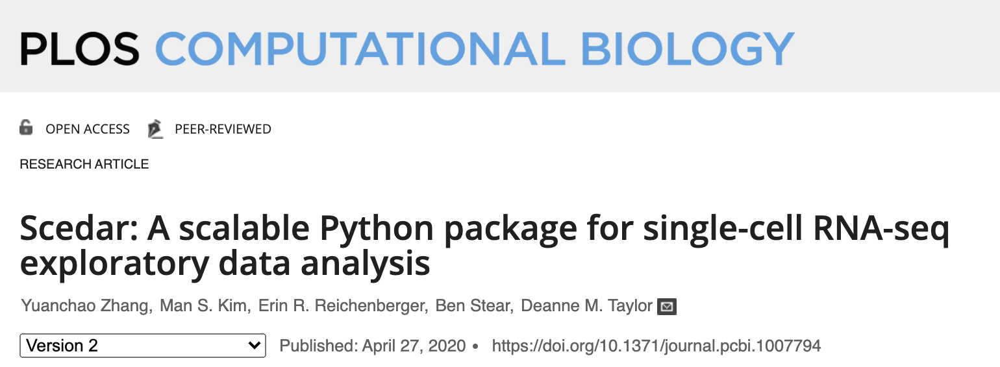

Scedar (Single-cell exploratory data analysis for RNA-Seq) is a reliable and easy-to-use Python package for efficient visualization, imputation of gene dropouts, detection of rare transcriptomic profiles, and clustering of large-scale single cell RNA-seq (scRNA-seq) datasets.

Zhang Y, Kim MS, Reichenberger ER, Stear B, Taylor DM (2020) Scedar: A scalable Python package for single-cell RNA-seq exploratory data analysis. PLOS Computational Biology 16(4): e1007794. (https://doi.org/10.1371/journal.pcbi.1007794)


- $\ldots$


### Attention au type d'objet

-   Expliquer que chaque pipeline a son type d'Objet
    -   Seurat en R $\longrightarrow$ Seurat Object
    -   Scanpy en python $\longrightarrow$ AnnData class
    -   SingleCellExperiment 
- Il existe des fonctions qui permettent de passer de l'un à l'autre

- Dans la suite on va travailler avec Seurat

A VOIR COMMENT ON ARTICULE AVEC AnnData juste après. 
Peut-etre le mettre dans pour aller plus loin quand on veut basculer dans scanpy et/ou quand on doit passer par sce.  

### AnnData

{width="50%" fig-align:"center"}

* `X`: Données de comptage sous forme de matrice creuse (sparse):
  * ```python
  adata.X
  <100x2000 sparse matrix of type '<class 'numpy.float32'>'
	with 126526 stored elements in Compressed Sparse Row format>
    ```
  * ```python
  adata.obs_names = [f"Cell_{i:d}" for i in range(adata.n_obs)]
  adata.var_names = [f"Gene_{i:d}" for i in range(adata.n_vars)]
  print(adata.obs_names[:10])
  Index(['Cell_0', 'Cell_1', 'Cell_2', 'Cell_3', 'Cell_4', 'Cell_5', 'Cell_6',
       'Cell_7', 'Cell_8', 'Cell_9'],
      dtype='object')
    ```
* `obs`/`var`: Metadonnées des observations variables 
* `Layers`: `adata.layers["log_transformed"] = np.log1p(adata.X)`
* `obsm`/`varm` : Métriques ou des données dérivées supplémentaires liées aux observations / variables (Résultat ACP)
* `uns`: Données non structurées (paramètres de l'analyse, autres métadonnées, ...)
* `obsp`/`varp`: Relations par paires entre les cellules


## Exemple pour la suite

### Présentation des données

- Données de Peripheral Blood Mononuclear Cells (PBMC) de 10X Genomics. 

- 2700 cellules séquencées en Illumina NextSeq 500. 

- Téléchargez le jeu de données [ici](https://satijalab.org/seurat/articles/pbmc3k_tutorial#:~:text=can%20be%20found-,here,-.) ou sur le dépot git de la formation

- Dans le dossier ".../hg19/" on a trois fichiers 
  + barcodes.tsv
  + genes.tsv
  + matrix.mtx


### Création de l'objet Seurat

- On commence par lire les données en sortie de CellRanger de 10X à l'aide de la fonction `Read10X()`. 

- Remarque : pour les formats h5 plus récents, utilisez la fonction `Read10X_h5()`

```{r init}
#| message: false
#| warning: false

# Load the PBMC dataset
pbmc.data <- Read10X(data.dir = "data/pbmc3k_filtered_gene_bc_matrices/filtered_gene_bc_matrices/hg19/")
```

- Création ensuite de l'objet Seurat avec `CreateSeuratObject()` :

```{r}
# Initialize the Seurat object with the raw (non-normalized data).
pbmc <- CreateSeuratObject(counts = pbmc.data, 
                           project = "pbmc3k", 
                           min.cells = 3, 
                           min.features = 200)
class(pbmc)
pbmc
```

### Contenu du SO

- $C$= `r ncol(pbmc)` cellules décrites par `$G=$ `r nrow(pbmc)`gènes
- Les comptages bruts sont dans `pbmc@assays$RNA$counts`

```{r}
dim(pbmc)
pbmc@assays$RNA$counts[10:20,1:15]
Assays(pbmc)
```

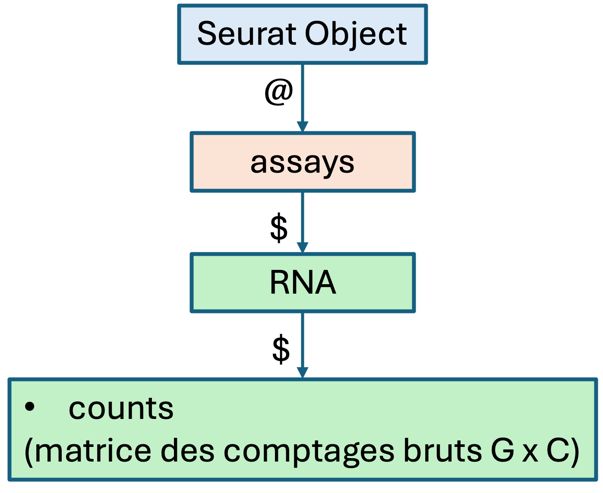


### Spécificités des données scRNAseq

- $C$ cellules décrites par  $G$ gènes:  $C\leq G$ or $C \approx G$ $\Longrightarrow$ grande dimension
- Mesures: $y_{cg}\in\mathbb{N}$  = count expression measure of gene $g$ in cell $c$. Ce sont des comptages
- Technical and biological noise
- High variability
- Zero-inflated data $\Longrightarrow$ "sparsity" 
($\geq 80\%$ of zeros per raw, dropouts). 


# Pipeline d'analyse d'une condition biologique

## Contrôle qualité

### QC metrics : `nCount_RNA` et `nFeature_RNA`

- A la création de l'objet **SO**, calcul de `nCount_RNA` et `nFeature_RNA`, disponibles dans `meta.data`

 <!-- + orig.ident: this often contains the sample identity if known,        but will default to project as we had assigned it
 -->
 
  + nCount_RNA: number of UMIs per cell
  + nFeature_RNA: number of genes detected per cell

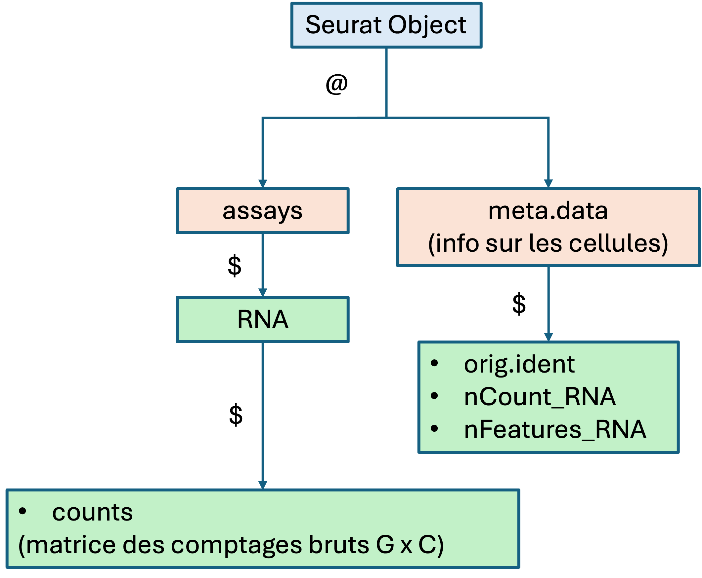


```{r}
head(pbmc@meta.data)
VlnPlot(pbmc, features = c("nFeature_RNA", "nCount_RNA"), ncol = 2)
```

**Mettre le schema evolué avec meta.data**

### QC metrics

- Calculate some additional metrics for plotting:

  + number of genes detected per UMI: 
this metric with give us an idea of the complexity of our dataset (more genes detected per UMI, more complex our data)
  
```{r}
pbmc$log10GenesPerUMI <- log10(pbmc$nFeature_RNA) /   log10(pbmc$nCount_RNA)
VlnPlot(pbmc, features = c("log10GenesPerUMI"))
```
  
  
  + mitochondrial ratio: this metric will give us a percentage of cell reads originating from the mitochondrial genes
The number of genes per UMI for each cell is quite easy to calculate, and we will log10 transform the result for better comparison between samples. function `PercentageFeatureSet()` 

```{r}
pbmc[["percent.mt"]] <- PercentageFeatureSet(pbmc, 
                                             pattern = "^MT-")
head(pbmc@meta.data, 5)
VlnPlot(pbmc, features = c("percent.mt"))
```

```{r}
plot1 <- FeatureScatter(pbmc, 
                        feature1 = "nCount_RNA", 
                        feature2 = "percent.mt")
plot2 <- FeatureScatter(pbmc, 
                        feature1 = "nCount_RNA", 
                        feature2 = "nFeature_RNA")
plot1 + plot2
```

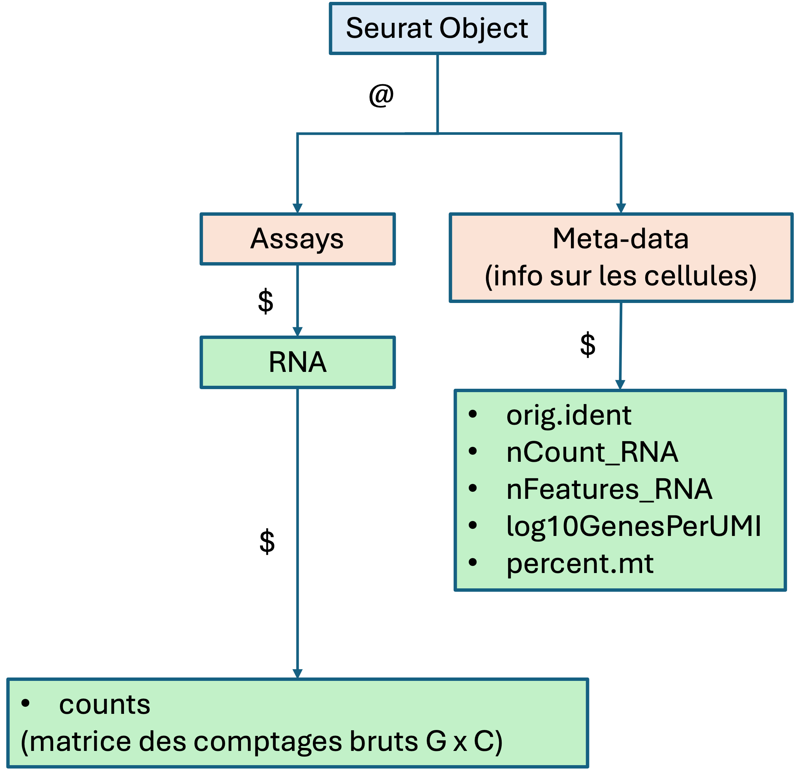


### Filtrage des cellules 

- A l'aide de ces indicateurs, filtrage préliminaire des cellules 

```{r}
dim(pbmc)
pbmc <- subset(pbmc, 
               subset = nFeature_RNA > 200 & 
                        nFeature_RNA < 2500 & 
                        percent.mt < 5)
dim(pbmc)
```

On ne conserve que $C=$ `r ncol(pbmc)` cellules pour la suite de l'étude. 


## Normalisation

### Why do we need to normalize the data ?

- We need to remove technical biases in order to 
  + to be able to compare cells
  
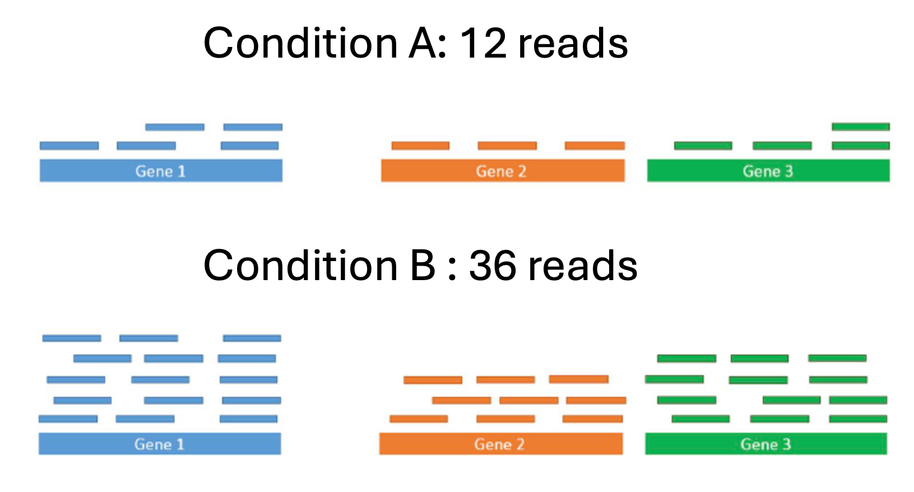

Images from https://www.biostars.org/p/349881/

> The 2 libraries have the same RNA composition.
> But the condition B has 3 times more reads than
the condition A.
We need to correct for differences in library size.

  + to be able to compare genes
  
- Take into account the sparsity of the count matrix  

### Normalization in Seurat

- Many possible strategies for normalized data
- In Seurat, function `NormalizeData(object,normalization.method= ...,)`

  + "LogNormalize" : Feature counts for each cell are divided by the total counts for that cell and multiplied by the scale.factor. This is then natural-log transformed using log1p

  + "CLR" : Applies a centered log ratio transformation
  
  >clr_function <- function(x) {
  >        return(log1p(x = x / (exp(x = sum(log1p(x = x[x > 0]), na.rm   >= TRUE) / length(x = x)))))}
  >log1p(x) computes log(1+x) accurately also for |x| << 1.

  + "RC" (Relative counts): Feature counts for each cell are divided by the total counts for that cell and multiplied by the scale.factor. 
  No log-transformation is applied. 
  For counts per million (CPM) set scale.factor = 1e6

  + "SCTransform" : il faut passer par une autre fonction `SCTransform()`
The use of SCTransform replaces the need to run NormalizeData, FindVariableFeatures, or ScaleData (described below.)
In Seurat v5, SCT v2 is applied by default. You can revert to v1 by setting vst.flavor = 'v1'

<!--
Article: Comparison and evaluation of statistical
error models for scRNA-seq.
Saket Choudhary and Rahul Satija
-->


### Several normalization strategies in Seurat

- In Seurat, function `NormalizeData(object,normalization.method= ...,)`

  + "LogNormalize" : Feature counts for each cell are divided by the total counts for that cell and multiplied by the scale factor ($sf=100000$ default). Then this is log-transformed using $\log(.+1)$
  
$$
\log\left(\frac{x_{gc}}{\underset{g}{\sum} x_{gc}} \times sf +1\right)
$$

  + "CLR" : Applies a centered log ratio transformation
  
$$
\log\left(\frac{x_{gc}}{\exp\left(\frac{1}{G}\underset{g}{\sum}x_{gc}\mathbb{1}_{x_{gc}>0}\right)}  +1\right)
$$

  + "RC" (Relative counts): Feature counts for each cell are divided by the total counts for that cell and multiplied by the scale factor ($s=1e6$ default). But no log-transformation is applied. 

$$
\frac{x_{gc}}{\underset{g}{\sum} x_{gc}} \times s
$$

  + "SCTransform" : implemented in  the function `SCTransform()`. The use of SCTransform replaces the need to run NormalizeData, FindVariableFeatures, or ScaleData (described below). 
  
It utilizes the Pearson residuals from NB regression as input to standard dimension reduction techniques (see Hafemeister and Satija, 2019)
<!--
https://link.springer.com/article/10.1186/s13059-019-1874-1
-->


### Exemple

```{r}
 pbmc <- NormalizeData(pbmc, 
                       normalization.method = "LogNormalize", 
                       scale.factor = 10000)
pbmc@assays$RNA$data[10:20,1:5]
# pbmc[["RNA"]]$data[10:20,1:10]
# dim(pbmc[["RNA"]]$data)
```
  
```{r,echo=F}
aux<-data.frame(brut=apply(pbmc@assays$RNA$counts,2,sum),
                norm=apply(pbmc@assays$RNA$data,2,sum))
ggplot(melt(aux),aes(x=variable,y=value))+
  geom_boxplot()
rm(aux)
```
  
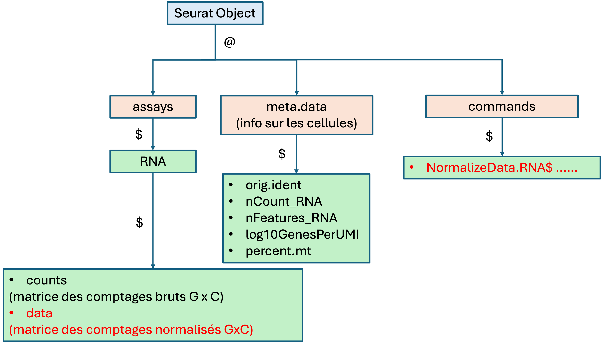  
  
  
### High Variable Gene (HVG)

- Goal: identify a subset of features (genes) exhibiting high variability across cells

- In Seurat, function `FindVariableFeatures(object,selection.method=...,)` 

- Method "vst" (by default):

  1. Fit a line to the relationship of log(variance) and log(mean) using loess ($\Rightarrow \sigma_g$ for each gene $g$)
  
  2. Standardize the feature values (clipped to a maximum value of $\sqrt{C}$)
  $$
  z_{gc} = \frac{x_{gc}-\bar{x}_g}{\sigma_g}
  $$
  3. For each gene, compute the variance of standardized values across all cells. 
2,000 genes with the highest standardized variance as “highly variable.” 

- Other options: 

  + "mean.var.plot" (mvp)
  + "dispersion" (disp): 

```{r}
pbmc <- FindVariableFeatures(pbmc, 
                             selection.method = "vst", 
                             nfeatures = 2000)
length(VariableFeatures(pbmc))
# Identification du top 10 des HVG
top10<-head(VariableFeatures(pbmc), 10)
top10
# plot variable features with and without labels
plot1 <- VariableFeaturePlot(pbmc)
plot2 <- LabelPoints(plot = plot1, points = top10, repel = TRUE)
plot2
```

<!--
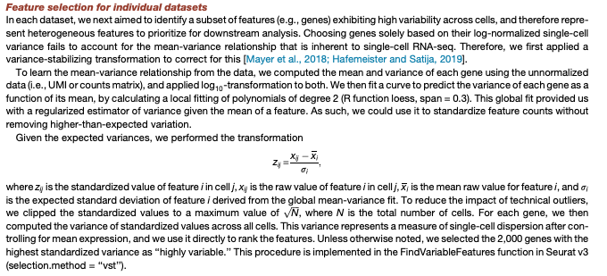
-->

## Réduction de dimension

### Objectifs de la réduction de dimension

- Minimize curse of dimensionality\vspace*{0.3cm}
- Allow visualization\vspace*{0.3cm}
- Reduce computational time\vspace*{0.3cm}
- \ldots \vspace*{0.3cm}
- But beware of the interpretations after!\vspace*{0.3cm}

### Several methods

Several methods are available:

- **PCA**, 
- **t-SNE**, 
- **UMAP**, 
- ZIFA, 
- ZINB-WaVe, 
- SWNE, 
- Diffusion MAP, 
- pCMF, 
- $\ldots$ 

Comparaison des rendus avec [Sleepwalk](https://anders-biostat.github.io/sleepwalk/#)

### Scaling the data

Vignette Seurat: 

- Shifts the expression of each gene, so that the mean expression across cells is 0
- Scales the expression of each gene, so that the variance across cells is 1
This step gives equal weight in downstream analyses, so that highly-expressed genes do not dominate
- The results of this are stored in pbmc[["RNA"]]$scale.data
By default, only variable features are scaled.
You can specify the features argument to scale additional features

Dans Seurat, fonction `ScaleData()`

```{r}
pbmc<-ScaleData(pbmc) #features = Default is variable features J (=2000 par défaut)
dim(pbmc@assays$RNA$scale.data) # on a plus que J=2000 gènes 
#d'où des soucis (warnings) dans la suite mais c'est plus rapide pour la formation ????
pbmc[["RNA"]]$scale.data[10:20,1:10]
```

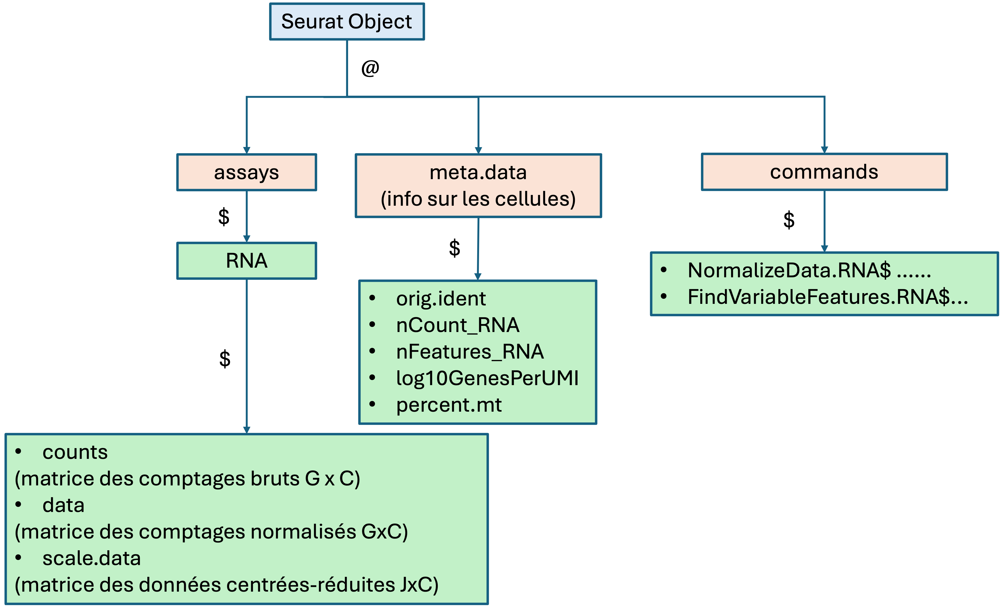


### Principe de PCA

- PCA = Principal Component Analysis
- Réduire l'espace tout en conservant "assez dinformation"
- Méthode de réduction linéaire : Les composantes principales (méta-variables) sont des combinaisons linéaires des variables initiales (ici les gènes)
- Correspond à la diagonalisation de la matrice de corrélation (si ACP centrée réduite)
  + valeur propre $\lambda_s$ = inertie des individus projetés sur l'axe porté par un vecteur propre normé associé $v_s$ (axe principal)
  + composante principale $C_s$ contient les coordonnées des projetés des individus sur l'axe engendré par $v_s$

```{r}
#| echo: FALSE
#| fig-height: 4

set.seed(1234)
R<-matrix(c(1,1,-1,1),ncol=2)/sqrt(2)
Sigma<-R%*%diag(c(4,0.5))%*%t(R)
X<-as.data.frame(rmvnorm(50,mean=rep(0,2),sigma=Sigma))
#ggplot(X,aes(x=V1,y=V2))+
#  geom_point()+
#  theme_minimal()+xlab("x")+ylab("y")+xlim(-4,4)+ylim(-5,5)
```

```{r}
#| fig-height: 6
proj<-function(X,a,b,xl,xmin=-4,xmax=4,ymin=-5,ymax=5){
  v<-c(a,b)
  v<-v/sqrt(sum(v^2))
  
  dfline=data.frame(xx=seq(-xl,xl,0.01),yy=(v[2]/v[1]*seq(-xl,xl,0.01)))
  aux<-as.matrix(X)%*%as.matrix(v)
  Y<-matrix(rep(v,each=nrow(X)),ncol=2)
  for (i in 1:nrow(Y))
    Y[i,]<-aux[i]*Y[i,]
  dfproj=data.frame(xp=Y[,1],yp=Y[,2])
  
  line_df <- data.frame(
  x = X[,1],
  y = X[,2],
  xend =Y[,1],
  yend = Y[,2]
  )

  g<-ggplot(X,aes(x=V1,y=V2))+
    geom_point()+
    geom_line(data=dfline,aes(x=xx,y=yy))+
    geom_point(data=dfproj,aes(x=xp,y=yp),col="red")+
    geom_segment(
    data = line_df, 
    mapping = aes(x=x, y=y, xend=xend, yend=yend), 
    inherit.aes = FALSE,linetype="dotted"
  )+
  xlab("")+ylab("")+xlim(xmin,xmax)+ylim(ymin,ymax)+
  ggtitle(paste("Inertie axiale= ",round(sum(diag(var(Y))),2),sep=""))
  return(g)
}

res<-PCA(X,scale.unit = F,graph=F)
g1<-proj(X,a=res$var$coord[1,1],b=res$var$coord[2,1],xl=4)
g2<-proj(X,a=cos(2*pi/3),b=sin(2*pi/3),xl=3)

grid.arrange(g1,g2,ncol=2)
```


```{r}
#| fig.width: 8
#| fig.height: 4 
#| fig.cap: Analyse en composante principale du jeu de données iris sur les deux premières dimensions.
X <- iris[,c(1,3)]
# Run PCA
pca <- princomp(X)
load <- loadings(pca)
slope <- load[2, ] / load[1, ]
cmeans <- apply(X, 2, mean)
intercept <- cmeans[2] - (slope * cmeans[1])


# Plot perpendicular segments

df<-data.frame(X)
img1 <- ggplot(df,aes(Sepal.Length,Petal.Length))+
  geom_point()+
  geom_point(data = cmeans %>% t %>%  as.data.frame(),aes(Sepal.Length,Petal.Length),col="red",size=4) +
  geom_abline(intercept=intercept[1],slope=slope[1],linetype="dashed")+
  geom_abline(intercept=intercept[2],slope=slope[2],linetype="dashed")+
  theme_classic(base_size=16) + coord_fixed()


img2 <- (pca$scores) %>% as.data.frame() %>% ggplot(aes(Comp.1,-1*Comp.2)) + geom_point()+ theme_classic(base_size=16) + geom_vline(xintercept = 0,linetype="dashed")+ geom_hline(yintercept = 0,linetype="dashed")

design <- "AB"
wrap_plots(A=img1,B=img2, design = design,tag_level="new")+  plot_annotation(tag_levels = "A")
```

- Les axes de l'ACP sont projetés sur les dimensions d'origine et passent par la moyenne (rouge).

- Projection des points dans l'espace de l'ACP.


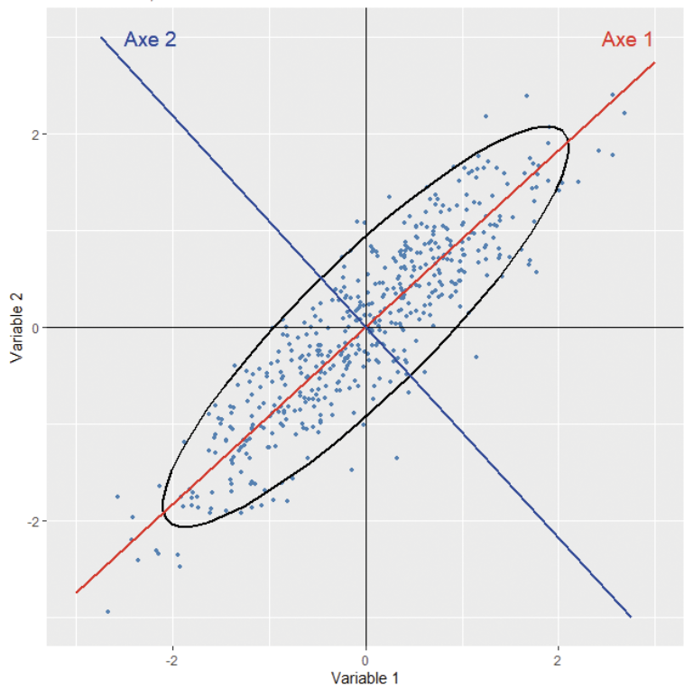

### PCA with Seurat

-   L'ACP est faite sur les données centrées réduites à l'aide de la fonction `runPCA()`

```{r}
#| message: false
pbmc <- RunPCA(pbmc, features = VariableFeatures(object = pbmc))
  #str(pbmc@reductions$pca)
```

- On retrouve les coordonnées des projections des cellules sur les différents axes principaux (composantes principales)

```{r}
head(pbmc@reductions$pca@cell.embeddings)    #head(pbmc[["pca"]]@cell.embeddings)
#head(Embeddings(pbmc@reductions$pca))
```

et visualisation de la projection des cellules dans le premier plan factoriel avec la fonction `DimPlot()` : 

```{r}
DimPlot(pbmc, reduction = "pca") + NoLegend()
```

- Les corrélations entre les gènes et les composantes principales

```{r}
head(pbmc@reductions$pca@feature.loadings)
corrplot(pbmc[["pca"]]@feature.loadings[c("CST3", "TYROBP", "LST1", "AIF1", "FTL"),1:5],method="ellipse")
```

- Gènes les plus corrélés avec les composantes principales : 

```{r}
print(pbmc[["pca"]], dims = 1:3, nfeatures = 5)
VizDimLoadings(pbmc, dims = 1:2, reduction = "pca",nfeatures=20)
```

```{r}
DimHeatmap(pbmc, dims = 1:2, cells = 500, balanced = TRUE)
```

- Pour choisir le nombre de composantes principales à conserver :

```{r}
ElbowPlot(pbmc)
```

Mais probleme de l'ACP sur les données scRNAseq

- C'est une méthode de réduction de dimension linéaire
- Elle est sensible à la sparsité des données scRNAseq 
- C'est utilisé pour réduire le jeu de données pour certaines méthodes dans la suite de l'étude

<!--
### t-SNE

- Méthode de réduction de dimension non-linéaire 
(Maaten and Hinton, 2008; Van Der Maaten, 2014)

- 

t-Distributed stochastic neighbor embedding is a state-of-the-art dimensionality reduction algorithm for non-linear data representation that produces a low-dimensional distribution of high-dimensional data (Maaten and Hinton, 2008; Van Der Maaten, 2014). It excels at revealing local structure in high-dimensional data. t-SNE is based on the SNE (Hinton and Roweis, 2002), which starts from converting the high-dimensional Euclidean distances between data points into conditional probabilities that represent similarities. The main idea and the modifications of t-SNE are (1) the symmetric version of SNE and (2) using a Student’s t distribution to compute the similarity between two points in the low-dimensional space.

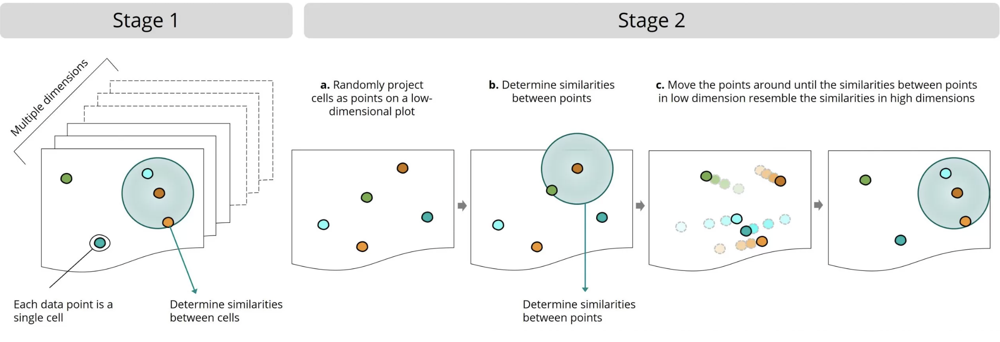

Dans Seurat, en raison de la dimension des données, part avec les données de l'ACP (reduction="pca" par défaut). Détermination des voisins par KNN puis t-SNE avec la fonction `RunTSNE()`
-->

### t-SNE 

- t-SNE = t-Distributed stochastic neighbor embedding 
(Maaten and Hinton, 2008; Van Der Maaten, 2014)

- Dimensionality reduction algorithm for non-linear data representation that produces a low-dimensional distribution of high-dimensional data

<!--
@article{maaten2008visualizing,
  title={Visualizing data using t-SNE},
  author={Maaten, Laurens van der and Hinton, Geoffrey},
  journal={Journal of machine learning research},
  volume={9},
  number={Nov},
  pages={2579--2605},
  year={2008}
}

@article{van2014accelerating,
  title={Accelerating t-SNE using tree-based algorithms},
  author={Van Der Maaten, Laurens},
  journal={The journal of machine learning research},
  volume={15},
  number={1},
  pages={3221--3245},
  year={2014},
  publisher={JMLR. org}
}
-->


<!--
https://www.scdiscoveries.com/blog/knowledge/what-is-t-sne-plot/
-->

::: {.callout-warning title="Seurat" icon=false}

- function `RunTSNE()` 

- initial data = PCA coordinates  (reduction="pca" default) +  KNN neighbours (`FindNeighbors()`)
:::


### Example

```{r}
#| message: false
pbmc <- FindNeighbors(pbmc, dims = 1:10)
pbmc <- RunTSNE(pbmc, dims = 1:10)
DimPlot(pbmc, reduction = "tsne")+NoLegend()
```

::::{.columns}
:::{.column}
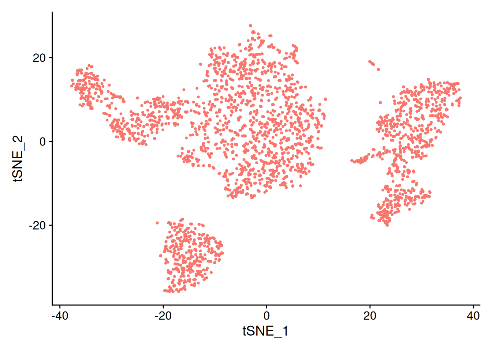
:::
:::{.column}
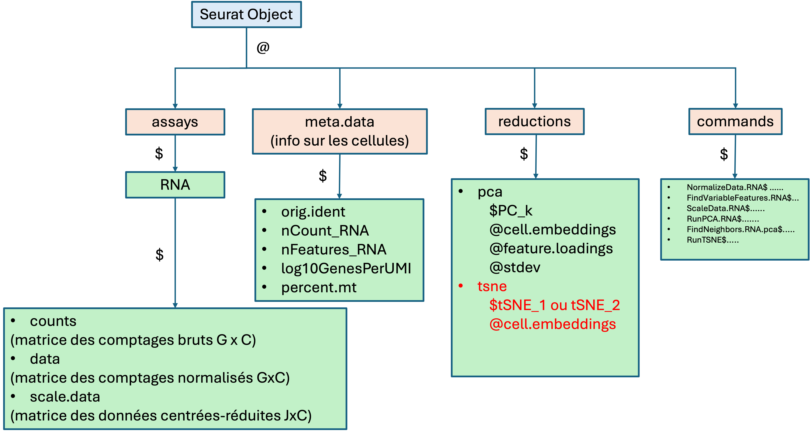
:::
::::


### UMAP

-   utilise au démarrage les coordonnées de PCA
-   explication du principe de l'UMAP
-   illustration

Uniform manifold approximation and projection is a dimension reduction technique that can be used not only for visualization similarly to t-SNE but also for general non-linear dimension reduction. Compared with t-SNE, UMAP retains more global structure with superior run-time performance (McInnes et al., 2018; Becht et al., 2019).

The algorithm is based on three assumptions about the data: (a) the data are uniformly distributed on the Riemannian manifold; (b) the Riemannian metric is locally constant (or can be approximated); and (c) the manifold is locally connected. According to these assumptions, the manifold with fuzzy topology can be modeled. The embedding is found by searching the low-dimensional projection of the data with the closest equivalent fuzzy topology. In terms of model construction, UMAP includes two steps: (1) building a particular weighted k-neighbor graph using the nearest-neighbor descent algorithm (Dong et al., 2011) and (2) computing a low-dimensional representation which can preserve desired characteristics of this graph.


```{r}
#| message: false
pbmc <- FindNeighbors(pbmc, dims = 1:10)
pbmc <- RunUMAP(pbmc, dims = 1:10)
DimPlot(pbmc, reduction = "umap")+NoLegend()
```

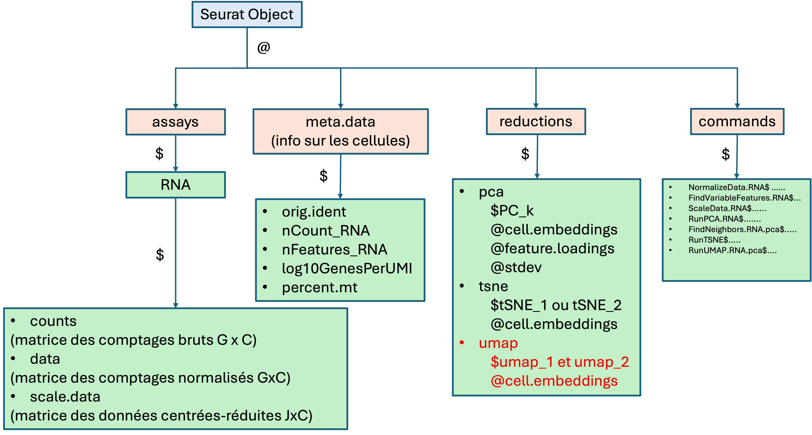

<!--
https://biostatsquid.com/pca-umap-tsne-comparison/

UMAP, also non-linear, is similar to t-SNE in preserving local structure but is faster, scalable, and tends to maintain both local and global relationships better. UMAP is often preferred for larger datasets or when maintaining both global and local patterns is crucial, while t-SNE might be used for finer cluster analysis in smaller datasets. PCA is generally faster and preferred for preliminary analysis or when the relationships in the data are primarily linear.


-->


### UMAP

- UMAP = **Uniform manifold approximation and projection** 

- It is a general non-linear dimension reduction method

- Compared with t-SNE, UMAP retains more global structure with superior run-time performance 

(McInnes et al., 2018; Becht et al., 2019).

<!--
@article{mcinnes2018umap,
  title={Umap: Uniform manifold approximation and projection for dimension reduction},
  author={McInnes, Leland and Healy, John and Melville, James},
  journal={arXiv preprint arXiv:1802.03426},
  year={2018}
}

@article{becht2019dimensionality,
  title={Dimensionality reduction for visualizing single-cell data using UMAP},
  author={Becht, Etienne and McInnes, Leland and Healy, John and Dutertre, Charles-Antoine and Kwok, Immanuel WH and Ng, Lai Guan and Ginhoux, Florent and Newell, Evan W},
  journal={Nature biotechnology},
  volume={37},
  number={1},
  pages={38--44},
  year={2019},
  publisher={Nature Publishing Group}
}
-->

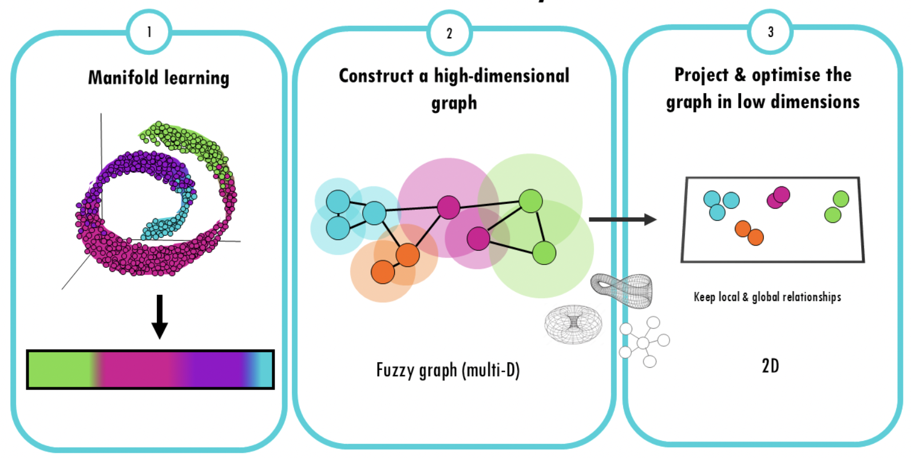

- For more details : 

  + A youtube video describing the process can be found [here](https://www.youtube.com/watch?v=jth4kEvJ3P8).

  + A comparison between PCA, t-SNE and UMAP can be found [here](https://biostatsquid.com/pca-umap-tsne-comparison/)

### Example

::: {.callout-warning title="Seurat" icon=false}

- function `RunUMAP()` 

- initial data = PCA coordinates  (reduction="pca" default) +  KNN neighbours (`FindNeighbors()`)
:::


```{r}
pbmc <- FindNeighbors(pbmc, dims = 1:10)
pbmc <- RunUMAP(pbmc, dims = 1:10)
DimPlot(pbmc, reduction = "umap")+NoLegend()
```


::::{.columns}
:::{.column}
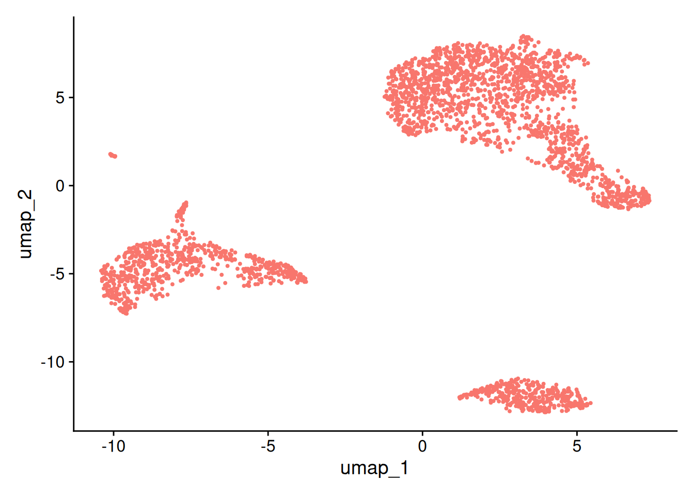

:::
:::{.column}


:::
::::


## Cells clustering

### Clustering objective

- Goal : organizing cells into groups whose members are similar in some way 
- Fundamental question : What is meant by "similar cells"? 
- The number of clusters $K$ is unknown 
- Typical clustering methods : 
	+ Hierarchical clustering (CAH)
	+ Kmeans clustering
	+ Graph-based clustering
	+ Model-based clustering 
	+ ...


### Some methods

<!--
\textcolor{blue}{\tiny \cite{Duo18}}\\
\textcolor{blue}{\tiny \cite{Freytag18}}\\
\textcolor{blue}{\tiny \cite{petegrosso2019}}\\ 
\textcolor{blue}{\tiny \cite{zhang2020review}}
-->

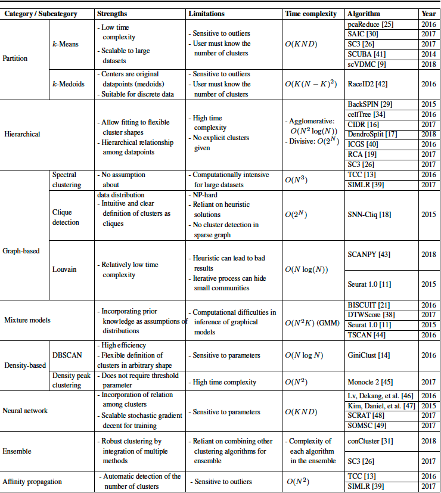

### Louvain's algorithm in Seurat

::: {.callout-note title="Steps of Louvain algo" icon=false}
- Calculate k-nearest neighbors and construct the SNN graph
(based on Euclidean distance in PCA space)
- Optimize a modularity function to determine clusters 
- Sensitive choice of the resolution parameter $r$
(involve the number of clusters K)
:::

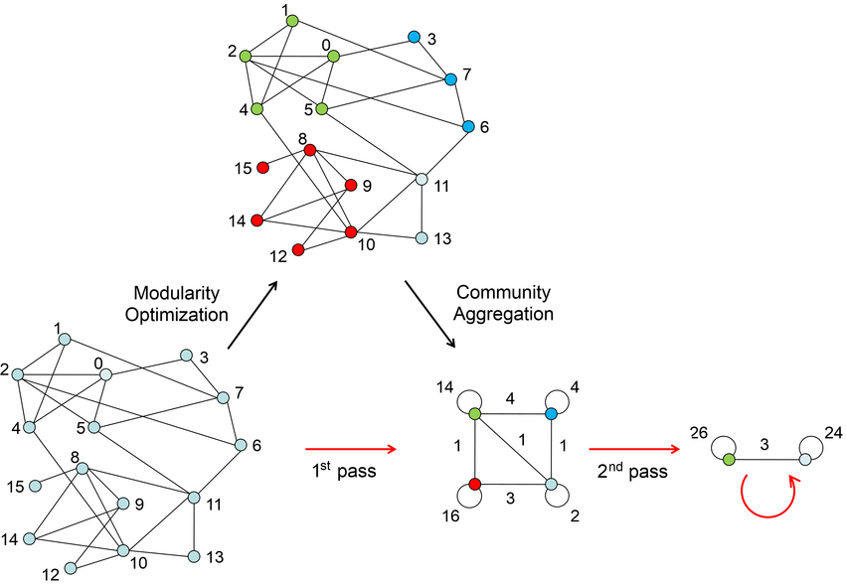

::: {.callout-warning title="Seurat" icon=false}
-   Functions `FindNeighbour()` +  `FindCluster()`
:::

### Example

- Clustering for resolution $0.5$

```{r}
pbmc <- FindClusters(pbmc, resolution = 0.5)
```


:::: {.columns}
::: {.column width="50%"}
```{r}
table(pbmc@meta.data$seurat_clusters)
DimPlot(pbmc, reduction = "umap") 
```
:::
::: {.column width="50%"}
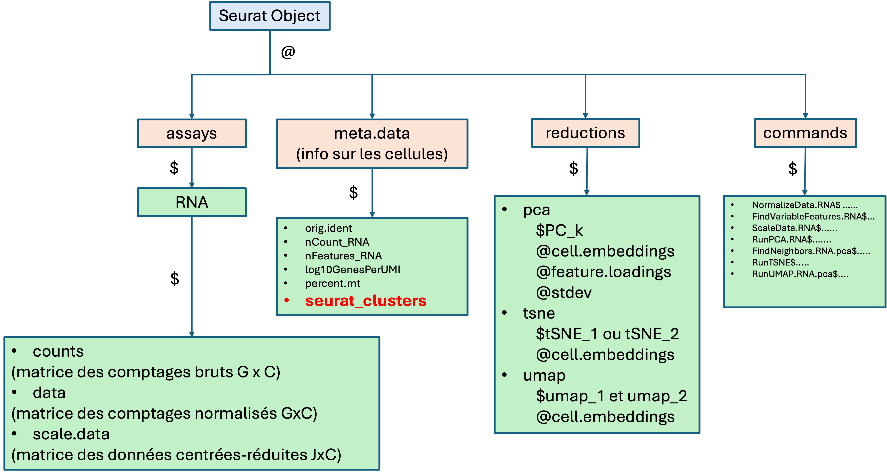
:::
::::

### Choice of the resolution?

- Run clustering for several resolution values 

```{r}
list_resolutions<-seq(0.1,1,by=0.1)
for (r in list_resolutions){
    pbmc <- FindClusters(pbmc, resolution = r, cluster.name = paste0("Clusters_", r))
}
head(pbmc@meta.data)
```

```{r}
NbCluster_gg(pbmc, list_resolutions)
```


- Comparison of the several clusterings using

:::: {.columns}
::: {.column width="50%"}
+ Adjusted Rand Index (ARI)

```{r}
source("Cours/FunctionsAux.R")
ari_matrix <- ARI_matrix(pbmc, list_resolutions)
heatmapari(ari_matrix, list_resolutions)
```
:::
::: {.column width="50%"}
+ `clustree` for visualization
```{r}
clusterplot<-clustree(pbmc, prefix = "Clusters_")
clusterplot
```
:::
::::

```{r}
#| message: false
#| eval: false
#| echo: false

# Visualisation ARI - fonctions auxiliaires
source("Cours/FunctionsAux.R")
ari_matrix <- ARI_matrix(pbmc, list_resolutions)
heatmapari(ari_matrix, list_resolutions)

# Nb de clusters
NbCluster_gg(pbmc, list_resolutions)

# Comparaison visuelle des clusterings obtenus
p1<-DimPlot(pbmc,reduction = "umap",group.by = "Clusters_0.3")
p2<-DimPlot(pbmc,reduction = "umap",group.by = "Clusters_0.4")
p1+p2

# clustree
clusterplot<-clustree(pbmc, prefix = "Clusters_")
clusterplot
```

<!--
- On peut tous les stocker dans objet SO mais attention à bien positionner celui étudié pour la suite avec la fonction `Idents()`. 

```{r}
colnames(pbmc@meta.data)
```
-->

### Cell clustering for after

- We focus on the clustering for resolution $0.5$ 


```{r}
Idents(pbmc)<-pbmc@meta.data$Clusters_0.5
pbmc$seurat_clusters<-pbmc@meta.data$Clusters_0.5
```

:::: {.columns}
::: {.column width="50%"}
```{r}
EffPlot(pbmc,resolution=0.5,clustname="seurat_clusters")
```
:::
::: {.column width="50%"}
```{r}
DimPlot(pbmc,reduction = "umap")
```
:::
::::

## Cluster markers 

### Principle 

- Goal: find genes differentially expressed between 2 cell groups ($\mathcal G_1$ and $\mathcal G_2$)

- Markers for a single cluster $\mathcal C_k$, compared to all other cells: 
$\mathcal G_1 = \mathcal C_k$ and
$\mathcal G_2 = \{1,\ldots,n\} \backslash \mathcal C_k$

- For each gene, we want to test a differentially expression 

::: {.callout-warning title="Seurat" icon=false}
- Functions `FindMarkers()` and `FindAllMarkers()`
:::


### Several situations 

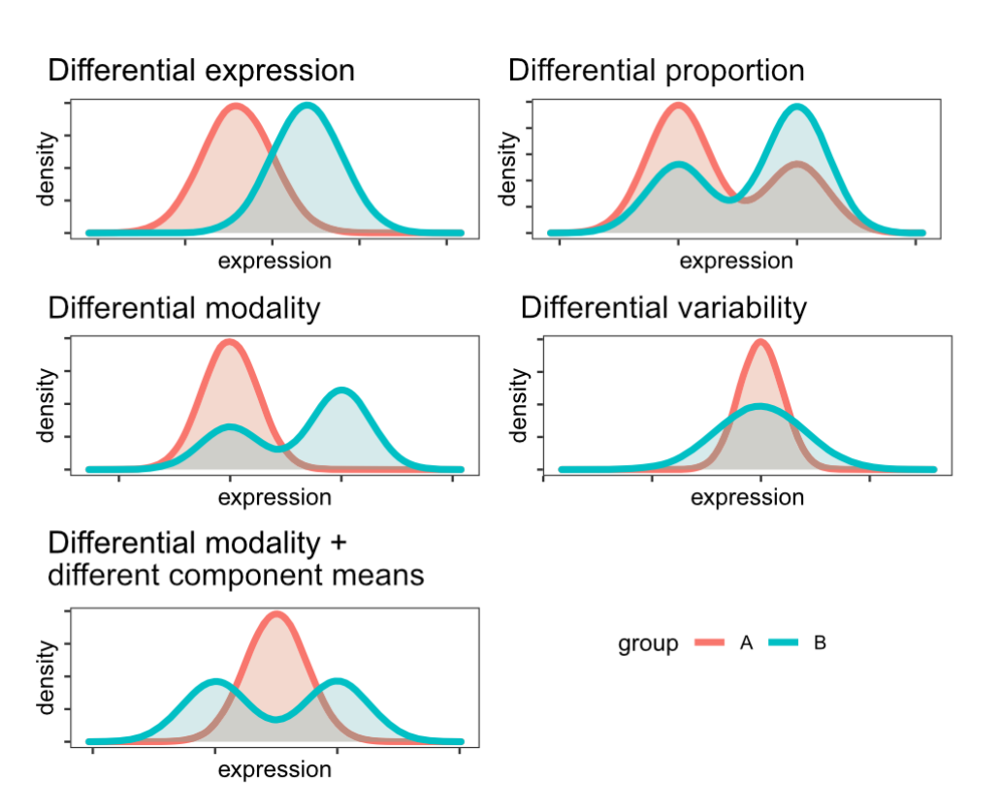{width="80%" fig-align="center"}


### Wilcoxon test 

:::: {.columns}
::: {.column width="50%"}

- For each gene, test whether the two expression samples $\underline{X}^{(1)}=(X_{gc}; c\in\mathcal G_1)$ and
$\underline{X}^{(2)}=(X_{gc}; c\in\mathcal G_2)$
have the same probability distribution

- Wilcoxon test: non parametric test based on ranks

- Multiple testing correction (Bonferroni in Seurat)
:::
::: {.column width="50%"}

```{r}
#| echo: false
#| warning: false
#| message: false
pbmcaux<-pbmc
pbmcaux$aux<-pbmc$Clusters_0.5
pbmcaux$aux[pbmc$Clusters_0.5==3]<-"3"
pbmcaux$aux[pbmc$Clusters_0.5!=3]<-"0"
Idents(pbmcaux)<-pbmcaux$aux
RidgePlot(pbmcaux,features=c("CD79A","GNG5"))
```

:::
::::

### Example for Cluster 3

```{r}
#| warning: false
#| message: false
GeneMkWilcox3<-FindMarkers(pbmc,
                           test.use = "wilcox",
                           ident.1 = 3,
                           logfc.threshold=0.5)
head(GeneMkWilcox3)
```

- Number of gene markers: 

```{r}
sum(GeneMkWilcox3$p_val_adj<0.01)
```


### Double-dipping problem

- Too many marker genes detected $\Longrightarrow$ double-dipping problem

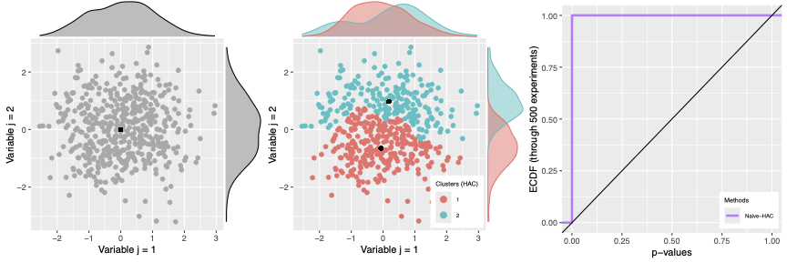

- Still an open problem in statistics, no solutions yet for scRNAseq data analysis

### AUC method

::::{.columns}
:::{.column width="40%"}
- AUC = area under the ROC curve ($2\times |\mbox{AUC}-0.5|$ )
- Warning: it is not a testing procedure! 
- Difficult to choose a threshold!
:::
:::{.column width="60%"}
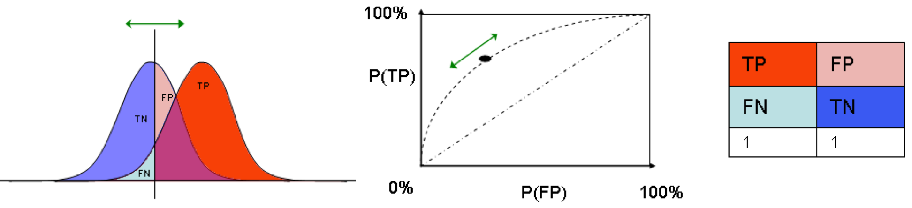{width="80%" fig-align="center"}

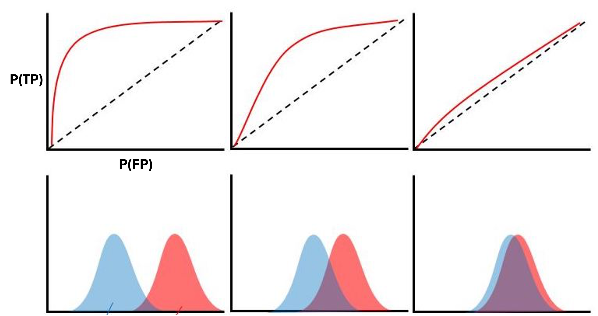{width="80%" fig-align="center"}
:::
::::


### Example

```{r}
GeneMkAUC3<-FindMarkers(pbmc,
                        test.use = "roc",
                        ident.1 = 3,
                        logfc.threshold=0.5)
head(GeneMkAUC3)
ggplot(GeneMkAUC3,aes(x=myAUC))+
  geom_density()
```


### Other available indicators

- pct.1 / pct.2 : $\%$ of cells in which gene $g$ is expressed ($X_{cg}>0$) in group $\mathcal G_1$ / $\mathcal G_2$

- avg$\_$log2FC : log fold-change of the average expression between the two groups

- All these indicators require the choice of a threshold 

```{r}
head(GeneMkAUC3)
```


### Example
::::{.columns}
:::{.column width="40%"}
- Selection of markers for Cluster 3 

```{r}
#| echo: false
GeneMkAUC3$gene<-rownames(GeneMkAUC3)
GeneMkWilcox3$gene<-rownames(GeneMkWilcox3)
```

```{r}
#| echo: true
GeneMkCl3_merge<-merge(GeneMkAUC3,GeneMkWilcox3[,c(1,5,6)],by="gene")
head(GeneMkCl3_merge)

SelectGene<-GeneMkCl3_merge%>%
    filter(myAUC>0.9)%>%
    filter(avg_log2FC>2)%>%
    arrange(desc(myAUC))
```

```{r}
head(SelectGene)
```
:::
:::{.column width="50%"}
- Visualization with `VlnPlot()`, 
`FeaturePlot()`, `DotPlot()`, `RidgePlot()`

```{r}
VlnPlot(pbmc, features = SelectGene$gene[1:2], layer = "data", log = TRUE)
```

```{r}
FeaturePlot(pbmc, features = SelectGene$gene[1:2])
```

```{r}
DotPlot(pbmc,features = SelectGene$gene[1:3])
```

```{r}
#| message: false
#| warning: false
RidgePlot(pbmc,features = SelectGene$gene[1:2])
```
:::
::::

### Gene markers for all clusters

- Function `FindAllMarkers()` to detect gene markers for each cluster (based on `FindMarkers()`).

<!--
> Attention, ne lancez pas les fonctions suivantes en raison du temps calcul
> Chargez la sauvegarde des fichiers obtenus
-->

::::{.columns}
:::{.column width="45%"}

```{r}
#| eval: false
GeneMkWilcox<-FindAllMarkers(pbmc,
            logfc.threshold = 0.1,
            test.use = "wilcox")
```

```{r}
#| eval: false
#| echo: false
saveRDS(GeneMkWilcox, file = "data/GeneMkWilcox.rds")
```

```{r}
#| echo: false
GeneMkWilcox<-readRDS("data/GeneMkWilcox.rds")
GeneMkWilcox$gene<-rownames(GeneMkWilcox)
```

```{r}
head(GeneMkWilcox)
table(GeneMkWilcox$cluster)
```
:::
:::{.column width="45%"}

```{r}
#| eval: false
GeneMkAUC<-FindAllMarkers(pbmc,
          logfc.threshold = 0.1,
          test.use = "roc")
```

```{r}
#| eval: false
#| echo: false
saveRDS(GeneMkAUC, file = "data/GeneMkAUC.rds")
```

```{r}
#| echo: false
GeneMkAUC<-readRDS("data/GeneMkAUC.rds")
GeneMkAUC$gene<-rownames(GeneMkAUC)
```

```{r}
head(GeneMkAUC)
table(GeneMkAUC$cluster)
```
:::
::::

```{r}
#| eval: false
#| echo: false
## PB de merge car gene et cluster ! A revoir
## il faut merger les genes pour chaque cluster fixé
    ##GeneMk_merge<-merge(GeneMkAUC,GeneMkWilcox[,c(1,5,6,7)],by="gene")
    ##head(GeneMk_merge)
GeneMk_merge<-GeneMkWilcox%>%
              select(c("p_val","p_val_adj","cluster","gene"))%>%
              left_join(GeneMkAUC,by=c("gene","cluster"))
GeneMk_merge<-GeneMk_merge[,c(4,3,1:2,5:10)]%>%
              arrange(cluster,desc(myAUC))
GeneMk_merge[65:75,]  ## pourquoi ce n'est pas dans GeneMkAUC ???   
```

```{r}
ggplot(GeneMkAUC,aes(x=cluster,y=myAUC))+
  geom_violin(aes(color=cluster))+
  stat_summary(fun.y=function(z) { quantile(z,0.9) }, geom="point", shape=20, size=2)
```


```{r}
#| message: false
#| warning: false
GeneMkAUC %>%
    group_by(cluster) %>%
    arrange(desc(myAUC))%>%
    filter(avg_log2FC > 1) %>%
    slice_head(n = 10) %>%
    ungroup() -> top10
DoHeatmap(pbmc, features = top10$gene) + NoLegend()
```


### Other cases

- In the case where $\mathcal G_1 \bigcup \mathcal G_2 \neq \{1,\ldots,C\}$: 
Use `FindMarkers()` by specifying  `ident.1` et `ident.2`

- For instance, between two clusters $\mathcal G_1 = \mathcal C_k$  and $\mathcal G_2 = \mathcal C_{k'}$

```{r}
GeneMkCl3vsCl5<-FindMarkers(pbmc,
                  test.use="roc",
                  ident.1=3,
                  ident.2=5,
                  logfc.threshold=0.1)
```

```{r}
#| echo: false
ggplot(GeneMkCl3vsCl5,aes(x=myAUC))+
  geom_density()
```

```{r}
SelectCl3vsCl5<-GeneMkCl3vsCl5%>%
  filter(myAUC>0.9)%>%
  arrange(desc(avg_log2FC))
head(SelectCl3vsCl5)
```

```{r}
#| echo: false
DoHeatmap(pbmc[,which(pbmc$Clusters_0.5 %in% c(3,5))], 
          features = rownames(SelectCl3vsCl5),
          assay = "RNA",slot = "data") + 
  NoLegend()
```

```{r}
#| echo: false
#| eval: false
FeaturePlot(pbmc, features = rownames(SelectCl3vsCl5)[1:3])
DotPlot(pbmc,features = rownames(SelectCl3vsCl5)[1:10])+
  theme(axis.text.x = element_text(angle = 90, vjust = 0.5, hjust=1))
RidgePlot(pbmc,features = rownames(SelectCl3vsCl5)[1])
```

# Analysis pipeline for two (or more) biological conditions

## Example and Seurat object

### Example

- Data `ifnb` available in SeuratData

```{r}
#| warning: false
#| message: false
library(SeuratData)
InstallData("ifnb")
ifnb <- LoadData("ifnb")
```

- The object contains data from human PBMC from two conditions, interferon-stimulated and control cells (stored in the stim column in the object metadata). 

```{r}
ifnb
dim(ifnb)    
table(ifnb$orig.ident) #table(ifnb$stim)
```

- Aim: integrate the two conditions, so that we can jointly identify cell subpopulations across datasets, and then explore how each group differs across conditions

### Multiple "layers"

::: {.callout-warning title="Seurat" icon=false}
- In Seurat v5, all the data in one Seurat object, but simply split it into multiple layers 

- In previous versions, data had to be represented in different Seurat objects.
:::

```{r}
ifnb[["RNA"]] <- split(ifnb[["RNA"]], f = ifnb$stim)
ifnb

dim(ifnb[["RNA"]]$counts.CTRL)
dim(ifnb[["RNA"]]$counts.STIM)
```

<!--
A réfléchir : 
- Si on a deux fichiers de données diff : 2 objets Seurat normalisés séparément puis intégration
- Dans l'exemple ifnb c'est sous forme de layers (Seurat V5)

https://nbisweden.github.io/workshop-scRNAseq/labs/seurat/seurat_03_integration.html
-->


<!--
#### With default command from seurat data

```{r}
# devtools::install_github('satijalab/seurat-data')
InstallData("ifnb")
ifnb <- LoadData("ifnb")
```


```{r}
Assays(ifnb)
Layers(ifnb) # difference entre count et data ??

dim(ifnb)    # 14053 13999
table(ifnb$orig.ident)
table(ifnb$stim)
```

On splitte selon les deux conditions (counts.CTRL et counts.STIM)

```{r}
ifnb[["RNA"]] <- split(ifnb[["RNA"]], f = ifnb$stim)
ifnb

dim(ifnb[["RNA"]]$counts.CTRL)
dim(ifnb[["RNA"]]$counts.STIM)
```
-->

### From count matrices to Seurat object

- Create a Seurat object for each condition with `CreateSeuratObject()`

- Create a common variable "condition" (here `stim` in the example) 

- Merge the Seurat object with `merge()`

- See the construction of `ifnb` in exercice. 

<!--
##### Method 1 from `?ifnb`

```bash
cd data/
wget https://www.dropbox.com/s/79q6dttg8yl20zg/immune_alignment_expression_matrices.zip
unzip immune_alignment_expression_matrices.zip
rm immune_alignment_expression_matrices.zip
```

```{r}
ctrl.data <- data.frame(data.table::fread('data/immune_control_expression_matrix.txt.gz',sep = "\t"),row.names=1)
stim.data <- data.frame(data.table::fread('data/immune_stimulated_expression_matrix.txt.gz',sep = "\t"),row.names=1)
ctrl <- Seurat::CreateSeuratObject(counts = ctrl.data, project = 'CTRL', min.cells = 5)
ctrl$stim <- 'CTRL'
ctrl <- subset(x = ctrl, subset = nFeature_RNA > 500)
stim <- Seurat::CreateSeuratObject(counts = stim.data, project = 'STIM', min.cells = 5)
stim$stim <- 'STIM'
stim <- subset(x = stim, subset = nFeature_RNA > 500)
ifnb <- merge(x = ctrl, y = stim)
Seurat::Project(object = ifnb) <- 'ifnb'
annotations <- readRDS(file = system.file('extdata/annotations/annotations.Rds', package = 'ifnb.SeuratData'))
ifnb <- Seurat::AddMetaData(object = ifnb, metadata = annotations)
```


```{r}
Assays(ifnb)
Layers(ifnb) # difference entre count et data ??

dim(ifnb)    # 14053 13999
table(ifnb$orig.ident)
table(ifnb$stim)
```

On splitte selon les deux conditions (counts.CTRL et counts.STIM)

```{r}
dim(ifnb[["RNA"]]$counts.CTRL)
dim(ifnb[["RNA"]]$counts.STIM)
```

##### Method 2 from GEO and using `Read10X`

From https://www.ncbi.nlm.nih.gov/geo/query/acc.cgi?acc=GSE96583

```bash
wget https://www.ncbi.nlm.nih.gov/geo/download/\?acc\=GSM2560248\&format\=file\&file\=GSM2560248%5F2%2E1%2Emtx%2Egz -O GSM2560248_2.1.mtx.gz
wget https://www.ncbi.nlm.nih.gov/geo/download/?acc=GSM2560248&format=file&file=GSM2560248%5Fbarcodes%2Etsv%2Egz -O GSM2560248_barcodes.tsv.gz
wget https://www.ncbi.nlm.nih.gov/geo/download/?acc=GSM2560249&format=file&file=GSM2560249%5F2%2E2%2Emtx%2Egz -O GSM2560249_2.2.mtx.gz
wget https://www.ncbi.nlm.nih.gov/geo/download/?acc=GSM2560249&format=file&file=GSM2560249%5Fbarcodes%2Etsv%2Egz -O GSM2560249_barcodes.tsv.gz

```

```r
expression_matrix_ctrl <- ReadMtx(
  mtx = "data/GSM2560248_2.1.mtx.gz", features = "data/GSE96583_batch2.genes.tsv.gz",
  cells = "data/GSM2560248_barcodes.tsv.gz"
)

ctrl <- Seurat::CreateSeuratObject(counts = expression_matrix_ctrl, project = 'CTRL', min.cells = 5)
ctrl$stim <- 'CTRL'
ctrl <- subset(x = ctrl, subset = nFeature_RNA > 500)

expression_matrix_stim <- ReadMtx(
  mtx = "data/GSM2560249_2.2.mtx.gz", features = "data/GSE96583_batch2.genes.tsv.gz",
  cells = "data/GSM2560249_barcodes.tsv.gz"
)

stim <- Seurat::CreateSeuratObject(counts = expression_matrix_stim, project = 'STIM', min.cells = 5)
stim$stim <- 'STIM'
stim <- subset(x = stim, subset = nFeature_RNA > 500)


ifnb <- merge(x = ctrl, y = stim)
Seurat::Project(object = ifnb) <- 'ifnb'

```

> **Warning** Issues with this method:
> Some cell names are duplicated across objects provided. Renaming to enforce unique cell names.

```r
table(colnames(ctrl[["RNA"]]) %in%colnames(stim[["RNA"]]))

FALSE  TRUE 
 7926   112 
```
-->

## Normalization and HVG

### Normalization

- Perform normalization as described above for each counts matrix 
(data.CTRL and data.STIM)

```{r}
#| message: false
#| warning: false
ifnb <- NormalizeData(ifnb)
```

::::{.columns}
:::{.column width="45%"}

\tiny
```{r}
ifnb@assays$RNA$data.CTRL[1:10,1:5]
```
\normalsize

:::
:::{.column width="45%"}

\tiny
```{r}
ifnb@assays$RNA$data.STIM[1:10,1:5]
```
\normalsize

:::
::::

### HVG 

- High variable genes are computed for each condition 

```{r}
#| message: false
#| warning: false
ifnb <- FindVariableFeatures(ifnb)
```

::::{.columns}
:::{.column width="45%"}
```{r}
head(VariableFeatures(ifnb,assay="RNA",layer="counts.CTRL"))
```
:::
:::{.column width="45%"}
```{r}
head(VariableFeatures(ifnb,assay="RNA",layer="counts.STIM"))
```
:::
::::

```{r}
#| echo: false
top10<-head(VariableFeatures(ifnb), 10)
plot1<-VariableFeaturePlot(ifnb)
plot2 <- LabelPoints(plot = plot1, points = top10, repel = TRUE)
plot2
```

### Dimension reduction without integration

```{r}
ifnb <- ScaleData(ifnb)
ifnb <- RunPCA(ifnb)
ifnb <- FindNeighbors(ifnb, dims = 1:30, reduction = "pca")
ifnb <- RunUMAP(ifnb, dims = 1:30, 
                reduction = "pca", 
                reduction.name = "umap.unintegrated")
DimPlot(ifnb, reduction = "umap.unintegrated", group.by = c("stim"))
```

## Integration

### Several types of integration

::::{.columns}
:::{.column width="50%"}
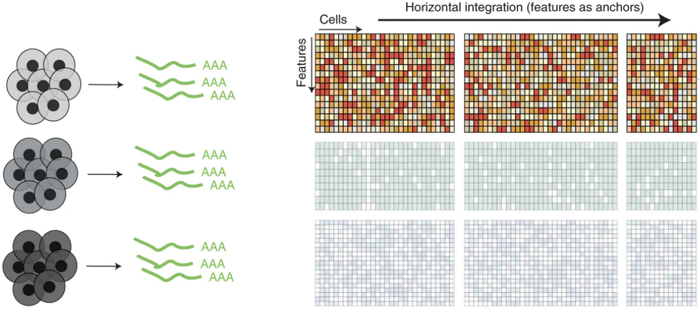{width="90%"}
:::
:::{.column width="50%"}
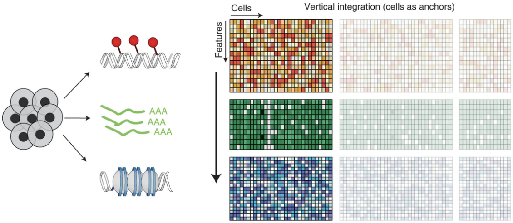{width="90%"}
:::
::::

- In the following, we focus on horizontal integration

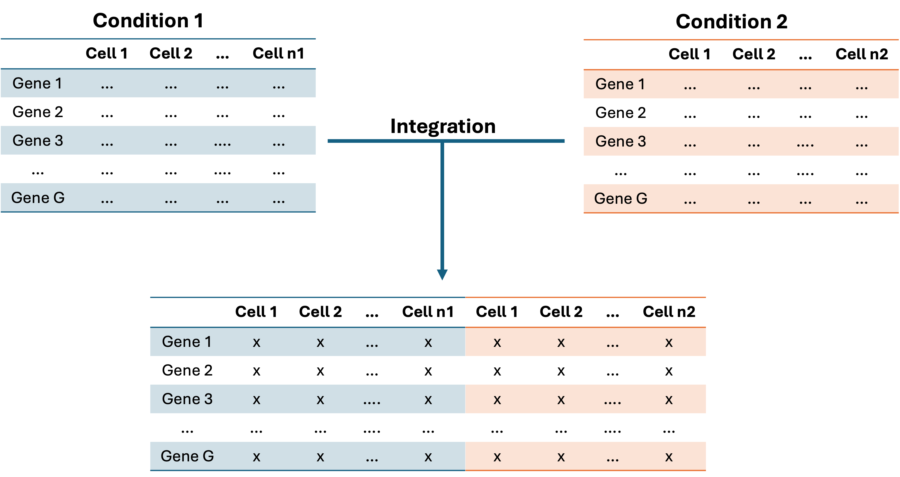{width="40%"}

### Overview

A FAIRE
https://www.sciencedirect.com/science/article/pii/S101684782300016X


### Integration in Seurat

<!--
>We now aim to integrate data from the two conditions, so that cells from the same cell type/subpopulation will cluster together.

>We often refer to this procedure as intergration/alignment. When aligning two genome sequences together, identification of shared/homologous regions can help to interpret differences between the sequences as well. Similarly for scRNA-seq integration, our goal is not to remove biological differences across conditions, but to learn shared cell types/states in an initial step - specifically because that will enable us to compare control stimulated and control profiles for these individual cell types.

>The Seurat v5 integration procedure aims to return a single dimensional reduction that captures the shared sources of variance across multiple layers, so that cells in a similar biological state will cluster. The method returns a dimensional reduction (i.e. integrated.cca) which can be used for visualization and unsupervised clustering analysis. For evaluating performance, we can use cell type labels that are pre-loaded in the seurat_annotations metadata column.
-->

::: {.callout-warning title="Seurat" icon=false}
- Function `IntegrateLayers()` 
- Four integration methods :

  + Anchor-based CCA integration (method=CCAIntegration)<br>
  CCA = Canonical Correlation Analysis

  + Anchor-based RPCA integration (method=RPCAIntegration)
  + Harmony (method=HarmonyIntegration)
  + FastMNN (method= FastMNNIntegration)
:::

- See also the R package [SeuratIntegrate](https://github.com/cbib/Seurat-Integrate/)  (Specque et al, 2024)

<!--
@article{seuratintegrate,
  title={SeuratIntegrate: an R package to facilitate the use of integration methods with Seurat},
  author={Specque, Florian and Barr{\'e}, Aur{\'e}lien and Nikolski, Macha and Chalopin, Domitille},
  journal={bioRxiv},
  pages={2024--12},
  year={2024},
  publisher={Cold Spring Harbor Laboratory}
}
-->


  
### CCA integration

CCA = Canonical Correlation Analysis

Goal: find linear combinations of the genes in both datasets that produce correlated cell embeddings in a lower-dimensional space

For more details, see for instance [this page]( https://divingintogeneticsandgenomics.com/post/cca-alignment/) or [this blog](https://xinmingtu.cn/blog/2022/CCA_dual_PCA/)

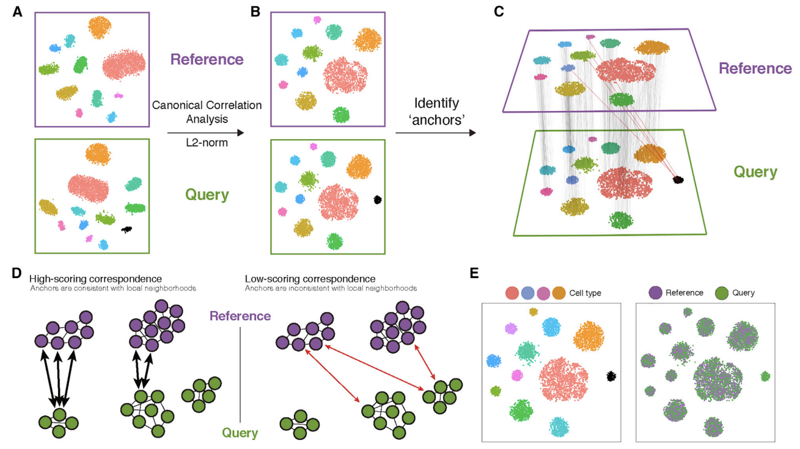


<!--
>The goal of CCA here is to find linear combinations of the genes in both datasets that produce correlated cell embeddings in a lower-dimensional space. Essentially, we aim to align the two datasets by identifying the correlated patterns in gene expression that are shared between the two sets of cells.

> CCA c'est Dual PCA pour deux datasets. SVD $X Y^\top = U\Sigma V$ $Z_X = U \Sigma^{1/2}$ et $Z_Y = V \Sigma^{1/2}$
> $X$ et $Y$ deux jeux de données avec les mêmes gènes $X\in\mathbb R^{n\times g}$ et $Y\in\mathbb R^{m\times g}$
> find $a\in\mathbb R^g$ et $b\in\mathbb R^g$ such that $u=X^\top a$ et $v = Y^\top b$ where $u$ and $v$ are the canonical variates, and the goal is to maximize the correlation $\mbox{corr}(u,v)$. 
> Détail ici : https://divingintogeneticsandgenomics.com/post/cca-alignment/

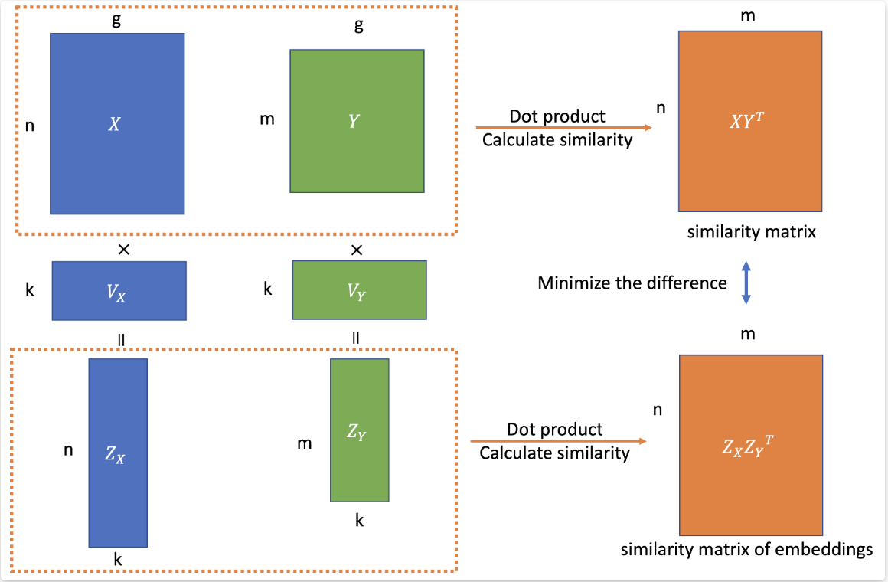
Explication: https://xinmingtu.cn/blog/2022/CCA_dual_PCA/
-->

### Example

```{r}
#| message: false
#| warning: false
ifnb_cca <- IntegrateLayers(object = ifnb, 
                        method = CCAIntegration, 
                        orig.reduction = "pca", 
                        new.reduction = "integrated.cca",
                        verbose = FALSE)
# re-join layers after integration
ifnb_cca[["RNA"]] <- JoinLayers(ifnb_cca[["RNA"]])
# Dimension reduction
ifnb_cca <- FindNeighbors(ifnb_cca, 
                      reduction = "integrated.cca", 
                      dims = 1:30)
ifnb_cca <- RunUMAP(ifnb_cca, 
                dims = 1:30, 
                reduction = "integrated.cca")
```

```{r}
#| echo: false
p1<-DimPlot(ifnb, reduction = "umap.unintegrated", group.by = c("stim"))
p2<-DimPlot(ifnb_cca, reduction = "umap", group.by = c("stim"))
p1+p2
```


### Harmony integration

- R Package [Harmony](https://github.com/immunogenomics/harmony), Python package [harmonypy](https://github.com/slowkow/harmonypy?tab=readme-ov-file),  Korsunsky et al., Nature methods, 2019

<!--
@article{korsunsky2019fast,
  title={Fast, sensitive and accurate integration of single-cell data with Harmony},
  author={Korsunsky, Ilya and Millard, Nghia and Fan, Jean and Slowikowski, Kamil and Zhang, Fan and Wei, Kevin and Baglaenko, Yuriy and Brenner, Michael and Loh, Po-ru and Raychaudhuri, Soumya},
  journal={Nature methods},
  volume={16},
  number={12},
  pages={1289--1296},
  year={2019},
  publisher={Nature Publishing Group US New York}
}
-->

::: {.callout-note title="Algorithm" icon=false}
Input:  PCA embedding of cells + batch assignments of cells

Iterate 2 steps

  1. maximum diversity clustering
  2. mixture model based linear batch correction

Return: batch corrected embedding
:::


<!--
> The Harmony algorithm inputs a PCA embedding (Z) of cells, along with their batch assignments (ϕ), and returns a batch corrected embedding (). This algorithm, summarized as Algorithm 1 below, iterates between two complementary stages: maximum diversity clustering (Algorithm 2) and a mixture model based linear batch correction (Algorithm 3). The clustering step uses the batch corrected embedding to compute a soft assignment of cells to clusters, encoded in the matrix R. The correction step uses these soft clusters to compute a new corrected embedding from the original one. Efficient implementations of Harmony, including the clustering and correction subroutines, are available as part of an R package at https://github.com/immunogenomics/harmony.

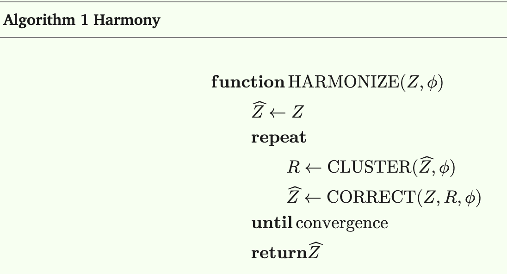
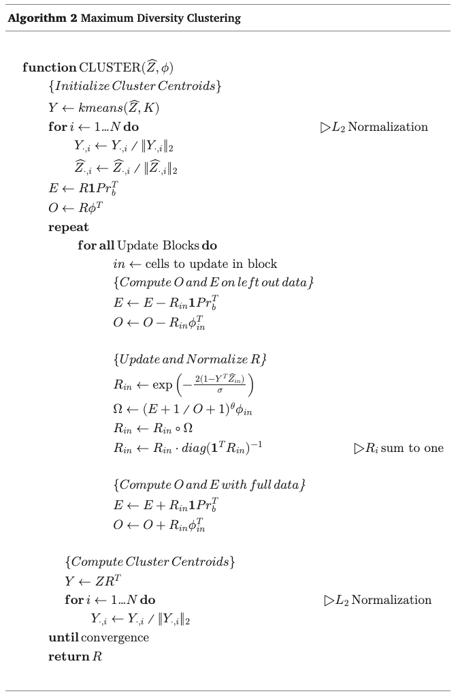
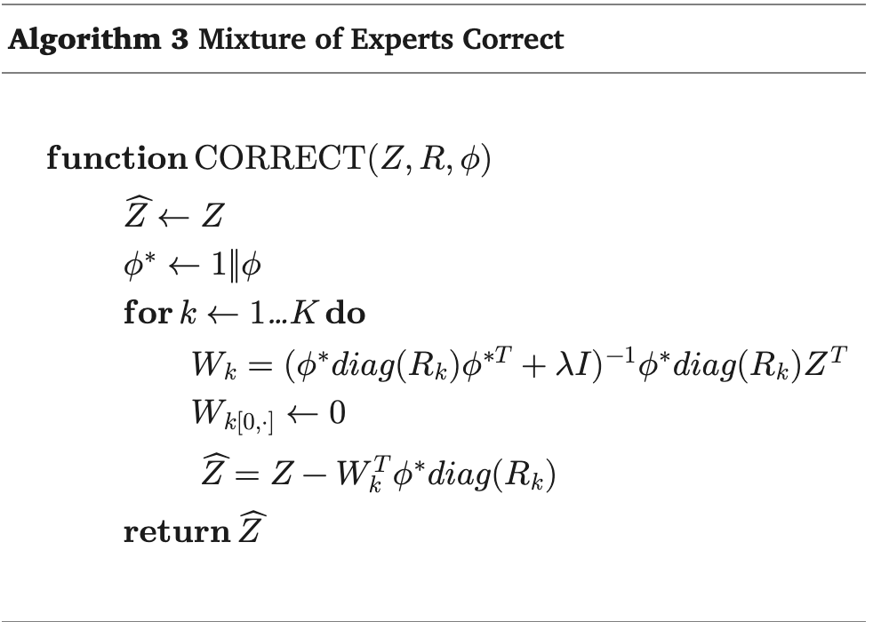
-->


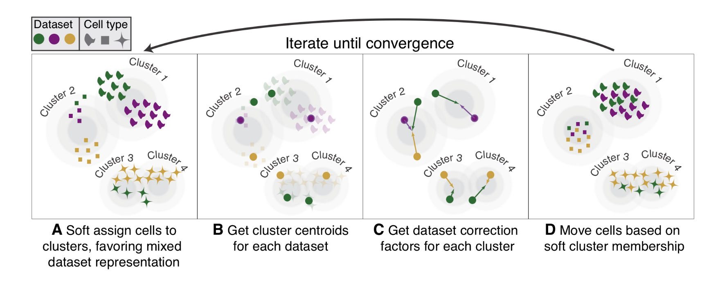  


- To see the iterations of Harmony, see [here](https://slowkow.com/notes/harmony-animation/)


### Example

```{r}
#| warning: false
#| message: false
ifnb_h <- IntegrateLayers(object = ifnb, 
                        method = HarmonyIntegration, 
                        orig.reduction = "pca", 
                        new.reduction = "integrated.harmony",
                        verbose = FALSE)
# re-join layers after integration
ifnb_h[["RNA"]] <- JoinLayers(ifnb_h[["RNA"]])
# Dimension reduction
ifnb_h <- FindNeighbors(ifnb_h, 
                      reduction = "integrated.harmony", 
                      dims = 1:30)
ifnb_h <- RunUMAP(ifnb_h, 
                dims = 1:30, 
                reduction = "integrated.harmony")
```

```{r}
#| echo: false
p3<-DimPlot(ifnb_h, reduction = "umap", group.by = c("stim"))
p1+p3
```

## Clustering

### Example

- In the following, we use the CCA integration 

- Clustering with Louvain algorithm (see above)

```{r}
ifnb<-ifnb_cca
ifnb <- FindClusters(ifnb, resolution = 0.5)
```

- Vizualisation

```{r}
#| echo: false
DimPlot(ifnb, 
        reduction = "umap", 
        group.by = c("stim", "seurat_clusters"))

DimPlot(ifnb, reduction = "umap", split.by = "stim")
```

- Cluster composition

```{r}
#| echo: false
Aux<-melt(table(Idents(ifnb),ifnb$stim))
colnames(Aux)<-c("Cluster","Condition","len")
ggplot(data=Aux, aes(x=Cluster, y=len, fill=Condition)) +
  geom_bar(stat="identity", position=position_dodge())+
  geom_text(aes(label=len), vjust=1.6, color="white",
            position = position_dodge(0.9), size=3.5)+
  theme_minimal()
```

### Annotations

- For this example, a cell annotation is available 

```{r}
Idents(ifnb)<- "seurat_annotations"
table(Idents(ifnb))
```

```{r}
#| echo: false
DimPlot(ifnb, 
        reduction = "umap", 
        group.by = c("seurat_annotations"))
```


## Differential analysis

### Warnings

- The term "differential analysis" is vague/large

- It is important to well formulate the question and know the data design 

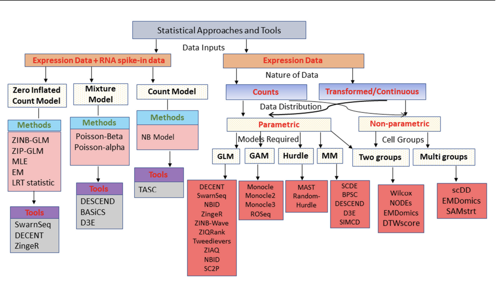

<!--
@article{das2022differential,
  title={Differential expression analysis of single-cell RNA-Seq data: current statistical approaches and outstanding challenges},
  author={Das, Samarendra and Rai, Anil and Rai, Shesh N},
  journal={Entropy},
  volume={24},
  number={7},
  pages={995},
  year={2022},
  publisher={MDPI}
}
--> 

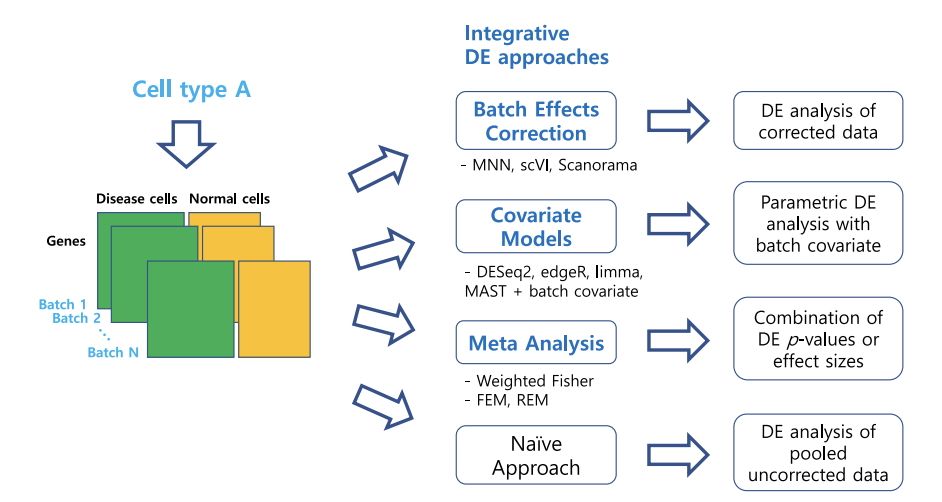

<!--
@article{nguyen2023benchmarking,
  title={Benchmarking integration of single-cell differential expression},
  author={Nguyen, Hai CT and Baik, Bukyung and Yoon, Sora and Park, Taesung and Nam, Dougu},
  journal={Nature Communications},
  volume={14},
  number={1},
  pages={1570},
  year={2023},
  publisher={Nature Publishing Group UK London}
}
-->


### Q: Identify conserved cell type markers

- Goal: identify canonical cell type marker genes that are conserved across conditions

- In function `FindConservedMarkers()`: DE gene testing for each condition + combine pvalues, based on a function of MetaDE R package (by default, Tippett's method). For more details on the methods available in metap package, see [here](https://cran.r-project.org/web/packages/metap/vignettes/compare.pdf).

### Example for the cluster of NK cells 

```{r}
#| warning: false
#| message: false
Idents(ifnb) <- "seurat_annotations"
NK.markers <- FindConservedMarkers(ifnb, 
                                   ident.1 = "NK", 
                                   grouping.var = "stim", 
                                   verbose = FALSE)
head(NK.markers)
```

<!--
> To identify canonical cell type marker genes that are conserved across conditions, we provide the FindConservedMarkers() function. This function performs differential gene expression testing for each dataset/group and combines the p-values using meta-analysis methods from the MetaDE R package. For example, we can calculated the genes that are conserved markers irrespective of stimulation condition in cluster 6 (NK cells).
calcul FindMarkers pour la classe "NK" contre les autres seulement pour les cellules de STIM et celles de CTRL. 
Puis, combine les pvaleurs selon une fonction du package metap. 
(Fishers combined p-value or others from the metap package)).
Par défaut dans la fonction FindConservedMarkers, meta.method = metap::minimump  Wilkinson's method 
(wilkinsonp(p, r = 1, alpha, log.p))

ref pour les méthodes de combinaison de pvaleurs
https://cran.r-project.org/web/packages/metap/vignettes/compare.pdf

-->

```{r}
#| echo: false
NK.markers<-NK.markers%>%
  arrange(minimump_p_val)

DotPlot(ifnb, features = rownames(NK.markers)[1:10], 
        cols = c("blue", "red"), dot.scale = 8, split.by = "stim") +
    RotatedAxis()
```


### Q: DE genes between two conditions

- Goal: identify genes whose expression varies between the two conditions (cell types combined)

- Design in the example `ifnb` (see exercice): 
  + two conditions: STIM vs CTRL
  + add the sample IDs of each cell 
  
  

```{r}
#| echo: false
# load the inferred sample IDs of each cell
ctrl <- read.table(url("https://raw.githubusercontent.com/yelabucsf/demuxlet_paper_code/master/fig3/ye1.ctrl.8.10.sm.best"), head = T, stringsAsFactors = F)
stim <- read.table(url("https://raw.githubusercontent.com/yelabucsf/demuxlet_paper_code/master/fig3/ye2.stim.8.10.sm.best"), head = T, stringsAsFactors = F)
info <- rbind(ctrl, stim)

# rename the cell IDs by substituting the '-' into '.'
info$BARCODE <- gsub(pattern = "\\-", replacement = "\\.", info$BARCODE)

# only keep the cells with high-confidence sample ID
info <- info[grep(pattern = "SNG", x = info$BEST), ]

# remove cells with duplicated IDs in both ctrl and stim groups
info <- info[!duplicated(info$BARCODE) & !duplicated(info$BARCODE, fromLast = T), ]

# now add the sample IDs to ifnb 
rownames(info) <- info$BARCODE
info <- info[, c("BEST"), drop = F]
names(info) <- c("donor_id")
ifnb <- AddMetaData(ifnb, metadata = info)

# remove cells without donor IDs
ifnb$donor_id[is.na(ifnb$donor_id)] <- "unknown"
ifnb <- subset(ifnb, subset = donor_id != "unknown")
```

```{r}
table(ifnb$donor_id)
```


<!--
Pour la suite, création d'une colonne Condition_TypeCellulaire

```{r}
ifnb$celltype.stim <- paste(ifnb$seurat_annotations, ifnb$stim, sep = "_")
table(ifnb$celltype.stim)
```
-->


### Wilcoxon test (Naive method)

```{r}
#| message: false
#| warning: false
Idents(ifnb)<-ifnb$stim
res1_Wilcox <- FindMarkers(object = ifnb, 
                           ident.1 = "STIM", 
                           ident.2 = "CTRL",
                           test.use = "wilcox")
```

Percent of genes with $pvaladj<0.01$: `r round(100*mean(res1_Wilcox$p_val_adj<0.01),2)` $\%$

```{r}
#| message: false
#| warning: false
genetop_wilcox1<-res1_Wilcox %>%
   filter(p_val_adj<0.01)%>%
   arrange(desc(abs(avg_log2FC)))%>%
   top_n(100)
```

```{r}
#| echo: false
DotPlot(ifnb,features=rownames(genetop_wilcox1)[1:10],group.by="stim")+
  theme(axis.text.x = element_text(angle = 90, vjust = 0.5, hjust=1))
```


### DESeq2 - pseudo-bulk method 

<!--
@article{love2014moderated,
  title={Moderated estimation of fold change and dispersion for RNA-seq data with DESeq2},
  author={Love, Michael I and Huber, Wolfgang and Anders, Simon},
  journal={Genome biology},
  volume={15},
  pages={1--21},
  year={2014},
  publisher={Springer}
}
-->


- From single-cell data to pseudo-bulk data: function `AggregateExpression()`

```{r}
#| message: false
#| warning: false
pseudo_ifnb1 <- AggregateExpression(ifnb, 
                                   assays = "RNA", 
                                   return.seurat = T, 
                                   group.by = c("stim", "donor_id"))

head(pseudo_ifnb1)
```


:::: {.columns}
::: {.column width="45%"}
- Using DESeq2 with Seurat object

```{r}
#| warning: false
#| message: false

Idents(pseudo_ifnb1)<-"stim"
bulk.cond1 <- FindMarkers(object = pseudo_ifnb1, 
                         ident.1 = "STIM", 
                         ident.2 = "CTRL",
                         test.use = "DESeq2")
```

Percent of genes with $pvaladj<0.01$: 
`r round(100*length(which(bulk.cond1$p_val_adj<0.01))/nrow(bulk.cond1),2)` $\%$

:::
::: {.column width="50%"}

- Using DESeq2 on pseudo-bulk data

```{r}
#| warning: false
#| message: false

library(DESeq2)
cts1<-as.matrix(pseudo_ifnb1@assays$RNA$counts)
coldata1<-pseudo_ifnb1@meta.data
dds1 <- DESeqDataSetFromMatrix(countData = cts1,
                      colData = coldata1,
                      design= ~ donor_id + stim) 
dds1 <- DESeq(dds1,fitType = c("local"))                      
resDEseq1<-results(dds1,name="stim_STIM_vs_CTRL")
```

Percent of genes with $pvaladj<0.01$: 
`r round(100*length(which(resDEseq1$padj<0.01))/nrow(resDEseq1),2)` $\%$

```{r}
#| warning: false
#| message: false

genetopDEseq1<-as.data.frame(resDEseq1) %>%
   filter(padj<0.01)%>%
   arrange(desc(abs(log2FoldChange)))%>%
   top_n(200)
```

```{r}
#| echo: false
#| #| warning: false
#| message: false

DotPlot(ifnb,features=rownames(genetopDEseq1)[1:10],group.by="stim")+
  theme(axis.text.x = element_text(angle = 90, vjust = 0.5, hjust=1))


library(pheatmap)
pheatmap(pseudo_ifnb1@assays$RNA$scale.data[rownames(genetopDEseq1),],
         cluster_cols = FALSE,       
         scale = "column",              
         show_rownames = FALSE,
         show_colnames = TRUE)
```

:::
::::

### NEBULA (specific single-cell method)

<!--
@article{he2021nebula,
  title={NEBULA is a fast negative binomial mixed model for differential or co-expression analysis of large-scale multi-subject single-cell data},
  author={He, Liang and Davila-Velderrain, Jose and Sumida, Tomokazu S and Hafler, David A and Kellis, Manolis and Kulminski, Alexander M},
  journal={Communications biology},
  volume={4},
  number={1},
  pages={629},
  year={2021},
  publisher={Nature Publishing Group UK London}
}
-->

- NEBULA = NEgative Binomial mixed model Using a Large-sample Approximation ([He et al., 2021](https://www.nature.com/articles/s42003-021-02146-6))


```{r}
#| message: false
#| warning: false

library(nebula)
ifnb_neb1<-scToNeb(obj=ifnb,assay="RNA",id="donor_id",pred=c("stim","seurat_annotations"))
df1 = model.matrix(~stim+seurat_annotations, data=ifnb_neb1$pred)
data_g = group_cell(count=ifnb_neb1$count,id=ifnb_neb1$id,pred=df1) 
re1 = nebula(data_g$count,data_g$id,pred=data_g$pred)
```

Percent of genes with $pvaladj<0.01$: 
`r round(100*mean(p.adjust(re1$summary$p_stimSTIM,method="BH")<0.01),2)` $\%$


```{r}
#| echo: false
#| message: false
#| warning: false

ifnbNebSumm1<-re1$summary
ifnbNebSumm1$padjStim<-p.adjust(re1$summary$p_stimSTIM,method="BH")
ifnbNebSumm1<-ifnbNebSumm1%>%
            filter(padjStim <0.01)%>%
            arrange(desc(abs(logFC_stimSTIM)))  
#colnames(ifnbNebSumm1)
```

```{r}
#| echo: false
#| message: false
#| warning: false
genetopNeb1<-ifnbNebSumm1%>%
   top_n(200)

DotPlot(ifnb,features=genetopNeb1$gene[1:30],group.by="stim")+
  theme(axis.text.x = element_text(angle = 90, vjust = 0.5, hjust=1))

pheatmap(pseudo_ifnb1@assays$RNA$scale.data[genetopNeb1$gene,],
         cluster_cols = FALSE,       
         scale = "column",              
         show_rownames = FALSE,
         show_colnames = TRUE)
```

### Comparison

```{r}
library(ggvenn)
ggvenn(list(DEseq2=rownames(genetopDEseq1),
            Nebula=genetopNeb1$gene,
            Wilcox=rownames(genetop_wilcox1)))
```


### Q: DE genes between two conditions for "CD14 Mono" cells 

- We only consider the cellular type "CD14 Mono"

- Goal: identify genes whose expression varies between the two conditions for the fixed cellular type "CD14 Mono"

- We compare Wilkoxon, DESeq2 and NEBULA 


```{r}
#| echo: false
#| message: false
#| warning: false

ICD14Mono<-which(ifnb$seurat_annotations=="CD14 Mono")
ifnb$celltype.stim <- paste(ifnb$seurat_annotations, ifnb$stim, sep = "_")
Idents(ifnb)<-ifnb$celltype.stim
res2_Wilcox <- FindMarkers(object = ifnb, 
                           ident.1 = "CD14 Mono_STIM", 
                           ident.2 = "CD14 Mono_CTRL",
                           test.use = "wilcox")

#mean(res2_Wilcox$p_val_adj<0.01)

genetop_wilcox2<-res2_Wilcox %>%
   filter(p_val_adj<0.01)%>%
   arrange(desc(abs(avg_log2FC)))%>%
   top_n(100)

#DotPlot(ifnb[,ICD14Mono],features=rownames(genetop_wilcox2)[1:10],group.by="stim")+
#  theme(axis.text.x = element_text(angle = 90, vjust = 0.5, hjust=1))
```

```r
#| echo: false
#| message: false
#| warning: false

pseudo_ifnb2 <- AggregateExpression(ifnb[,ICD14Mono], 
                                   assays = "RNA", 
                                   return.seurat = T, 
                                   group.by = c("stim", "donor_id", "seurat_annotations"))
colnames(pseudo_ifnb2@meta.data)<-c("orig.ident","stim","donor_id")

cts2<-as.matrix(pseudo_ifnb2@assays$RNA$counts)
coldata2<-pseudo_ifnb2@meta.data
dds2 <- DESeqDataSetFromMatrix(countData = cts2,
                              colData = coldata2,
                              design= ~ donor_id + stim) 
dds2 <- DESeq(dds2,fitType = c("local"))                      
resultsNames(dds2) # lists the coefficients

resDEseq2<-results(dds2,name="stim_STIM_vs_CTRL")
#length(which(resDEseq2$padj<0.01)) / nrow(resDEseq2)
```


```r
#| echo: false
#| message: false
#| warning: false

genetopDEseq2<-as.data.frame(resDEseq2) %>%
   filter(padj<0.01)%>%
   arrange(desc(abs(log2FoldChange)))%>%
   top_n(100)

#DotPlot(pseudo_ifnb2,features=rownames(genetopDEseq2)[1:10],group.by="stim")+
#  theme(axis.text.x = element_text(angle = 90, vjust = 0.5, hjust=1))

#pheatmap(pseudo_ifnb2@assays$RNA$scale.data[rownames(genetopDEseq2),],
#         cluster_cols = FALSE,       
#         scale = "column",              
#         show_rownames = FALSE,
#         show_colnames = TRUE)
```


```r
#| echo: false
#| message: false
#| warning: false

Idents(ifnb)<-ifnb$seurat_annotations
ifnb_neb2<-scToNeb(obj=ifnb[,ICD14Mono],assay="RNA",id="donor_id",pred=c("stim"))
df2 = model.matrix(~stim, data=ifnb_neb2$pred)
data_g2 = group_cell(count=ifnb_neb2$count,id=ifnb_neb2$id,pred=df2) # il faut grouper les cellules par indiv avant de faire nebula
re2 = nebula(data_g2$count,data_g2$id,pred=data_g2$pred)

#mean(p.adjust(re2$summary$p_stimSTIM,method="BH")<0.01)

ifnbNebSumm2<-re2$summary
ifnbNebSumm2$padjStim<-p.adjust(re2$summary$p_stimSTIM,method="BH")
ifnbNebSumm2<-ifnbNebSumm2%>%
            filter(padjStim <0.01)%>%
            arrange(desc(abs(logFC_stimSTIM)))  
#head(ifnbNebSumm2)
```

```r
#| echo: false
#| message: false
#| warning: false

genetopNeb2<-ifnbNebSumm2%>%
   top_n(100)

#DotPlot(ifnb,features=genetopNeb2$gene[1:10],group.by="stim")+
#  theme(axis.text.x = element_text(angle = 90, vjust = 0.5, hjust=1))


#library(pheatmap)
#pheatmap(pseudo_ifnb2@assays$RNA$scale.data[genetopNeb2$gene,],
#         cluster_cols = FALSE,       
#         scale = "row",              
#         show_rownames = FALSE,
#         show_colnames = TRUE)
```

:::: {.columns}
::: {.column width="45%"}
```r
#| echo: false
#| message: false
#| warning: false
library(ggvenn)
ggvenn(list(DEseq2=rownames(genetopDEseq2),
            Nebula=genetopNeb2$gene,
            Wilcox=rownames(genetop_wilcox2)))

```

:::
::: {.column width="45%"}
Result with DESeq2: 

```r
#| echo: false
#| message: false
#| warning: false
pheatmap(pseudo_ifnb2@assays$RNA$scale.data[rownames(genetopDEseq2),],
         cluster_cols = FALSE,       
         scale = "column",              
         show_rownames = FALSE,
         show_colnames = TRUE)
```

:::
::::


### Gene selection via Random Forest 

:::: {.columns}
::: {.column width="70%"}

```{r}
#| message: false
#| warning: false

library(randomForest)
datatrain<-t(as.matrix(ifnb@assays$RNA$scale.data[,ICD14Mono]))
dataRF<-data.frame(datatrain,
                   Cl = as.factor(ifnb$stim[ICD14Mono]))
resRF<-randomForest(Cl ~ ., data = dataRF,importance=T,proximity=T)
```
:::
::: {.column width="30%"}
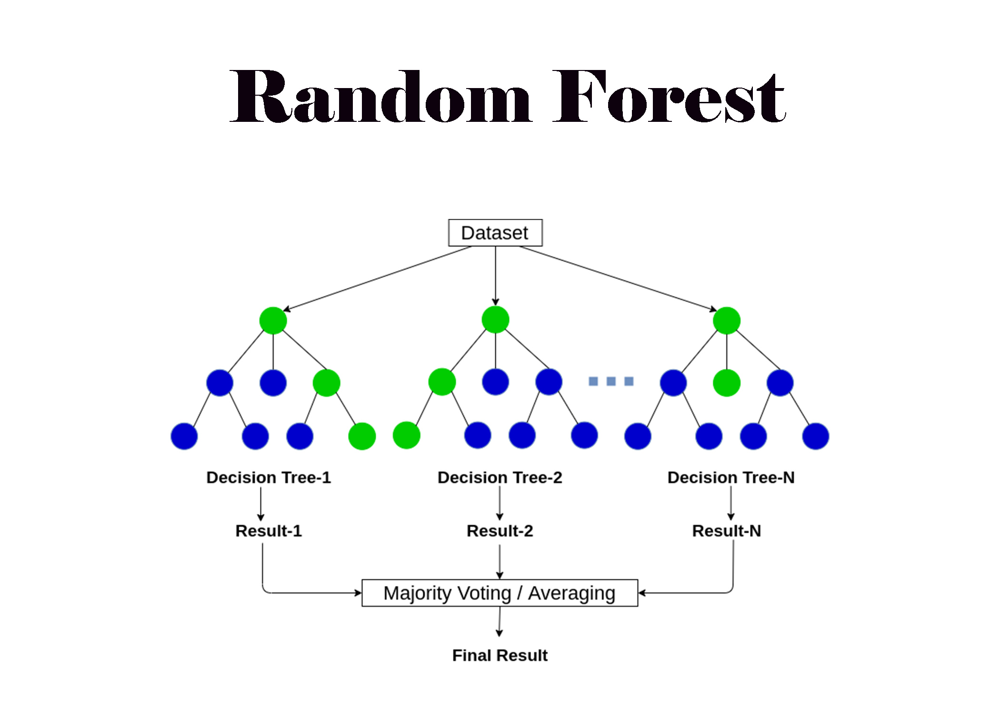
:::
::::

```{r}
varImpPlot(resRF)
table(resRF$predicted,dataRF$Cl)
```

```{r}
#| echo: false
#| message: false
#| warning: false

genetopRF2<-as.data.frame(resRF$importance)%>%
      arrange(desc(MeanDecreaseAccuracy))%>%
      top_n(100)
```

```{r}
#| echo: false
#| message: false
#| warning: false

DotPlot(ifnb,features=rownames(genetopRF2)[1:10],group.by="stim")+
  theme(axis.text.x = element_text(angle = 90, vjust = 0.5, hjust=1))


#library(pheatmap)
#pheatmap(pseudo_ifnb2@assays$RNA$scale.data[rownames(genetopRF2),],
#         cluster_cols = FALSE,       
#         scale = "row",              
#         show_rownames = FALSE,
#         show_colnames = TRUE)
```

<!--
### Comparison

```{r}
library(ggvenn)
ggvenn(list(DEseq2=rownames(genetopDEseq2),
            Nebula=genetopNeb2$gene,
            Wilcox=rownames(genetop_wilcox2),
            RF=rownames(genetopRF2)))
```
-->

## Gene functional analysis


Gene enrichment analysis identifies __biological pathways__ or __functions__ that are __overrepresented__ in a set of genes of interest.

In functional analysis of biological pathway, the biologist is __always__ the expert :

* The pathway database is determinent.
* You decide the relationship and biological significance of the data you want to present.


### Why ?

The interpretation of the list of differentially expressed genes can be challenging due to two scenarios:

1.  The list is so long that it becomes cumbersome and time-consuming to analyze and interpret each gene individually.

2.  Some genes may have low p-values but not low enough to meet the given threshold for significance.


**In such situations, enrichment analysis can be employed to enhance the understanding of our dataset.**


### Approaches


1.  **Over Representation Analysis (ORA)**: This method determines whether the differentially expressed genes are enriched in specific pathways or ontological groups. It assesses whether the observed number of genes in a particular pathway or gene ontology term is higher than what would be expected by chance.

2.  **Gene Set Enrichment Analysis (GSEA)**: GSEA evaluates whether a pre-defined set of genes (gene set) shows statistically significant differences between two or more biological conditions. Instead of focusing on individual genes, GSEA considers the collective behavior of genes within a gene set to identify enriched biological pathways or functional categories.
  


### From (Gene) Symbols to (Gene) IDs

Working with gene IDs, such as `Ensembl IDs`, instead of gene symbols is important for reproducibility in gene enrichment analysis due to the following reasons:

1.  **Gene Symbol Ambiguity:** Gene symbols can be ambiguous, as multiple genes can have the same symbol. This can lead to confusion and errors when performing analyses, especially when using external databases or tools.

2.  **Uniqueness:** Gene IDs are unique identifiers assigned to specific genes. They provide a standardized and consistent way of referring to genes across different datasets and analyses, ensuring accuracy and reproducibility.

3.  **Consistent Annotation:** Gene IDs are linked to comprehensive and up-to-date gene annotation databases, such as Ensembl. These databases provide detailed information about gene features, genomic locations, functional annotations, and other relevant metadata.

4.  **Cross-Species Comparisons:** Gene IDs enable seamless comparisons of gene enrichment results across different species.

5.  **Data Integration:** Gene IDs facilitate data integration across multiple experiments or studies. They enable the merging of different datasets, such as gene expression data or functional annotations, based on a common identifier.

6.  **Long-term Accessibility:** Gene IDs are stable and persist over time.

Using Gene IDs: enhances reproducibility in gene enrichment analysis by providing unique and standardized gene identifiers, enabling consistent annotation, supporting cross-species comparisons, facilitating data integration, and ensuring long-term accessibility of results.

### `bitr`: Biological Id TranslatoR

```{r}
require(clusterProfiler)
eg = bitr(rownames(genetop_wilcox1), fromType="SYMBOL", toType="ENTREZID", OrgDb="org.Hs.eg.db")
eg  |> as_tibble()  |>  rmarkdown::paged_table()
```

### Ensembl BioMart

BioMart provides a flexible and intuitive interface to explore and retrieve genomic data from Ensembl. It allows you to filter and select specific data attributes, enabling you to extract the information that is most relevant to your research or analysis.

1.  **Accessing BioMart**: Go to the Ensembl website (<https://www.ensembl.org>) and click on the "BioMart" option in the menu to access the BioMart interface.

2.  **Choosing a Dataset**: In the BioMart interface, you will see several tabs. Start by selecting the "CHOOSE DATABASE" tab. Here, you can choose the dataset you want to retrieve data from, such as the Ensembl genes, variation, or sequence databases.

3.  **Selecting Filters**: Once you've chosen the dataset, click on the "CHOOSE FILTERS" tab. Here, you can specify criteria to filter the data you are interested in. For example, you can filter by gene ID, chromosome location, gene biotype, or other attributes.

4.  **Selecting Attributes**: After setting your filters, switch to the "CHOOSE ATTRIBUTES" tab. Here, you can select the specific attributes or data fields you want to retrieve for the filtered data. These attributes can include gene names, chromosomal coordinates, functional annotations, or any other available information.

5.  **Retrieving Results**: Once you have chosen the desired attributes, switch to the "RESULTS" tab. Click on the "Results" button to retrieve the data based on your chosen filters and attributes. The results will be displayed in a table format.


Ensembl Biomart have an R api called `bioMart`:
```{r}
require(biomaRt)
listMarts()
```
```{r}
mart <- biomaRt::useMart(biomart="ENSEMBL_MART_ENSEMBL")
listEnsembl(mart=mart)
```

Check datasets availables

```{r,echo=T}
ensembl <- useEnsembl(biomart = "ensembl",version =114)
datasets <- listDatasets(ensembl)
datasets %>% as_tibble() %>% rmarkdown::paged_table()
```


### Now we can ask for the same thing but with `R` :

```{r}
ensembl <- useDataset(dataset = "hsapiens_gene_ensembl", mart = ensembl)
```

### If the dataset is known in advance:

```{r,eval=F}
ensembl <- useEnsembl(biomart = "ensembl", dataset = "hsapiens_gene_ensembl",version =114)
```


### Query in `biomaRt`

The `getBM()` function is the primary query function in biomaRt.

It has four main arguments:

-   `attributes`: is a vector of attributes that one wants to retrieve (= the output of the query).
-   `filters`: is a vector of filters that one wil use as input to the query.
-   `values`: a vector of values for the filters. In case multple filters are in use, the values argument requires a list of values where each position in the list corresponds to the position of the filters in the filters argument (see examples below).
-   `mart`: is an object of class Mart, which is created by the useEnsembl() function.


```{r}
filters = listFilters(ensembl)
filters  %>% as_tibble() %>% rmarkdown::paged_table()
```

```{r}
attributes = listAttributes(ensembl)
attributes %>% as_tibble() %>% rmarkdown::paged_table()
```


```{r}

gene_conversion <- getBM(attributes = c("ensembl_gene_id","entrezgene_id","hgnc_symbol"),
      filters = "hgnc_symbol",
      values = rownames(genetop_wilcox1), 
      mart = ensembl)
gene_conversion %>% as_tibble() %>% rmarkdown::paged_table()
```

### AnnotationHub

#### Get proper annotation for `AnnotationHub` using `BiocHubsShiny`:

The `BiocHubsShiny` package allows users to visually explore the `AnnotationHub` and `ExperimentHub` resources via shiny. It provides a tabular display of the available resources with the ability to filter and search through the column fields.[^1]

[^1]: From `BiocHubsShiny` vignette : https://bioconductor.org/packages/release/bioc/vignettes/BiocHubsShiny/inst/doc/BiocHubsShiny.html

```{r,eval=FALSE,echo=T}
BiocHubsShiny::BiocHubsShiny()

library("AnnotationHub")
hub <- AnnotationHub()

## Select rows in the table

ens.db <- hub[['AH119325']]
```

Query ens.db

```{r,eval=FALSE,}
select(ens.db, keys=rownames(genetop_wilcox1),columns=c("SYMBOL", "GENEID","ENTREZID","GENENAME","GENEBIOTYPE"),keytype = "GENENAME")
```


### Common sources of feature sets

1. **Gene Ontology (GO)**
2. **KEGG (Kyoto Encyclopedia of Genes and Genomes)**:
3. **WikiPathways**
4. **Disease Ontology**
5. **Reactome**
6. **Molecular Signatures Database (MSigDB)**
7. **Medical Subject Headings (MeSH)**

These pathway collections databases serve as valuable resources for researchers to explore and analyze biological pathways, functional annotations, and disease associations. They facilitate the interpretation of gene expression data, identify key pathways related to specific biological processes or diseases, and contribute to a deeper understanding of biological systems.


### **Gene Ontology (GO)**

::: {style="font-size: 18px;"}

### Website: <http://geneontology.org/>

### Description: 
GO is a widely used database that categorizes genes into three main ontologies: molecular function, biological process, and cellular component. It provides a standardized vocabulary to describe gene functions and interactions, allowing researchers to annotate and analyze gene sets in a structured manner.


1. **Molecular Function**
   - Describes the elemental activities of a gene product at the molecular level.
2. **Biological Process**
   - Represents sets of molecular events or biological pathways achieved by one or more gene products.
   - Biological process terms describe the larger, coordinated series of events that involve multiple molecular functions.
3. **Cellular Component**
   - Refers to the subcellular structures, locations, and macromolecular complexes in which gene products are active.
   - Cellular component terms describe the physical compartments or structures where gene products function.


:::{.callout-tip}
* [Ten Quick Tips for Using the Gene Ontology](https://journals.plos.org/ploscompbiol/article?id=10.1371/journal.pcbi.1003343)
:::

:::


### Over Representation analysis

Over Representation Analysis (ORA) is a widely used approach to determine whether known biological functions or processes are over-represented (= enriched) in an experimentally-derived gene list, e.g. a list of differentially expressed genes (DEGs).

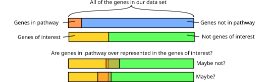{fig-align="center"}

### Over Representation analysis

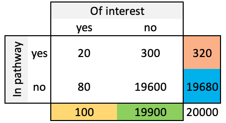{fig-align="center" width="400" height="300"}

### Fisher Exact Test

-   The Fisher Exact Test is a statistical method used to determine whether there is a significant association between two categorical variables, such as the presence or absence of a particular gene and a particular phenotype or disease.
-   In the context of gene enrichment analysis, the Fisher Exact Test is used to determine whether there is a significant association between a set of genes and a particular biological pathway or process.

Hypothesis: 

* $H_0$: The categories are independent.
* $H_1$: The categories are dependent.

> In Gene Enrichment, we want to see as genes as possible in the pathway that are DE, so we want a one sided test with greater hypothesis.


### Fisher Exact Test

The p-value can be calculated by hypergeometric distribution[^1]: 

$$
p = 1 - \displaystyle\sum_{i = 0}^{k-1}\frac{{M \choose i}{{N-M} \choose {n-i}}} {{N \choose n}}
$$

* $N$ is the total number of genes in the background distribution
* $M$ is the number of genes within that distribution that are annotated (either directly or indirectly) to the gene set of interest
* $n$ is the size of the list of genes of interest
* $k$ is the number of genes within that list which are annotated to the gene set. 

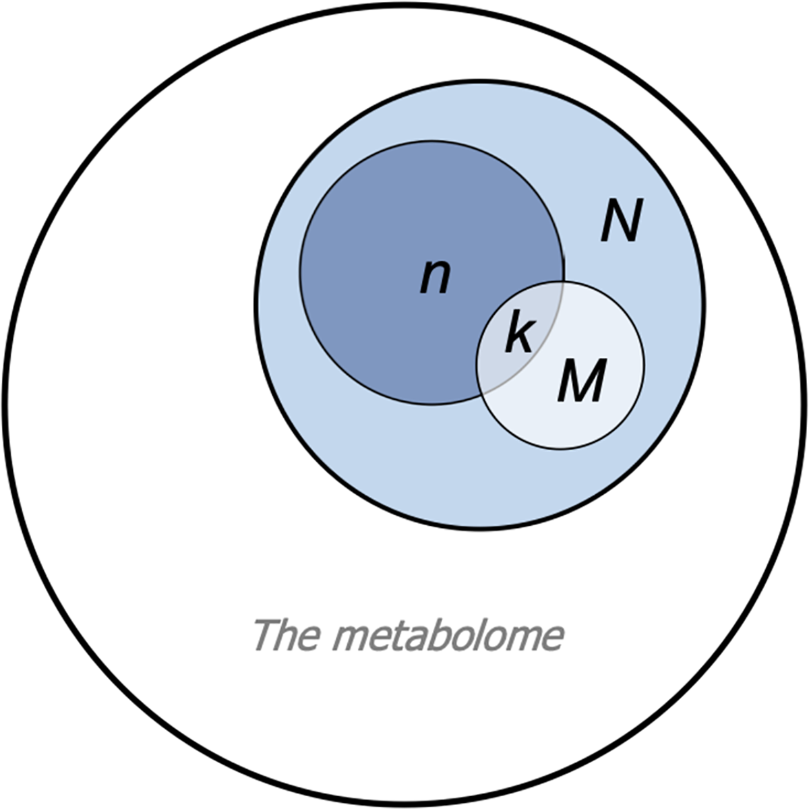{fig-align="center" width="250" height="250"}


[^1]: In case of alternative hypothesis as `greater`.

### Fisher Exact Test

#### With an (false) example

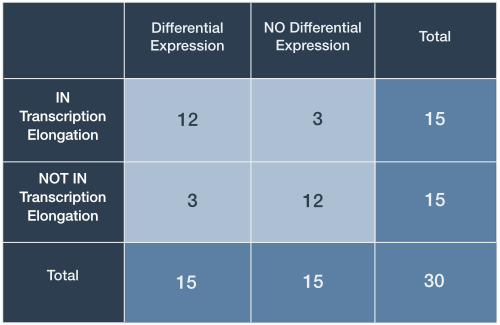{fig-align="center" width="400" height="300"}

### Fisher Exact Test

#### With an (false) example

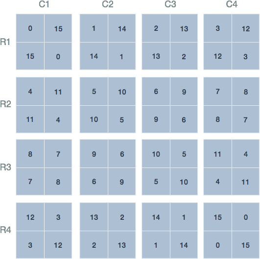{fig-align="center"}


### Fisher Exact Test

#### With an (false) example

{fig-align="center" width="400" height="300"}

### Fisher Exact Test

#### Using the Hypergeometric distribution

$$
\begin{equation*}
  \begin{split}
    \frac{(\text{15 Choose 1})\cdot(\text{15 Choose 14})}{(\text{30 Choose 15})}& = \frac{15\cdot15}{155 117 520}\\
    & = 1.45\cdot10^{-6}
  \end{split}
\end{equation*}
$$

### Fisher Exact Test

#### With an (false) example

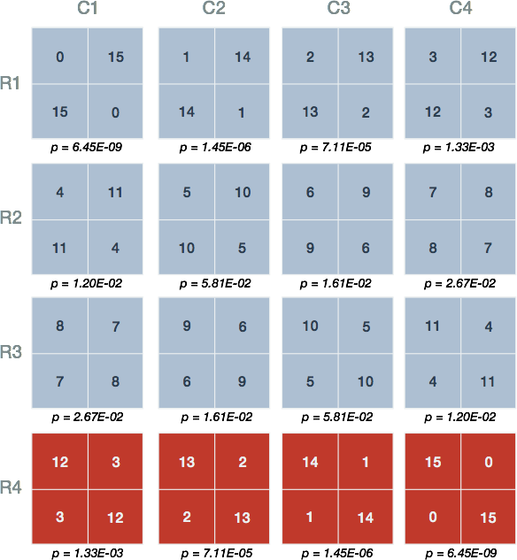{fig-align="center"}


### Fisher Exact Test

#### Solution

$$
\begin{equation*}
  \begin{split}
    p& = \sum\limits_{\text{DE & IN}\geq12}p_i\\
     & = 1.33\cdot10^{-3}+7.11\cdot10^{-5}+1.45\cdot10^{-6}+6.45\cdot10^{-9}\\
     & = 0.001407159\\
     & \simeq 0.0014
  \end{split}
\end{equation*}
$$

### Fisher Exact Test

#### With a real dataset 


```{r, warning=FALSE,message=FALSE}
require(clusterProfiler)
require(gt)
require(org.Hs.eg.db)
# eg = bitr(rownames(genetop_wilcox1), fromType="SYMBOL", toType="ENTREZID", OrgDb="org.Hs.eg.db")
# go_enrichment <- enrichGO(eg$ENTREZID, OrgDb = org.Hs.eg.db::org.Hs.eg.db, keyType = "ENTREZID", ont = "BP")
# saveRDS(go_enrichment,"data/go_enrichment.rds")
go_enrichment <- readRDS("data/go_enrichment.rds")
go_enrichment <- setReadable(go_enrichment, OrgDb = org.Hs.eg.db, keyType="ENSEMBL")
my_go <- "GO:0071901"
my_go <- go_enrichment %>% as_tibble() %>% arrange(desc(p.adjust)) %>% dplyr::filter(ID == my_go)

k = 5
M = 86 
N = 18986
n = 83


d <- data.frame(gene.in.interest=c(k,n-k),gene.not.interest=c(M-k,N-M-n+k))
row.names(d) <- c("In_category", "not_in_category")

mytable <- d
mytable <- rbind(mytable,colSums(d))
mytable <- cbind(mytable,rowSums(mytable))
colnames(mytable) <- c("Of_interest_yes", "Of_interest_no","Total")
rownames(mytable) <- c("in_pathway_yes","in_pathway_no","Total")

desired_colnames <- colnames(mytable) |> 
  str_remove('Of_interest_') |> 
  str_to_title()
names(desired_colnames) <- colnames(mytable)


options(scipen=999)

```

For a gene set `r my_go$Description` (`r my_go$ID`), I have :

* `r N` ($N$) number of genes in the analysis (background distribution).
* `r M` ($M$) genes within that distribution that are in the pathway of interest $C$.
* `r n` ($n$) genes of interest ($S$).
* `r k` ($k$) genes that are in $S$ and $C$.

And we can draw this contingency table:

```{r echo=FALSE, warning=FALSE,message=FALSE}
options(scipen=0)
mytable %>% tibble::rownames_to_column("Pathway") %>% mutate(Pathway = glue::glue("**Pathway of interest**: {str_extract(Pathway,'yes|no|Total')}")) %>%  gt(rowname_col = "Pathway") %>% cols_label(.list = desired_colnames) |> 
  tab_spanner(
    label = md('**Genes of interest**'),
    columns = 1:2
  ) %>%  fmt_markdown(columns = everything()) %>% 
  tab_header(
    title = glue::glue("Contingency table: DE genes against {my_go$Description} ({my_go$ID})")
  )
```


### Tests with `R`

#### Using Hypergeometric distribution


```{r}
all_probas <- dhyper(0:M, M, N-M, n,log=F)
```


```{r,echo=F}
p1 <- enframe(all_probas) %>% ggplot(aes(x=name,y=value)) + geom_line() + labs(y="probability",x="k",title = "Probability of observing our table giving k") + geom_vline(xintercept = 5,linetype='dashed',col="red")
print(p1)
```


### Tests with `R`

#### Using Hypergeometric distribution
#### Summing all probability having $k=32$ or more : 
```{r}
dhyper(k:M, M, N-M, n,log=F) %>% sum()
```


#### Using the distribution function directly

```{r}
phyper(k-1, M, N-M, n,lower.tail =F)
```


Or even if we want to replicate the formula :

```{r}
1-phyper(k-1, M, N-M, n)
```

### Using Fisher Test directly

```{r}
fisher.test(d, alternative = "greater")
```


### Over Representation Test tools

#### Online tools

* PANTHER (<http://geneontology.org/> or <http://www.pantherdb.org/>)
* gprofiler (<https://biit.cs.ut.ee/gprofiler/gost>)
* DAVID (<https://david.ncifcrf.gov/>)
* WEB-based GEne SeT AnaLysis Toolkit (WebGestalt) <https://www.webgestalt.org/>

#### Programmatic (R) tools 

* `ClusterProfiler`
* `hypeR`
* `gprofiler2`
* `rbioapi`: R api to query Enrichr, miEAA, PANTHER, Reactome, and STRING.

### `clusterProfiler`


#### And a `orgDB` object

```{r,eval=FALSE}
#| message: false
#| warning: false

require(clusterProfiler)
require(org.Hs.eg.db)
org.db <- org.Hs.eg.db

## We can also use our own DB
hub <- AnnotationHub()
org.db <- hub[['AH111575']]
org.db


```


#### GO over-representation analysis

The clusterProfiler package implements `enrichGO()` for gene ontology over-representation test.


```{r}
#| message: false
#| warning: false
org.db <- org.Hs.eg.db::org.Hs.eg.db
gene <- rownames(genetop_wilcox1)
eg = bitr(gene, fromType="SYMBOL", toType="ENTREZID", OrgDb="org.Hs.eg.db")
ego <- enrichGO(gene          = eg$ENTREZID,
                universe      = NULL,
                OrgDb         = org.db,
                keyType = "ENTREZID",
                ont           = "BP",
                pAdjustMethod = "BH",
                pvalueCutoff  = 0.05,
                qvalueCutoff  = 0.05,
                readable      = TRUE)

ego %>% as_tibble()
```


#### Basic visualisations: Dotplot

```{r}
#| echo: false

dotplot(ego,showCategory=10)
```

# Some extensions/complements 

## Spatial transcriptomic (ST)


### ST Data

- The **spot** by gene expression matrix 

- The information necessary to associate spots with their physical position on the tissue image


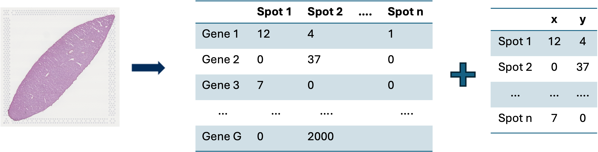

### Example

- Mouse brain spatial expression for the anterior region ($G=31053$ genes across $C=2696$ spots) 

:::: {.columns}
::: {.column width="60%"}

```{r}
#| message: false
#| warning: false

InstallData("stxBrain")
brain <- LoadData("stxBrain", type = "anterior1")
brain
```

```{r}
#| message: false
#| warning: false
#| echo: false
#| fig-width: 6

SpatialFeaturePlot(brain, features = "nCount_Spatial") + 
  theme(legend.position = "right")
```

:::
::: {.column width="40%"}

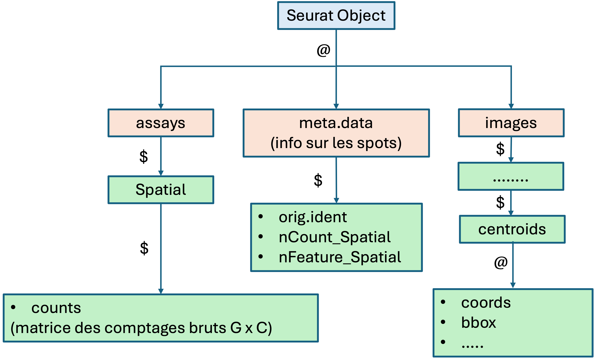{width="80%"}


```{r}
brain@assays$Spatial$counts[1:6,1:10]
brain@images$anterior1
```

:::
::::


### Analysis Pipeline of ST data

::: {.callout-note title="Pipeline" icon=false}
- Normalization

- Dimension reduction

- **Clustering** : take into account spatial information

- Marker genes 

- ....

- Detecting **spatially-variable features**
:::


### Normalization

- Variance in molecular counts across spots is not just technical in nature, but also is dependent on the tissue anatomy

- Standard approaches (such as the `LogNormalize()` function), which force each data point to have the same underlying "size" after normalization, can be problematic

- Recommend using sctransform (Hafemeister and Satija, Genome Biology 2019)

- `SCTransform()` replaces `NormalizeData()`, `ScaleData()`, and `FindVariableFeatures()`

<!--
@article{hafemeister2019normalization,
  title={Normalization and variance stabilization of single-cell RNA-seq data using regularized negative binomial regression},
  author={Hafemeister, Christoph and Satija, Rahul},
  journal={Genome biology},
  volume={20},
  number={1},
  pages={296},
  year={2019},
  publisher={Springer}
}
-->

<!--
regularized negative binomial models of gene expression in order to account for technical artifacts while preserving biological variance. 
UMI counts across cells in a dataset are modeled using a generalized linear model (GLM). The total UMI count per cell is used as an offset in the GLM. 

$$
x_{gc}\sim\mbox{NB}(\mu_{gc},\theta_g) \hspace{0.5cm} \ln(\mu_{gc})= \beta_{0g}+\ln(n_c)
$$
with $n_c = \sum_g x_{gc}$. 
We perform three steps to remove technical noise and perform variance stabilization:

  - Step 1: the inverse overdispersion parameter $\theta$ is individually estimated using a subset of genes (2000 by default), which are sampled in a density-dependent manner according to their average abundance. 
  
  Step 2:  we calculate a smoothed curve that characterizes the global relationship between $\mu$ and $\theta$, thereby regularizing $\theta$ estimates as a function of gene mean. We perform the same regularization for the intercept parameter. We use the geometric mean to estimate gene abundance, which is more robust to outlier values in scRNA-seq. As outlier values can originate from multiple sources including the presence of cell doublets, errors in UMI collapsing, or ambient RNA, we have empirically improved performance when using the geometric mean instead of the arithmetic mean. Although sctransform supports multiple estimators for $\theta$, we recommend the use
of glmGamPoi, an alternate estimator that is more robust and faster.

  - Step 3: we use the regularized parameter estimates to calculate Pearson
residuals $Z_{gc}$. The “residual variance” for a gene represents the remaining variation in gene expression that is not explained by the sctransform model,
-->

:::: {.columns}
::: {.column width="50%"}
```{r}
#| message: false
#| warning: false

brain <- SCTransform(brain, 
            assay = "Spatial",
            verbose = FALSE)
brain@assays$SCT
VariableFeaturePlot(brain)
```
:::
::: {.column width="50%"}
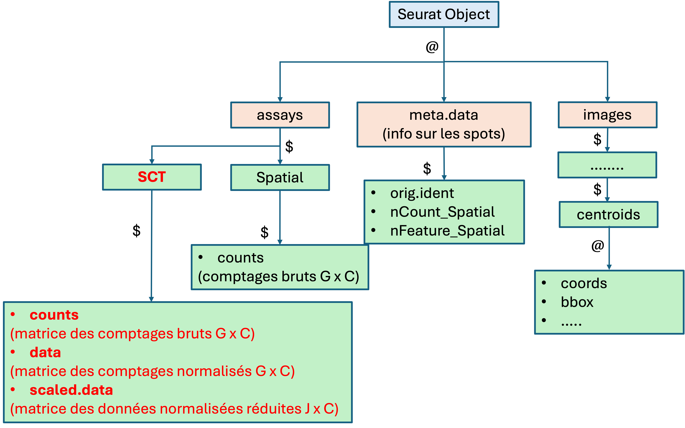

```{r}
#| message: false
#| warning: false

SpatialFeaturePlot(brain, features = c("Ttr","Hbb-bs"))
```

:::
::::


### Dimension reduction

:::: {.columns}
::: {.column width="50%"}
```{r}
#| message: false
#| warning: false
#| fig-width: 5

brain <- RunPCA(brain, assay = "SCT", verbose = FALSE)
brain <- FindNeighbors(brain, reduction = "pca", dims = 1:30)
brain <- RunUMAP(brain, reduction = "pca", dims = 1:30)
DimPlot(brain, reduction = "umap")+NoLegend()
```
:::
::: {.column width="50%"}

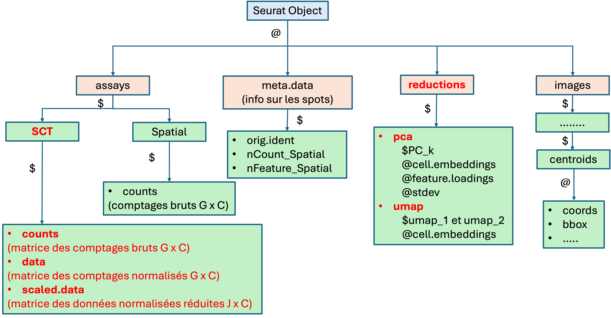
:::
::::


### Clustering 

:::: {.columns}
::: {.column width="50%"}
- Some clustering methods for ST 
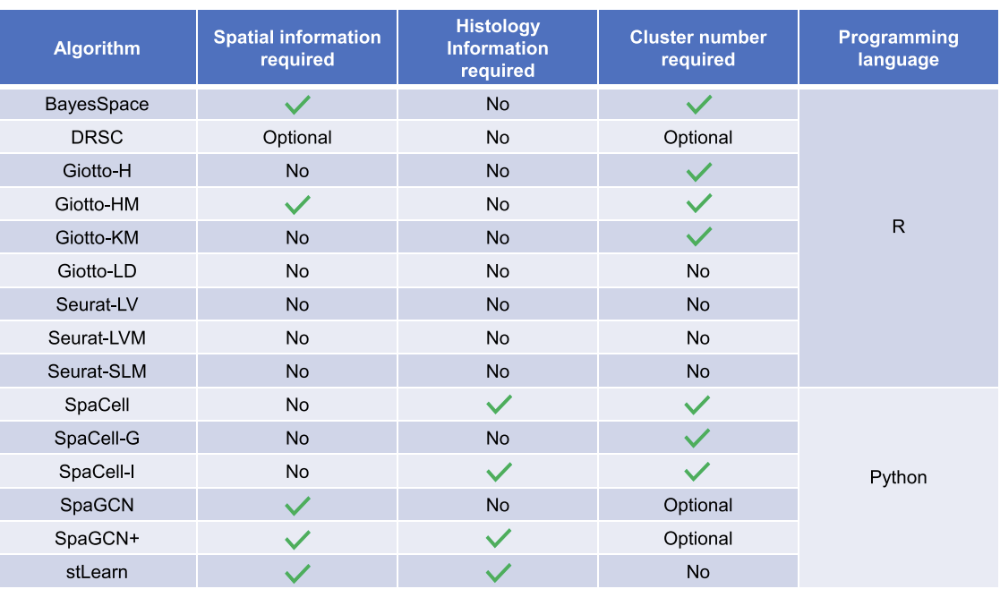{width="80%"}

<!--
@article{cheng2023benchmarking,
  title={Benchmarking cell-type clustering methods for spatially resolved transcriptomics data},
  author={Cheng, Andrew and Hu, Guanyu and Li, Wei Vivian},
  journal={Briefings in bioinformatics},
  volume={24},
  number={1},
  pages={bbac475},
  year={2023},
  publisher={Oxford University Press}
}
-->
:::
::: {.column width="50%"}

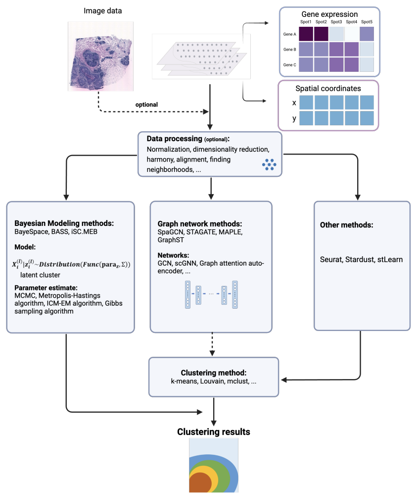{width="80%"}
<!--
@article{xiong2025comprehensive,
  title={A comprehensive comparison on clustering methods for multi-slide spatially resolved transcriptomics data analysis},
  author={Xiong, Caiwei and Shuai, Huang and Zhou, Muqing and Zhang, Yiyan and Wu, Wenrong and Li, Xihao and Yao, Huaxiu and Chen, Jiawen and Li, Yun},
  journal={bioRxiv},
  pages={2025--01},
  year={2025},
  publisher={Cold Spring Harbor Laboratory}
}
-->

:::
::::

### Example with BayesSpace

- See code in exercice

```{r}
#| echo: false
#| warning: false
#| message: false

library(BayesSpace)
diet.seurat = Seurat::DietSeurat(brain,
                                   graphs = "SCT_nn",
                                   dimreducs = c("pca"))
sce_brain = as.SingleCellExperiment(diet.seurat, assay = "SCT") 
colData(sce_brain) = cbind(colData(sce_brain),
                           brain@images$anterior1$centroids@coords) 
sce_brain$array_col<-sce_brain$y 
sce_brain$array_row<-sce_brain$x 

sce_brain = spatialPreprocess(sce_brain, 
                          platform = "Visium",
                          skip.PCA = T, 
                          log.normalize = log.normalize) 
sce_brain <- spatialCluster(sce_brain,
                          nrep = 1000,
                          q= 8,
                          burn.in = 10,
                          model = "t",
                          gamma = 2)
brain@meta.data[["BayesSpace"]] <- as.factor(sce_brain$spatial.cluster)
```

```{r}
#| echo: false
#| warning: false
#| message: false

#table(brain$BayesSpace) # mettre plutot le graphe
EffPlot(brain,clustname="BayesSpace",resolution=NULL)

p1<-SpatialDimPlot(brain, "BayesSpace",label=TRUE,label.size=2)

p2<-DimPlot(brain, reduction = "umap",group.by="BayesSpace",label=TRUE)
p1+p2
```


### Spatial variable features

- Goal: Identify features whose variability in expression can be explained to some degree by spatial location

::: {.callout-warning title="Seurat" icon=false}
- Function `FindSpatiallyVariableFeatures()`

- Methods: 
  + markvariogram: Wraps the functionality of markvario from the `spatstat` package (Walder and Stoyan, 96)
  + moransi: Wraps the functionality of the Moran.I function from the `ape` package (Gittleman and Kot, 90)

:::


- Other approaches in the literature: SpatialDE and Splotch for instance


<!--
@article{gittleman1990adaptation,
  title={Adaptation: statistics and a null model for estimating phylogenetic effects},
  author={Gittleman, John L and Kot, Mark},
  journal={Systematic Zoology},
  volume={39},
  number={3},
  pages={227--241},
  year={1990},
  publisher={Society of Systematic Zoology}
}
@article{walder1996variograms,
  title={On variograms in point process statistics},
  author={W{\"a}lder, Olga and Stoyan, Dietrich},
  journal={Biometrical Journal},
  volume={38},
  number={8},
  pages={895--905},
  year={1996},
  publisher={Wiley Online Library}
}

-->


```{r}
#| message: false
#| warning: false

brain <- FindSpatiallyVariableFeatures(brain, 
                                       assay = "SCT", 
                                       features=VariableFeatures(brain)[1:1000],
                                       selection.method = "moransi")
```

```{r}
#| message: false
#| warning: false
#| echo: false

##PB
#top.features <- head(SpatiallyVariableFeatures(brain, method = "moransi"), 6)
# dans forum pointe le pb

top.features = rownames(
  dplyr::slice_min(
    brain[["SCT"]]@meta.features,
    moransi.spatially.variable.rank,
    n = 6
  )
)

SpatialFeaturePlot(brain, features = top.features, ncol = 3, alpha = c(0.1, 1))
```


## Pseudotime

### Principle of trajectory inference

- Trajectory inference aims to reconstruct a cellular dynamic process
- 2 main steps:
  + Dimensionality reduction step: PCA, t-SNE, . . . . or graph-based
techniques . . . . or clustering methods
  + Trajectory modelling step
  
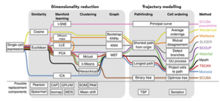  
  
  
### Review

- Some references: 
  + Cannoodt et al.(2016) : comparison of 10 methods
  + Saelens et al. (2019) : comparison of 29 (among 59 existing) methods
  
- [Dyno](https://dynverse.org/users/) contains a set of package to infer, visualise and interpret single-cell trajectories

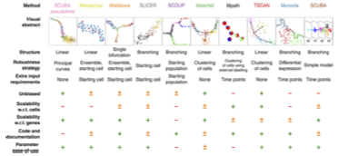
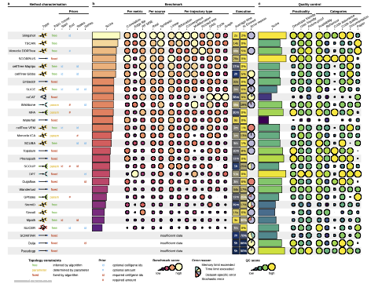

<!--
@article{cannoodt2016computational,
  title={Computational methods for trajectory inference from single-cell transcriptomics},
  author={Cannoodt, Robrecht and Saelens, Wouter and Saeys, Yvan},
  journal={European journal of immunology},
  volume={46},
  number={11},
  pages={2496--2506},
  year={2016},
  publisher={Wiley Online Library}
}

@article{saelens2019comparison,
  title={A comparison of single-cell trajectory inference methods},
  author={Saelens, Wouter and Cannoodt, Robrecht and Todorov, Helena and Saeys, Yvan},
  journal={Nature biotechnology},
  volume={37},
  number={5},
  pages={547--554},
  year={2019},
  publisher={Nature Publishing Group US New York}
}
-->


## Comment basculer entre Seurat / Scanpy / SingleCellExperiment

https://mojaveazure.github.io/seurat-disk/articles/convert-anndata.html
as.Seurat(<CellDataSet>) 
as.Seurat(<SingleCellExperiment>)
as.SingleCellExperiment()
https://github.com/cellgeni/sceasy
https://www.youtube.com/watch?v=como93CmnS8


- From Seurat to AnnData via h5Seurat

```{r}
# NE FONCTIONNE PAS - CMR

#library(SeuratDisk)
#class(pbmc)
#SaveH5Seurat(pbmc, filename = "pbmc.h5Seurat")
#Convert("pbmc.h5Seurat", dest = "h5ad")
```

> You can write out the Seurat object to an .h5ad file using the write_h5ad function:

```{r}
#write_h5ad(pbmc, "pbmc.h5ad")
```

>If you need more customized conversion, you first need to convert the Seurat object to an AnnData object. Again note that there is no one-to-one mapping possible between the AnnData and SeuratObject data structures, so some information might be lost during conversion. It is recommended to carefully inspect the converted object to ensure that all necessary information has been transferred.

>See ?as_AnnData for more details on how to customize the conversion process. Example:

```{r}
#library(anndataR)
#as_AnnData(
#  pbmc,
#  assay_name = "RNA",
#  x_mapping = "data",
#  layers_mapping = c(foo = "counts")
#)
```


- From Scanpy to Seurat

```{r}
#library(anndataR)
#library(Seurat)

#h5ad_file <- system.file("extdata", "example.h5ad", package = "anndataR")
```

>Read the .h5ad file and convert it to a Seurat object:

```{r}
#seurat_obj <- read_h5ad(h5ad_file, as = "Seurat")
#seurat_obj
```

>Note that there is no one-to-one mapping possible between the AnnData and SeuratObject data structures, so some information might be lost during conversion. It is recommended to carefully inspect the converted object to ensure that all necessary information has been transferred.

>See ?as_Seurat for more details on how to customize the conversion process. For instance:

```{r}
#adata$as_Seurat(
#  assay_name = "ADT",
#  layers_mapping = c(counts = "dense_counts", data = "dense_X")
#)
```

- From Seurat to SingleCellExperiment (sce)


## Comment basculer entre Seurat / Scanpy / SingleCellExperiment (Vincent)

- `SeuratDisk`: the solution provided by Seurat to convert to various format $\rightarrow$ not working
- `anndata2ri`: a python package developped to convert `AnnData`$\Leftrightarrow$`SingleCellExperiment`
- `zellkonverter`: a python package developped to convert `SingleCellExperiment`$\rightarrow$ various objects.
- `Seurat`$\rightarrow$`AnnData` can be done by hand $\rightarrow$ [details here](https://jr-leary7.github.io/quarto-site/tutorials/Seurat_AnnData_Conversion.html)

```{r}
if (!dir.exists("conversion_files/")) {
  dir.create("conversion_files")
}
```

```{r}
sce_ifnb <- as.SingleCellExperiment(ifnb)
```


```{r,eval=F}
library(zellkonverter)
library(reticulate)
writeH5AD(sce_ifnb, file = "conversion_files/sce_ifnb.h5ad")
```

```python

import anndata as ad
adata = ad.read('conversion_files/sce_ifnb.h5ad', backed='r')
adata
AnnData object with n_obs × n_vars = 13668 × 14053 backed at 'conversion_files/sce_ifnb.h5ad'
    obs: 'orig.ident', 'nCount_RNA', 'nFeature_RNA', 'stim', 'seurat_annotations', 'RNA_snn_res.0.5', 'seurat_clusters', 'donor_id', 'celltype.stim', 'ident'
    uns: 'X_name'
    obsm: 'INTEGRATED.CCA', 'PCA', 'UMAP', 'UMAP.UNINTEGRATED'
    layers: 'logcounts'

```

Stay in R:

```{r,eval=F}
adata <- SCE2AnnData(sce_ifnb)
adata
```

Tuto by hand: https://jr-leary7.github.io/quarto-site/tutorials/Seurat_AnnData_Conversion.html

Est-ce que je l'ajoute et que je teste si ça marche ? 


### AnnData

{width="50%" fig-align:"center"}

* `X`: Données de comptage sous forme de matrice creuse (sparse):
  * ```python
  adata.X
  <100x2000 sparse matrix of type '<class 'numpy.float32'>'
	with 126526 stored elements in Compressed Sparse Row format>
    ```
  * ```python
  adata.obs_names = [f"Cell_{i:d}" for i in range(adata.n_obs)]
  adata.var_names = [f"Gene_{i:d}" for i in range(adata.n_vars)]
  print(adata.obs_names[:10])
  Index(['Cell_0', 'Cell_1', 'Cell_2', 'Cell_3', 'Cell_4', 'Cell_5', 'Cell_6',
       'Cell_7', 'Cell_8', 'Cell_9'],
      dtype='object')
    ```
* `obs`/`var`: Metadonnées des observations variables 
* `Layers`: `adata.layers["log_transformed"] = np.log1p(adata.X)`
* `obsm`/`varm` : Métriques ou des données dérivées supplémentaires liées aux observations / variables (Résultat ACP)
* `uns`: Données non structurées (paramètres de l'analyse, autres métadonnées, ...)
* `obsp`/`varp`: Relations par paires entre les cellules


### Appendix

- Commandes Seurat : https://satijalab.org/seurat/articles/essential_commands


