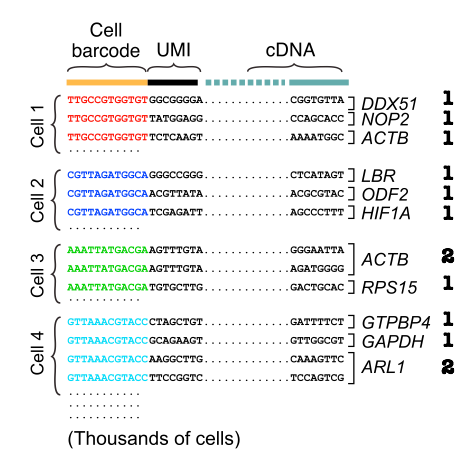
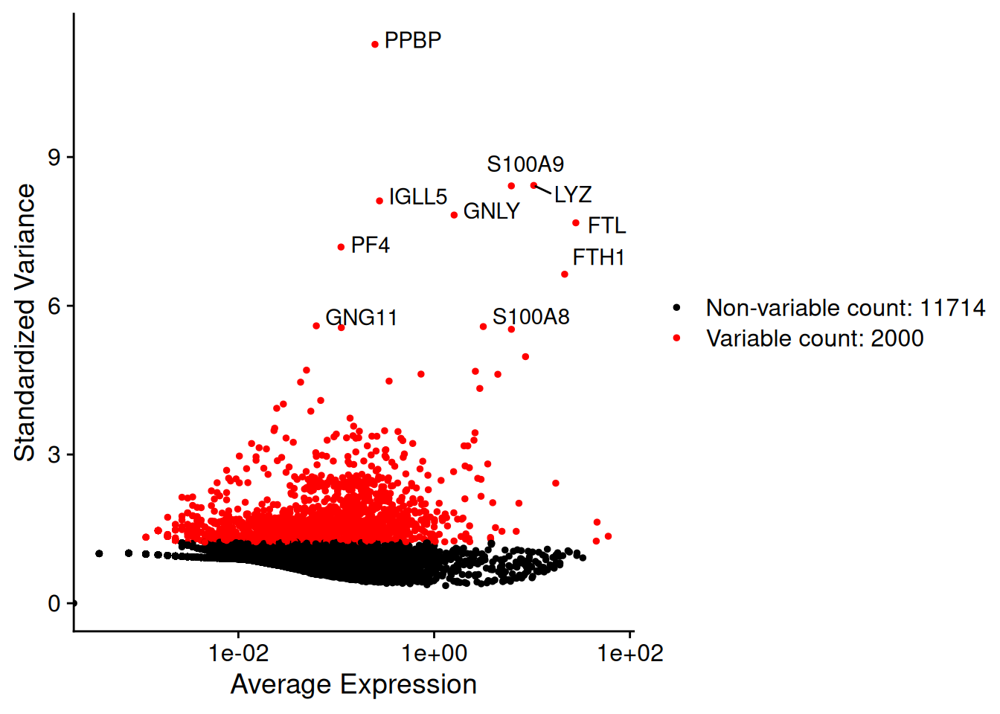
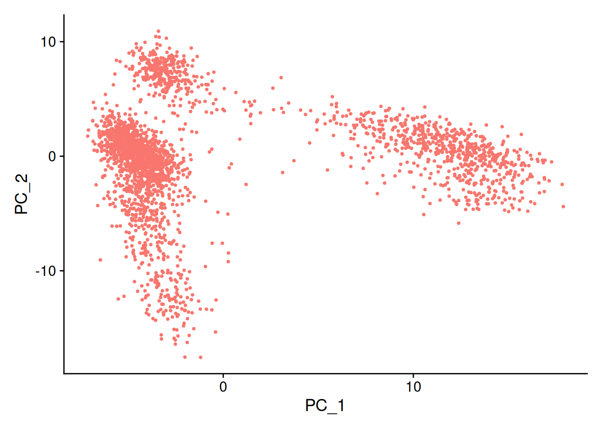
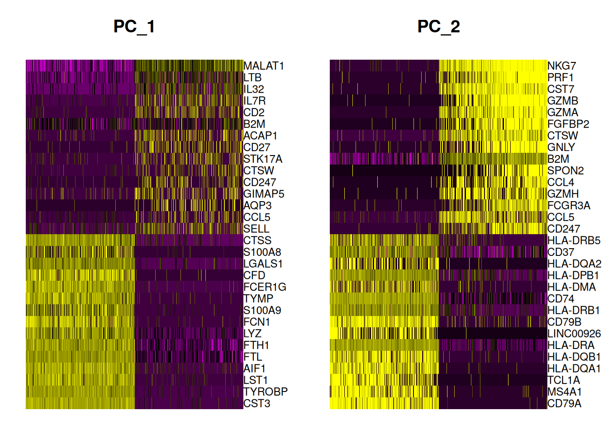
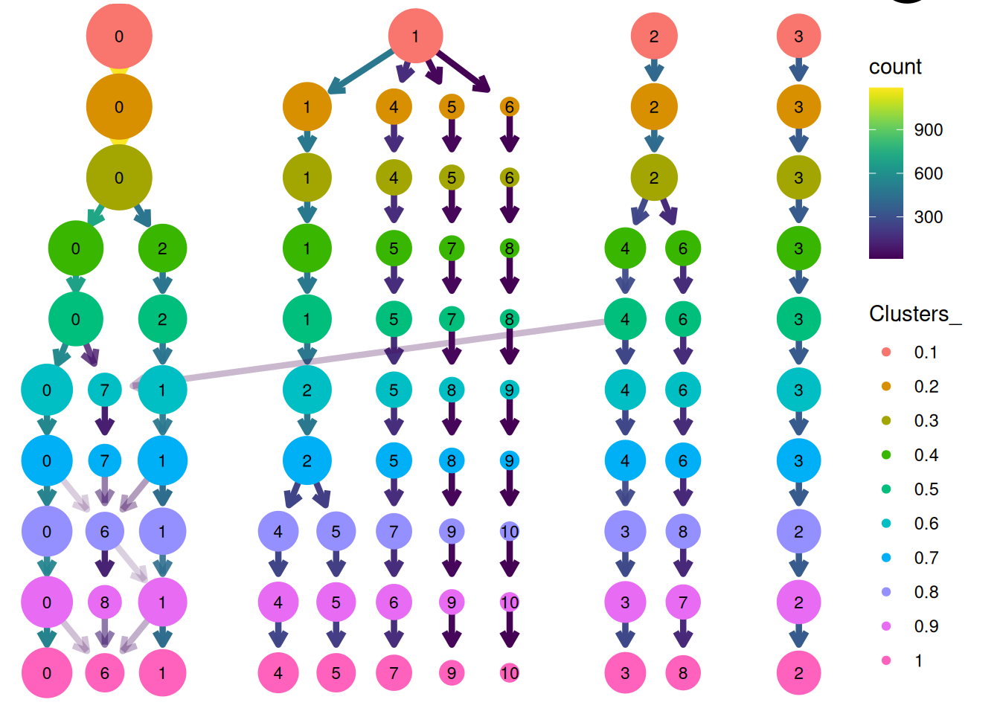
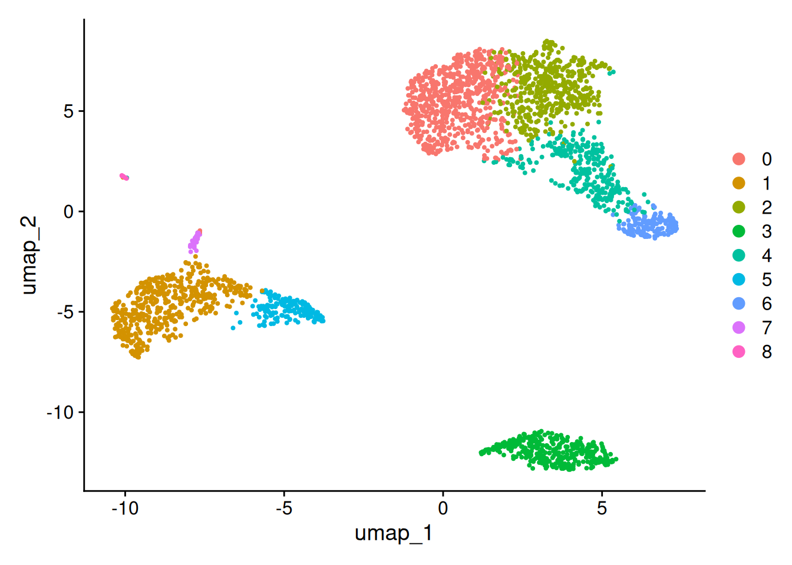
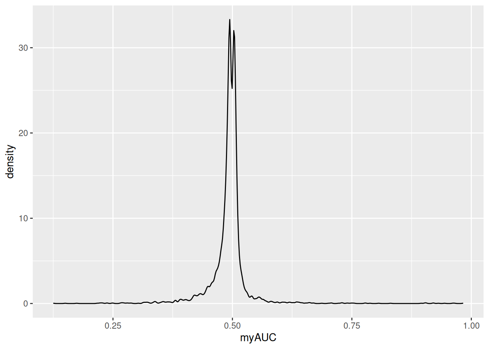

```{r setup, include=FALSE}
require(knitr)
require(kableExtra)
require(tidyverse)
require(Seurat)
options(kableExtra.latex.load_packages = FALSE)
options(knitr.table.format = "html")
```

# Formation Seurat


## Qu'est-ce-que les données de single-cell RNA-seq ? {.smaller}


### Principe du bulk RNA-seq

{width=60%}

:::{.fragment}

### Principe du single-cell RNA-seq (scRNAseq)

{width=60%}

:::


## De la manip à la fin de la bio-informatique 

### Différentes technologies

::: {#fig-techno-rna layout-ncol=1}

{fig-align="center"}

{fig-align="center"}


From https://www.nature.com/articles/s41580-023-00615-w
:::


## De la manip à la fin de la bio-informatique 

### Alignement - filtrage 

- Après la manip, passage par la bioinformatique
- Alignement des séquences, analyse des cellules que l'on peut retenir, ....

:::{.fragment}


### Avec [CellRanger](https://github.com/10XGenomics/cellranger)


{width="30%" fig-align="center"}

{width="50%" fig-align="center"}


:::


## De la manip à la fin de la bio-informatique 


::::{.columns}
:::{.column}
### Algorithme de [CellRanger](https://www.10xgenomics.com/support/software/cell-ranger/latest/algorithms-overview/cr-gex-algorithm)


{width="100%" fig-align="center"}

:::{.fragment}

Les étapes importantes :

- Trimming des reads
- Demultiplexage - Stockage des UMIs
- Alignement
- UMI counting

{width="40%" fig-align="center"}
:::


:::

:::{.column}

{width="50%" fig-align="center"}

:::

::::


## De la manip à la fin de la bio-informatique 

### En sortie de [CellRanger](https://github.com/10XGenomics/cellranger)

::: {#fig-techno-rna layout="[[1,1]]"}

{#cellranger-pos}

{#cellranger-v2}

:::


## De la manip à la fin de la bio-informatique 

### Autres outils

- La suite `Salmon` pour le single-cell : [`alevin`](https://salmon.readthedocs.io/en/latest/alevin.html)
- Traitement des umis dans une pipeline classique [`umi-tools`](https://umi-tools.readthedocs.io/en/latest/index.html) 

### Autres pipelines

- [`scrnaseq`](https://nf-co.re/scrnaseq/2.7.0/) du nf-core

## De la manip à la fin de la bio-informatique 

### Après la bio-informatique


::::{.columns}
:::{.column}

### Pour 10X

https://satijalab.org/seurat/reference/read10x

- 3 fichiers : features, barcode et table de comptage (_matrix.mtx_)

```r
Read10X(
  data.dir,
  gene.column = 2,
  cell.column = 1,
  unique.features = TRUE,
  strip.suffix = FALSE
)
```

:::

:::{.column}
### Pour alevin

- _quants_mat.gz_ – Compressed count matrix.
- _quants_mat_cols.txt_ – Column Header (Gene-ids) of the matrix.
- _quants_mat_rows.txt_ – Row Index (CB-ids) of the matrix.
- _quants_tier_mat.gz_ – Tier categorization of the matrix.

::: {.callout-note title="_quants_tier_mat.gz_"}
- Tier 1 is the set of genes where all the reads are uniquely mapping. 
- Tier 2 is genes that have ambiguously mapping reads, but connected to unique read evidence as well, that can be used by the EM to resolve the multimapping reads.
- Tier 3 is the genes that have no unique evidence and the read counts are, therefore, distributed between these genes according to an uninformative prior.

:::

```r
# Reading in the alevin quants quants using tximport
txi <- tximport(files, type="alevin")
```

:::

::::


## De la question bio à la question stat

### Biological questions

:::: {.columns}
::: {.column width="50%"}
- **Existe-t-il des sous-populations distinctes de cellules ?**
- **Pour chaque type cellulaire, quels sont les gènes marqueurs ?**
- **Comment visualiser les cellules ?**
- **Are there continuums of differentiation / activation cell states?**
- ...
:::
::: {.column width="50%"}
{width="65%"}
:::
:::

## De la question bio à la question stat

### Statistical analysis
:::: {.columns}
::: {.column width="50%"}
- **Regroupement (clustering) des cellules**
- **Sélection de variables (gènes) dans un contexte d'apprentissage ou d'analyse différentielle (tests d'hypothèse)**
- **Réduction de dimension**
- **Inférence de réseaux**
- **Inférence du (pseudo-)temps cellulaire**
- ...
:::
::: {.column width="50%"}
{width="65%"}

:::
:::


## Les packages pour analyser les données de scRNAseq

### Number of available tools for scRNAseq data


:::: {.columns}
::: {.column width="50%"}
{width="60%"}
:::
::: {.column width="50%"}


:::
:::

## Les packages pour analyser les données de scRNAseq

### Some bio-info-stat. pipelines/workflows

::: {.panel-tabset}

### Seurat

[Seurat](https://satijalab.org/seurat/) <!--\cite{Satija15}-->

{width="40%"}

### SCANPY

[SCANPY](https://github.com/theislab/Scanpy)

{width="40%"}

### Sincell

[Sincell](https://bioconductor.org/packages/release/bioc/html/sincell.html) 

{width="40%"}

### simpleSingleCell

[simpleSingleCell](https://bioconductor.org/packages/release/workflows/html/simpleSingleCell.html)

{width="40%"}
{width="40%"}

### SINCERA

[SINCERA](https://research.cchmc.org/pbge/sincera.html)    

{width="30%"}

### Scedar

[Scedar](https://github.com/logstar/scedar)

{width="40%"}

:::


## Les packages pour analyser les données de scRNAseq

### Attention au type d'objet

-   Chaque pipeline a son type d'Objet
    -   Seurat en R $\longrightarrow$ `Seurat Object`
    -   Scanpy en python $\longrightarrow$ `AnnData class`
    -   `SingleCellExperiment` 
- Il existe des fonctions qui permettent de passer de l'un à l'autre


## Exemple pour la suite

### Présentation des données

- Données de Peripheral Blood Mononuclear Cells (PBMC) de 10X Genomics. 

- 2700 cellules séquencées en Illumina NextSeq 500. 

- Téléchargez le jeu de données [ici](https://cf.10xgenomics.com/samples/cell/pbmc3k/pbmc3k_filtered_gene_bc_matrices.tar.gz) ou sur le dépot git de la formation

- Dans le dossier `".../hg19/"` on a trois fichiers 
  + `barcodes.tsv`
  + `genes.tsv`
  + `matrix.mtx`

## Contenu de l'objet Seurat (SO)

- Chargement des données et création de l'objet Seurat (SO) avec `Read10X()` et `CreateSeuratObject()`

```{r}
#| echo: false
#| warning: false

pbmc.data <- Read10X(data.dir = "data/pbmc3k_filtered_gene_bc_matrices/filtered_gene_bc_matrices/hg19/")

pbmc <- CreateSeuratObject(counts = pbmc.data, 
                           project = "pbmc3k", 
                           min.cells = 3, 
                           min.features = 200)
```

::::{.columns}
:::{.column}
- $C$= `r ncol(pbmc)` cellules décrites par `$G=$ `r nrow(pbmc)`gènes
- Les comptages bruts sont dans `pbmc@assays$RNA$counts`

```{r}
pbmc@assays$RNA$counts[10:20,1:15]
```


- Bruit technique et biologique
- Forte variabilité
- Données avec beaucoup de zéros (zero-inflated) $\longrightarrow$ sparsité ($\geq 80\%$ de zéros par ligne, dropouts)


:::
:::{.column}

:::
::::


# Pipeline d'analyse d'une condition biologique


## Contrôle qualité

### QC metrics : `nCount_RNA` et `nFeature_RNA`

- A la création de l'objet **SO**, calcul de `nCount_RNA` et `nFeature_RNA`, disponibles dans `meta.data`
  + nCount_RNA: number of UMIs per cell
  + nFeature_RNA: number of genes detected per cell


::::{.columns}
:::{.column}
{width="80%" fig-align="center"}
:::
:::{.column}
```{r}
head(pbmc@meta.data)
VlnPlot(pbmc, features = c("nFeature_RNA", "nCount_RNA"), ncol = 2)
```
:::
::::


## Contrôle qualité

### Additional metrics for plotting


::::{.columns}
:::{.column}
- Number of genes detected per UMI: 
this metric with give us an idea of the complexity of our dataset (more genes detected per UMI, more complex our data)

```{r}
#| echo: true
#| 
pbmc$log10GenesPerUMI <- log10(pbmc$nFeature_RNA) /   log10(pbmc$nCount_RNA)
VlnPlot(pbmc, features = c("log10GenesPerUMI"))
```

:::
:::{.column}

- Mitochondrial ratio: this metric will give us a percentage of cell reads originating from the mitochondrial genes
The number of genes per UMI for each cell is quite easy to calculate, and we will log10 transform the result for better comparison between samples. function `PercentageFeatureSet()` 

```{r}
#| echo: true
pbmc[["percent.mt"]] <- PercentageFeatureSet(pbmc, 
                                             pattern = "^MT-")
head(pbmc@meta.data, 5)
VlnPlot(pbmc, features = c("percent.mt"))
```

:::
::::


## Normalisation 

### Why do we need to normalize the data ?

- We need to remove technical biases in order to 
  + to be able to compare cells
  


::: {.callout-warning}

- The 2 libraries have the same RNA composition.
- But the condition B has 3 times more reads than the condition A.
- Take into account the sparsity of the count matrix  

**We need to correct for differences in library size to be able to compare genes.**

:::


## Normalization in Seurat


### Several normalization strategies in Seurat (Part I)

- In Seurat, function `NormalizeData(object,normalization.method= ...,)`

  + "LogNormalize" : Feature counts for each cell are divided by the total counts for that cell and multiplied by the scale factor ($sf=100000$ default). Then this is log-transformed using $\log(.+1)$
  
$$
\log\left(\frac{x_{gc}}{\underset{g}{\sum} x_{gc}} \times sf +1\right)
$$

  + "CLR" : Applies a centered log ratio transformation
  
$$
\log\left(\frac{x_{gc}}{\exp\left(\frac{1}{G}\underset{g}{\sum}x_{gc}\mathbb{1}_{x_{gc}>0}\right)}  +1\right)
$$

## Normalization in Seurat

### Several normalization strategies in Seurat (Part II)

- In Seurat, function `NormalizeData(object,normalization.method= ...,)`

  + "RC" (Relative counts): Feature counts for each cell are divided by the total counts for that cell and multiplied by the scale factor ($s=1e6$ default). But no log-transformation is applied. 

$$
\frac{x_{gc}}{\underset{g}{\sum} x_{gc}} \times s
$$

  + "SCTransform" : implemented in  the function `SCTransform()`. The use of SCTransform replaces the need to run NormalizeData, FindVariableFeatures, or ScaleData (described below). 
  
It utilizes the Pearson residuals from NB regression as input to standard dimension reduction techniques (see Hafemeister and Satija, 2019)

## Example

```r
 pbmc <- NormalizeData(pbmc, 
                       normalization.method = "LogNormalize", 
                       scale.factor = 10000)
```

  
{width="90%" fig-align="center"}
  
  
## High Variable Gene (HVG)

- Goal: identify a subset of features (genes) exhibiting high variability across cells

- In Seurat, function `FindVariableFeatures(object,selection.method=...,)` 

- Method "vst" (by default):

  1. Fit a line to the relationship of log(variance) and log(mean) using loess ($\Rightarrow \sigma_g$ for each gene $g$)
  
  2. Standardize the feature values (clipped to a maximum value of $\sqrt{C}$)
  $$
  z_{gc} = \frac{x_{gc}-\bar{x}_g}{\sigma_g}
  $$
  3. For each gene, compute the variance of standardized values across all cells. 
2,000 genes with the highest standardized variance as “highly variable.” 

- Other options: 

  + "mean.var.plot" (mvp)
  + "dispersion" (disp)

## Identification des gènes HVG

```r
pbmc <- FindVariableFeatures(pbmc, 
                             selection.method = "vst", 
                             nfeatures = 2000)
top10<-head(VariableFeatures(pbmc), 10)
plot1 <- VariableFeaturePlot(pbmc)
plot2 <- LabelPoints(plot = plot1, points = top10, repel = TRUE)
```

{width="90%" fig-align="center"}

## Réduction de dimension

::::{.columns}
:::{.column}

### Objectifs de la réduction de dimension

- Minimize curse of dimensionality
- Allow visualization
- Reduce computational time
- $\ldots$ 
- But beware of the interpretations after!

:::

:::{.column}

:::{.fragment}

### Several methods

Several methods are available:

- **PCA**, 
- **t-SNE**, 
- **UMAP**, 
- ZIFA, 
- ZINB-WaVe, 
- SWNE, 
- Diffusion MAP, 
- pCMF, 
- $\ldots$ 

Comparaison des rendus avec [Sleepwalk](https://anders-biostat.github.io/sleepwalk/#)
:::

:::

::::


## Scaling the data

::: {.callout-note title="**Vignette Seurat**"}
- Shifts the expression of each gene, so that the mean expression across cells is 0
- Scales the expression of each gene, so that the variance across cells is 1
This step gives equal weight in downstream analyses, so that highly-expressed genes do not dominate
- The results of this are stored in pbmc[["RNA"]]$scale.data
By default, only variable features are scaled.
You can specify the features argument to scale additional features
:::

 
:::{.fragment}


Dans Seurat, fonction `ScaleData()`

```r
pbmc<-ScaleData(pbmc) #features = Default is variable features J (=2000 par défaut)
```

::::{.columns}
:::{.column}

```{r}
#| echo: false
#| fig-align: center
#| fig-width: 12
pbmc<-NormalizeData(pbmc,normalization.method = "LogNormalize", 
                       scale.factor = 10000)
pbmc<-ScaleData(pbmc)
pbmc[["RNA"]]$scale.data[10:19,1:2] |> as_tibble()  |>  rmarkdown::paged_table()
```


:::
:::{.column}

{width="100%" fig-align="center"}
:::
::::

:::


## Principe de PCA

- PCA = Principal Component Analysis
- Réduire l'espace tout en conservant "assez dinformation"
- Méthode de réduction linéaire : Les composantes principales (méta-variables) sont des combinaisons linéaires des variables initiales (ici les gènes)
- Correspond à la diagonalisation de la matrice de corrélation (si ACP centrée réduite)
  + valeur propre $\lambda_s$ = inertie des individus projetés sur l'axe porté par un vecteur propre normé associé $v_s$ (axe principal)
  + composante principale $C_s$ contient les coordonnées des projetés des individus sur l'axe engendré par $v_s$


::::{.columns}
:::{.column}
{width="70%"}
:::
:::{.column}

{width="60%"}
:::
::::


## Principe de la PCA

```{r}
#| echo: FALSE
#| warning: false
#| message: false
require(mvtnorm)
require(tidyverse)
require(patchwork)
library(FactoMineR)
library(gridExtra)
```

```{r}
#| echo: FALSE
#| fig-height: 4
#| 

set.seed(1234)
R<-matrix(c(1,1,-1,1),ncol=2)/sqrt(2)
Sigma<-R%*%diag(c(4,0.5))%*%t(R)
X<-as.data.frame(rmvnorm(50,mean=rep(0,2),sigma=Sigma))
res<-PCA(X,scale.unit = F,graph=F)
```


```{r,echo=F}
#| fig-height: 6
#| fig-align: center
#| fig-width: 8
proj<-function(X,a,b,xl,xmin=-4,xmax=4,ymin=-5,ymax=5){
  v<-c(a,b)
  v<-v/sqrt(sum(v^2))
  
  dfline=data.frame(xx=seq(-xl,xl,0.01),yy=(v[2]/v[1]*seq(-xl,xl,0.01)))
  aux<-as.matrix(X)%*%as.matrix(v)
  Y<-matrix(rep(v,each=nrow(X)),ncol=2)
  for (i in 1:nrow(Y))
    Y[i,]<-aux[i]*Y[i,]
  dfproj=data.frame(xp=Y[,1],yp=Y[,2])
  
  line_df <- data.frame(
  x = X[,1],
  y = X[,2],
  xend =Y[,1],
  yend = Y[,2]
  )

  g<-ggplot(X,aes(x=V1,y=V2))+
    geom_point()+
    geom_line(data=dfline,aes(x=xx,y=yy))+
    geom_point(data=dfproj,aes(x=xp,y=yp),col="red")+
    geom_segment(
    data = line_df, 
    mapping = aes(x=x, y=y, xend=xend, yend=yend), 
    inherit.aes = FALSE,linetype="dotted"
  )+
  xlab("")+ylab("")+xlim(xmin,xmax)+ylim(ymin,ymax)+
  ggtitle(paste("Inertie axiale= ",round(sum(diag(var(Y))),2),sep=""))
  return(g)
}


g1<-proj(X,a=res$var$coord[1,1],b=res$var$coord[2,1],xl=4)
g2<-proj(X,a=cos(2*pi/3),b=sin(2*pi/3),xl=3)

grid.arrange(g1,g2,ncol=2)
```

## Principe de PCA


```{r,echo=FALSE}
#| fig.width: 8
#| fig.height: 4 
#| fig.cap: Analyse en composante principale du jeu de données iris sur les deux premières dimensions.
X <- iris[,c(1,3)]
# Run PCA
pca <- princomp(X)
load <- loadings(pca)
slope <- load[2, ] / load[1, ]
cmeans <- apply(X, 2, mean)
intercept <- cmeans[2] - (slope * cmeans[1])


# Plot perpendicular segments

df<-data.frame(X)
img1 <- ggplot(df,aes(Sepal.Length,Petal.Length))+
  geom_point()+
  geom_point(data = cmeans %>% t %>%  as.data.frame(),aes(Sepal.Length,Petal.Length),col="red",size=4) +
  geom_abline(intercept=intercept[1],slope=slope[1],linetype="dashed")+
  geom_abline(intercept=intercept[2],slope=slope[2],linetype="dashed")+
  theme_classic(base_size=16) + coord_fixed()


img2 <- (pca$scores) %>% as.data.frame() %>% ggplot(aes(Comp.1,-1*Comp.2)) + geom_point()+ theme_classic(base_size=16) + geom_vline(xintercept = 0,linetype="dashed")+ geom_hline(yintercept = 0,linetype="dashed")

design <- "AB"
wrap_plots(A=img1,B=img2, design = design,tag_level="new")+  plot_annotation(tag_levels = "A")
```

- Les axes de l'ACP sont projetés sur les dimensions d'origine et passent par la moyenne (rouge).
- Projection des points dans l'espace de l'ACP.


## PCA with Seurat

-   L'ACP est faite sur les données centrées réduites à l'aide de la fonction `runPCA()`

```r
pbmc <- RunPCA(pbmc, features = VariableFeatures(object = pbmc))
  #str(pbmc@reductions$pca)
```

Mais probleme de l'ACP sur les données scRNAseq

:::{style="font-size: 80%;"}
- C'est une méthode de réduction de dimension linéaire
- Elle est sensible à la sparsité des données scRNAseq 
- C'est utilisé pour réduire le jeu de données pour certaines méthodes dans la suite de l'étude
:::

::::{.columns}
:::{.column}

```r
DimPlot(pbmc, reduction = "pca") + NoLegend()
```

{width="90%"}
:::
:::{.column}

```r
DimHeatmap(pbmc, dims = 1:2, cells = 500, balanced = TRUE)
``` 

{width="80%"}
:::
::::


## t-SNE 

- t-SNE = t-Distributed stochastic neighbor embedding [@maaten2008visualizing;@van2014accelerating]
- Dimensionality reduction algorithm for non-linear data representation that produces a low-dimensional distribution of high-dimensional data

{width="60%" fig-align="center"}

::: {.callout-warning title="Seurat" icon="false"}

- function `RunTSNE()` 

- initial data = PCA coordinates  (reduction="pca" default) +  KNN neighbours (`FindNeighbors()`)
:::


## t-SNE with Seurat


### Example

```r
pbmc <- FindNeighbors(pbmc, dims = 1:10)
pbmc <- RunTSNE(pbmc, dims = 1:10)
DimPlot(pbmc, reduction = "tsne")+NoLegend()
```


::::{.columns}
:::{.column}


:::
:::{.column}

{width="90%"}
:::
::::


## UMAP

- UMAP = **Uniform manifold approximation and projection** 
  - It is a general non-linear dimension reduction method
  - Compared with t-SNE, UMAP retains more global structure with superior run-time performance 
  - [@mcinnes2018umap;@becht2019dimensionality]


- For more details : 
  + A youtube video describing the process can be found [here](https://www.youtube.com/watch?v=jth4kEvJ3P8).
  + A comparison between PCA, t-SNE and UMAP can be found [here](https://biostatsquid.com/pca-umap-tsne-comparison/)


## Example

::: {.callout-warning title="Seurat" icon=false}

- function `RunUMAP()` 

- initial data = PCA coordinates  (reduction="pca" default) +  KNN neighbours (`FindNeighbors()`)
:::


```r
pbmc <- FindNeighbors(pbmc, dims = 1:10)
pbmc <- RunUMAP(pbmc, dims = 1:10)
DimPlot(pbmc, reduction = "umap")+NoLegend()
```


::::{.columns}
:::{.column}


:::
:::{.column}


:::
::::


## Clustering

### Principe / objectif du clustering

- Goal : organizing cells into groups whose members are similar in some way 
- Fundamental question : What is meant by "similar cells"? 
- The number of clusters $K$ is unknown 
- Typical clustering methods : 
	+ Hierarchical clustering (CAH)
	+ Kmeans clustering
	+ Graph-based clustering
	+ Model-based clustering 
	+ ...


## Clustering

### Some methods

<!--
\textcolor{blue}{\tiny \cite{Duo18}}\\
\textcolor{blue}{\tiny \cite{Freytag18}}\\
\textcolor{blue}{\tiny \cite{petegrosso2019}}\\ 
\textcolor{blue}{\tiny \cite{zhang2020review}}
-->

{width="100%" fig-align="center"}


## Clustering dans Seurat avec Louvain


::: {.callout-note title="Étapes"}
- Calculate k-nearest neighbors and construct the SNN graph
(based on Euclidean distance in PCA space)
- Optimize a modularity function to determine clusters - Louvain’s
algorithm
- Sensitive choice of the resolution parameter
(involve the number of clusters K)
:::

{width="100%" fig-align="center"}


## Clustering dans Seurat

- Fonctions `FindNeighbour()` puis  `FindCluster()`

### Exemple 

- Clustering pour une résolution de $0.5$

```r
pbmc <- FindClusters(pbmc, resolution = 0.5)
```


## Clustering dans Seurat


### Choix de la résolution

```r
list_resolutions<-seq(0.1,1,by=0.1)
for (r in list_resolutions){
    pbmc <- FindClusters(pbmc, resolution = r, cluster.name = paste0("Clusters_", r))
}

clusterplot<-clustree(pbmc, prefix = "Clusters_")

```

{width="80%" fig-align="center"}

## Clustering dans Seurat

::::{.columns}
:::{.column}

```r
Idents(pbmc)<-pbmc@meta.data$Clusters_0.5
pbmc$seurat_clusters<-pbmc@meta.data$Clusters_0.5
DimPlot(pbmc, reduction = "umap")
```


{width="80%" fig-align="center"}


:::
:::{.column}
{width="80%" fig-align="center"}

:::
::::


## Gènes marqueurs

### Formalisation du problème

- Objectif: déterminer les gènes dont l'expression varient entre 2 "groupes" cellulaires ($\mathcal G_1$ et $\mathcal G_2$)
- Gènes marqueurs pour une classe  $\mathcal C_k$: 
$\mathcal G_1 = \mathcal C_k$ et 
$\mathcal G_2 = \{1,\ldots,n\} \backslash \mathcal C_k$
- Côté statistique, c'est un problème de test !
- Fonctions dans `Seurat`: `FindMarkers()` et `FindAllMarkers()`

- Pour un gène $g$ fixé :
 on veut tester s'il y a une différente de distribution de l'expression de ce gène entre deux échantillons:
  - $\underline{X}^{(1)}=(X_{gc}; c\in\mathcal G_1)$ 
  - $\underline{X}^{(2)}=(X_{gc}; c\in\mathcal G_2)$


## Marker gene

### Différentes situations

{width="80%" fig-align="center"}


## Wilcoxon dans Seurat

- Test de Wilcoxon : test non paramétrique basé sur les rangs
- Correction de tests multiples (dans Seurat, Bonferroni)


```r
GeneMkWilcox3<-FindMarkers(pbmc,
                           test.use = "wilcox",
                           ident.1 = 3,
                           logfc.threshold=0.5)
sum(GeneMkWilcox3$p_val_adj<0.01)
```

```

```
[1] 640
```


:::{.fragment}

### Problème de double-dipping

- Beaucoup de gènes marqueurs détectés $\Longrightarrow$ problème de double-dipping

{width="80%" fig-align="center"}

- Reste un problème ouvert en statistique, loin d'une solution pour le scRNAseq

:::

## Méthode AUC  (area under the ROC curve) 


::::{.columns}
:::{.column width="30%"}
- AUC = area under the ROC curve ($2\times |\mbox{AUC}-0.5|$ )
- Attention, ce n'est pas un test ! 
- Mais difficulté sur le choix du seuil !
:::
:::{.column width="70%"}
{width="80%" fig-align="center"}

{width="80%" fig-align="center"}
:::
::::


## AUC dans Seurat


```r
GeneMkAUC3<-FindMarkers(pbmc,
                        test.use = "roc",
                        ident.1 = 3,
                        logfc.threshold=0.5)
ggplot(GeneMkAUC3,aes(x=myAUC))+
  geom_density()
```




### Autres indicateurs disponibles

- pct.1 / pct.2 : $\%$ de cellules où le gène $g$ est exprimé ($X_{cg}>0$) dans le groupe $\mathcal G_1$ / $\mathcal G_2$
- avg$\_$log2FC : log2 Fold-Change de l'expression moyenne entre les deux groupes  
- Pour tous ces indicateurs, il faut ensuite faire des choix de seuil

# Pipeline d'analyse pour deux (plusieurs) conditions biologiques

## Plusieurs types d'intégration

::: {layout="[[1,1], [1]]"}
{width="90%"}

{width="90%"}

{width="40%"}
:::


## Integration dans Seurat

- Seurat function: `IntegrateLayers() `
- Five integration methods :
  + Anchor-based CCA integration (`method=CCAIntegration`)
  CCA = Canonical Correlation Analysis
  + Anchor-based RPCA integration (`method=RPCAIntegration`)
  + Harmony (`method=HarmonyIntegration`)
  + FastMNN (`method= FastMNNIntegration`)
  + scVI (method=scVIIntegration) (Ne semble plus être dispo)
  

:::{.callout-tip}
[`SeuratIntegrate`](https://www.biorxiv.org/content/10.1101/2024.12.16.628691v1.full.pdf): an R package to facilitate the use of integration methods with Seurat
:::


## Canonical Correlation Analysis - CCA


::::{.columns}
:::{.column width="30%"}

:::{.callout-note title="Definition"}
The goal of CCA here is to find linear combinations of the genes in both datasets that produce correlated cell embeddings in a lower-dimensional space. Essentially, we aim to align the two datasets by identifying the correlated patterns in gene expression that are shared between the two sets of cells.
:::

:::{.fragment}
- Équivalent à faire du dual PCA pour deux datasets.
- SVD $X Y^\top = U\Sigma V$ $Z_X = U \Sigma^{1/2}$ et $Z_Y = V \Sigma^{1/2}$
- $X$ et $Y$ deux jeux de données avec les mêmes gènes $X\in\mathbb R^{n\times g}$ et $Y\in\mathbb R^{m\times g}$
- find $a\in\mathbb R^g$ et $b\in\mathbb R^g$ such that $u=X^\top a$ et $v = Y^\top b$ where $u$ and $v$ are the canonical variates, and the goal is to maximize the correlation $\mbox{corr}(u,v)$. 
- Détails [ici](https://divingintogeneticsandgenomics.com/post/cca-alignment/) et [ici](https://xinmingtu.cn/blog/2022/CCA_dual_PCA/) 

:::


:::
:::{.column width="70%"}

{.fragment width="90%"}

:::
::::


## Harmony

:::{.callout-note title="[Harmony](https://github.com/immunogenomics/harmony)"}
The Harmony algorithm inputs a PCA embedding (Z) of cells, along with their batch assignments, and returns a batch corrected embedding. 
:::


{.r-stretch fig-align="center"}


## Identify conserved cell type markers

- `FindCOnservedMarkers()`: Identify canonical cell type marker genes that are conserved across conditions:
  - Perform differential gene expression testing for each dataset/group 
  - Combines the p-values using meta-analysis methods from the `MetaDE R` package
- Application: We can calculated the genes that are conserved markers irrespective of stimulation condition in cluster 6 (NK cells).
- List and comparaison of available methods [here](https://cran.r-project.org/web/packages/metap/vignettes/compare.pdf)


## Analyse différentielle


::::{.columns}
:::{.column}

:::{style="font-size: 150%;"}
:::{.callout-caution}
- Il faut bien avoir en tête son design
- Il faut bien réfléchir à la question à laquelle on souhaite répondre
:::
:::

:::{.fragment}
- Question 1:  déterminer les gènes dont l'expression varie entre les deux conditions (types cellulaires confondus)
- Question 2 : déterminer les gènes dont l'expression varie entre les deux conditions pour le type cellulaire "CD14 Mono" fixé.
:::


:::
:::{.column}

:::{.fragment}


### Beaucoup de méthodes proposées

{width="80%"}


:::


:::
::::

:::{.fragment}

### Focus sur 4 méthodes

- Naïve : Wilcoxon
- Par pseudo-bulk : DESeq2
- Par une méthode spécifique single-cell : NEBULA
- Par une approche supervisée : Random Forest
:::

## Analyse fonctionnelle des gènes

L’analyse d’enrichissement de gènes identifie les __voies (pathways) biologiques__ ou les __fonctions__ qui sont __surreprésentées__ dans un ensemble de gènes d’intérêt.

Dans l’analyse fonctionnelle des voies biologiques, le biologiste est __toujours__ l’expert :

* La base de données de pathways est déterminante.
* Vous décidez de la relation et de la signification biologique des données que vous souhaitez présenter.

:::{.fragment}
### Pourquoi faire de l'enrichissement ?

:::{style="font-size: 70%;"}

L’interprétation de la liste des gènes différentiellement exprimés peut être difficile dans deux cas :

1) La liste est si longue qu’il devient fastidieux et chronophage d’analyser et d’interpréter chaque gène individuellement.
2) Certains gènes peuvent avoir de faibles _p-valeurs_, mais pas suffisamment faibles pour atteindre le seuil de signification défini.

**Dans de telles situations, l’analyse d’enrichissement peut être utilisée pour améliorer la compréhension de notre jeu de données.**
:::
:::


## Approches d'enrichissements

1)  **Analyse de Surreprésentation (ORA - Over Representation Analysis)** : Cette méthode détermine si les gènes différentiellement exprimés sont enrichis dans des voies spécifiques ou des groupes ontologiques. 

2)  **Analyse d’Enrichissement de Groupes de Gènes (GSEA - Gene Set Enrichment Analysis)** : GSEA évalue si un ensemble pré-défini de gènes présente des différences statistiquement significatives entre deux ou plusieurs conditions biologiques. 

:::{.fragment}
### Différentes sources de voies biologiques

1. **Gene Ontology (GO)**
2. **KEGG (Kyoto Encyclopedia of Genes and Genomes)**
3. **WikiPathways**
4. **Disease Ontology**
5. **Reactome**
6. **MSigDB (Molecular Signatures Database)**
7. **MeSH (Medical Subject Headings)**

:::

## Des noms de gènes aux identifiants 

Les identifiants de gènes sont **uniques, stables et standardisés**, contrairement aux symboles géniques souvent **ambigus**.

Ils permettent :

- Une **annotation fiable** via des bases comme Ensembl  
- Des **comparaisons inter-espèces**  
- L’**intégration de données** entre études  
- Une **reproductibilité** et une **accessibilité à long terme**

:::{.fragment}
### `bitr`: Biological Id TranslatoR

```{r}
#| echo: false
bulk.cond1 <- readRDS("data/bulk.cond1.rds")
```

```{r}
#| echo: true
require(clusterProfiler)
genes <- bulk.cond1  |> filter(p_val_adj<0.01)  |> rownames()
eg = bitr(genes, fromType="SYMBOL", toType="ENTREZID", OrgDb="org.Hs.eg.db")
eg  |> as_tibble()  |>  rmarkdown::paged_table()
```
:::

## **Gene Ontology (GO)**

::: {style="font-size: 18px;"}

### Site web : <http://geneontology.org/>

### Description :  
GO est une base de données très utilisée qui classe les gènes selon trois grandes ontologies :

1. **Molecular Function**  
   - Activités élémentaires d’un produit génique au niveau moléculaire.
2. **Biological Process**  
   - Suite coordonnée d’événements impliquant plusieurs fonctions moléculaires.
3. **Cellular Component**  
   - Structures ou localisations cellulaires où les produits géniques sont actifs.

:::{.callout-tip}
* [Dix conseils pour utiliser la Gene Ontology](https://journals.plos.org/ploscompbiol/article?id=10.1371/journal.pcbi.1003343)
:::
::: 


## Analyse de Surreprésentation (ORA - Over Representation Analysis)

L'**Analyse de Surreprésentation (ORA)** est une méthode courante pour identifier si certaines fonctions ou processus biologiques connus sont **surreprésentés** (= enrichis) dans une liste de gènes obtenue expérimentalement

::::{.columns}

:::{.column}

{fig-align="center"}

:::

:::{.column}

{fig-align="center" width="400" height="300"}

:::

::::


## GO over-representation analysis with `R`

The clusterProfiler package implements `enrichGO()` for gene ontology over-representation test.


```{r}
#| message: false
#| warning: false
#| echo: true
org.db <- org.Hs.eg.db::org.Hs.eg.db
ego <- enrichGO(gene          = eg$ENTREZID,
                universe      = NULL,
                OrgDb         = org.db,
                keyType = "ENTREZID",
                ont           = "BP",
                pAdjustMethod = "BH",
                pvalueCutoff  = 0.05,
                qvalueCutoff  = 0.05,
                readable      = TRUE)

ego |> as_tibble() |>  rmarkdown::paged_table()
```


# Pour aller plus loin

## Spatial transcriptomic (ST)

### ST Data

- The **spot** by gene expression matrix 

- The information necessary to associate spots with their physical position on the tissue image


### Example

Description: 

- Mouse brain spatial expression for the anterior region

$G=31053$ genes across $C=2696$ spots 

```{r}
library(SeuratData)
library(Seurat)
library(ggplot2)
InstallData("stxBrain")
brain <- LoadData("stxBrain", type = "anterior1")
brain
```

## Spatial transcriptomic (ST)

### Contenu de l'objet : 

::::{.columns}
:::{.column}
{width="90%"}
:::
:::{.column}


```{r}
brain@assays$Spatial$counts[1:6,1:10]
brain@images$anterior1
```

```{r}
SpatialFeaturePlot(brain, features = "nCount_Spatial") + 
  theme(legend.position = "right")
```

:::
::::


## Spatial transcriptomic (ST)

### Pipeline

- Normalization

- Dimension reduction

- **Clustering** : take into account spatial information

- Marker genes 

- ....

- Detecting **spatially-variable features**

## Spatial transcriptomic (ST)

### Normalization

- Variance in molecular counts across spots is not just technical in nature, but also is dependent on the tissue anatomy. Standard approaches (such as the `LogNormalize()` function), which force each data point to have the same underlying ‘size' after normalization, can be problematic.

- Recommend using sctransform (Hafemeister and Satija, Genome Biology 2019)

regularized negative binomial models of gene expression in order to account for technical artifacts while preserving biological variance. 
UMI counts across cells in a dataset are modeled using a generalized linear model (GLM). The total UMI count per cell is used as an offset in the GLM. 

$$
x_{gc}\sim\mbox{NB}(\mu_{gc},\theta_g) \hspace{0.5cm} \ln(\mu_{gc})= \beta_{0g}+\ln(n_c)
$$
with $n_c = \sum_g x_{gc}$. 
We perform three steps to remove technical noise and perform variance stabilization:

  - Step 1: the inverse overdispersion parameter $\theta$ is individually estimated using a subset of genes (2000 by default), which are sampled in a density-dependent manner according to their average abundance. 
  Step 2:  we calculate a smoothed curve that characterizes the global relationship between $\mu$ and $\theta$, thereby regularizing $\theta$ estimates as a function of gene mean. We perform the same regularization for the intercept parameter. We use the geometric mean to estimate gene abundance, which is more robust to outlier values in scRNA-seq. As outlier values can originate from multiple sources including the presence of cell doublets, errors in UMI collapsing, or ambient RNA, we have empirically improved performance when using the geometric mean instead of the arithmetic mean. Although sctransform supports multiple estimators for $\theta$, we recommend the use
of glmGamPoi, an alternate estimator that is more robust and faster.

  - Step 3: we use the regularized parameter estimates to calculate Pearson
residuals $Z_{gc}$. The "residual variance" for a gene represents the remaining variation in gene expression that is not explained by the sctransform model,

- `sctransform` normalizes the data, detects high-variance features, and stores the data in the SCT assay.


```{r}
#Normalization
brain <- SCTransform(brain, assay = "Spatial", verbose = FALSE)
brain@assays$SCT

##-> englobe etape de normalisation, HVG, scale data
VariableFeaturePlot(brain)

SpatialFeaturePlot(brain, features = c("Ttr","Hbb-bs"))
```
